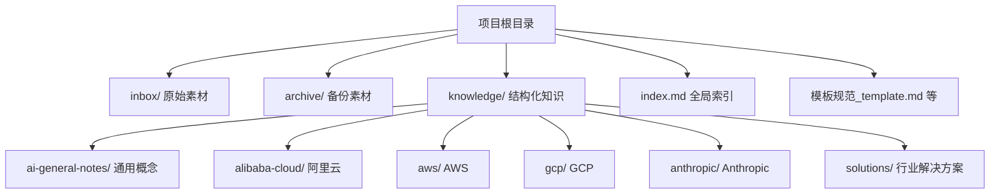
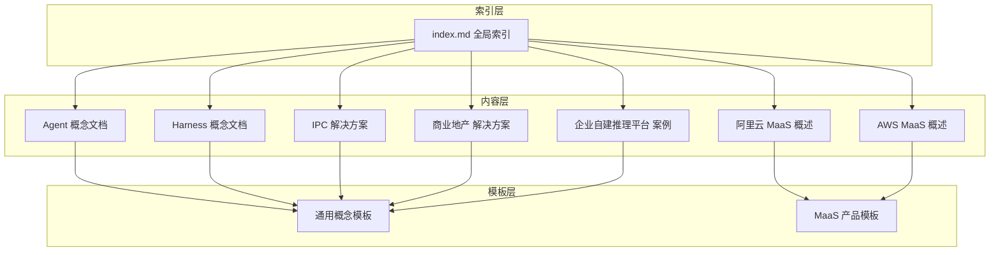
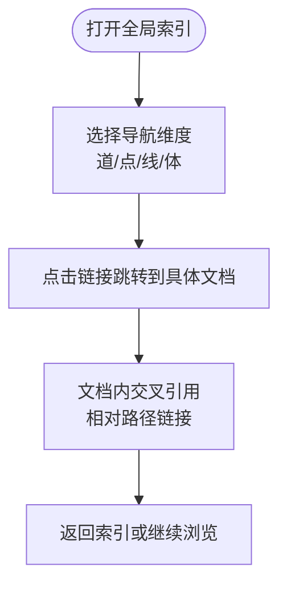
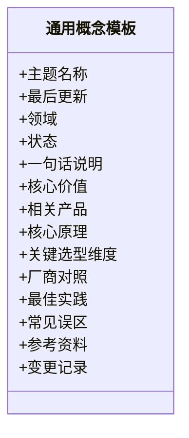
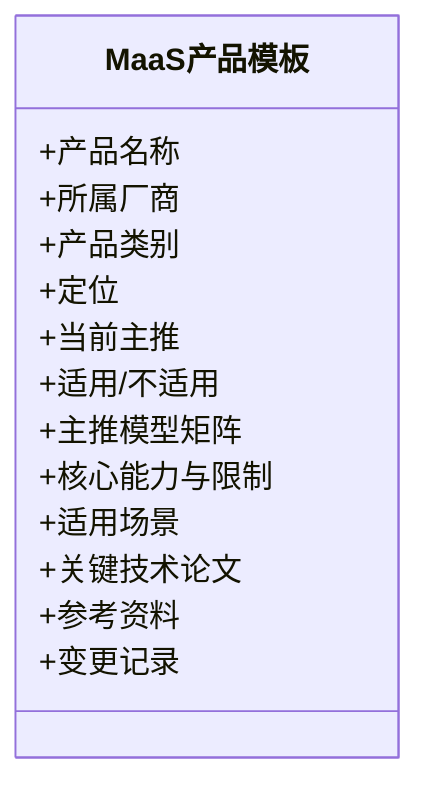
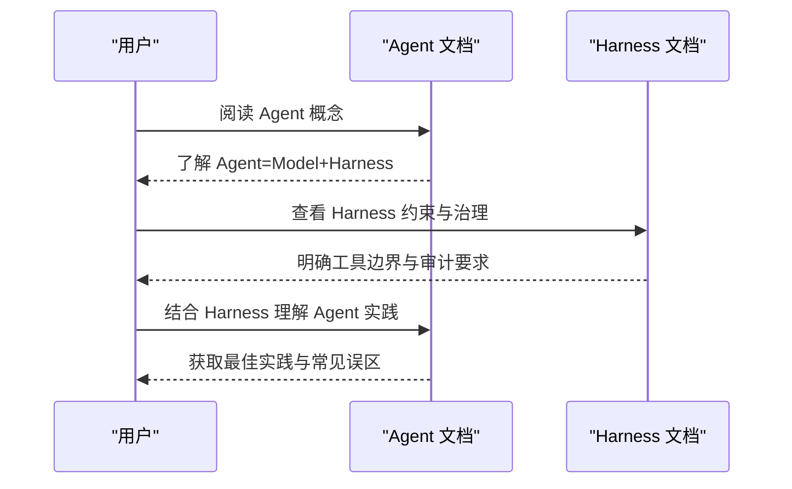
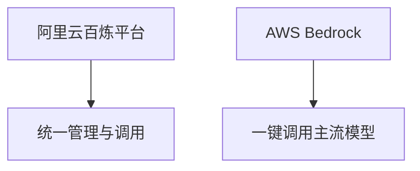
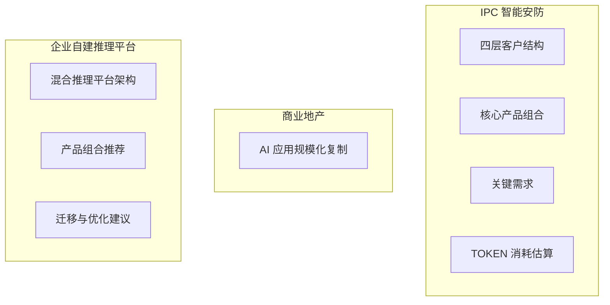
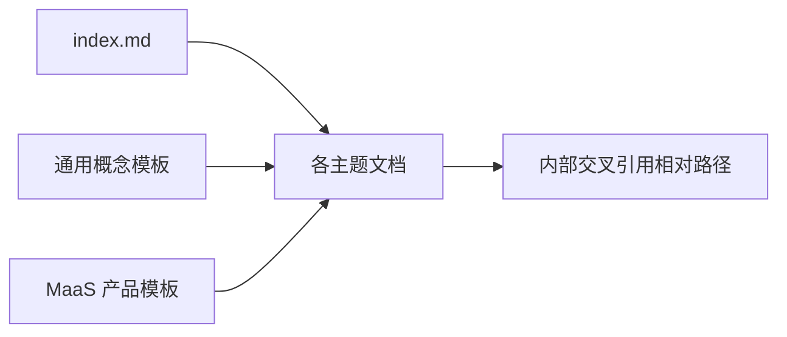

# 跨平台索引系统

<cite>
**本文引用的文件**
- [index.md](file://index.md)
- [README.md](file://README.md)
- [_maas_template.md](file://knowledge/_maas_template.md)
- [ai-general-notes/_template.md](file://knowledge/ai-general-notes/_template.md)
- [agent-def.md](file://knowledge/ai-general-notes/agent-def.md)
- [harness.md](file://knowledge/ai-general-notes/harness.md)
- [alibaba-cloud/maas/overview.md](file://knowledge/alibaba-cloud/maas/overview.md)
- [aws/maas/overview.md](file://knowledge/aws/maas/overview.md)
- [solutions/vertical-ipc/overview.md](file://knowledge/solutions/vertical-ipc/overview.md)
- [solutions/commercial-real-estate/overview.md](file://knowledge/solutions/commercial-real-estate/overview.md)
- [solutions/enterprise-ai-platform/case-report.html](file://knowledge/solutions/enterprise-ai-platform/case-report.html)
</cite>

## 目录
1. [简介](#简介)
2. [项目结构](#项目结构)
3. [核心组件](#核心组件)
4. [架构总览](#架构总览)
5. [详细组件分析](#详细组件分析)
6. [依赖关系分析](#依赖关系分析)
7. [性能考虑](#性能考虑)
8. [故障排查指南](#故障排查指南)
9. [结论](#结论)
10. [附录](#附录)

## 简介
本项目是一个跨平台的知识库索引系统，围绕“道（通用概念）—点（单产品知识）—线（对比分析）—体（行业解决方案）”四个维度组织知识，通过全局索引文件对知识进行导航与检索。系统采用“模板驱动 + 目录结构 + 文档内交叉引用”的方式，实现跨厂商、跨产品、跨领域的知识关联与检索。

- “道”：AI 通用概念与方法论，强调可迁移的认知框架与选型维度
- “点”：各厂商具体产品与能力说明，便于快速定位与对比
- “线”：以阿里云视角的竞品对比与定位差异分析
- “体”：行业解决方案与规模化复制案例，强调落地与收益

该索引系统通过统一的模板规范与链接约定，确保知识在不同维度间可检索、可关联、可复用。

**章节来源**
- [README.md:1-20](file://README.md#L1-L20)
- [index.md:1-69](file://index.md#L1-L69)

## 项目结构
知识库采用“根目录 + 多领域分类 + 模板规范”的结构组织，配合全局索引文件实现跨域导航与检索。

- 全局索引文件集中呈现“道—点—线—体”四维导航，便于快速定位知识
- 模板规范统一知识表达格式，提升一致性与可检索性
- 各厂商与行业解决方案目录按主题细分，便于交叉引用与检索

**图表来源**
- [index.md:6-69](file://index.md#L6-L69)
- [README.md:13-18](file://README.md#L13-L18)

**章节来源**
- [README.md:13-18](file://README.md#L13-L18)
- [index.md:6-69](file://index.md#L6-L69)

## 核心组件
- 全局索引（index.md）：提供跨域导航入口，按“道—点—线—体”组织链接，支持快速检索与跳转
- 通用概念模板（ai-general-notes/_template.md）：规范“是什么/核心原理/关键选型维度/厂商对照/最佳实践/常见误区/参考资料/变更记录”
- 产品模板（_maas_template.md）：规范 MaaS 产品维度（定位、主推模型、核心能力与限制、适用场景、技术论文、参考资料、变更记录）
- 知识文档（示例：Agent、Harness、各厂商 MaaS 概述、行业解决方案）：承载具体知识内容，通过内部链接实现跨域关联

这些组件共同构成“模板—内容—索引”的知识组织闭环，支撑跨平台、跨厂商的知识检索与推荐。

**章节来源**
- [index.md:6-69](file://index.md#L6-L69)
- [ai-general-notes/_template.md:1-75](file://knowledge/ai-general-notes/_template.md#L1-L75)
- [_maas_template.md:1-65](file://knowledge/_maas_template.md#L1-L65)

## 架构总览
全局索引系统通过“模板规范 + 目录结构 + 文档内交叉引用”实现跨平台知识的导航与检索。

- 索引层：全局索引集中呈现导航与检索入口
- 内容层：各主题文档承载具体知识，内部通过相对路径链接实现跨域引用
- 模板层：统一表达规范，确保知识结构一致、便于检索与复用

**图表来源**
- [index.md:6-69](file://index.md#L6-L69)
- [agent-def.md:1-128](file://knowledge/ai-general-notes/agent-def.md#L1-L128)
- [harness.md:1-108](file://knowledge/ai-general-notes/harness.md#L1-L108)
- [alibaba-cloud/maas/overview.md:1-9](file://knowledge/alibaba-cloud/maas/overview.md#L1-L9)
- [aws/maas/overview.md:1-9](file://knowledge/aws/maas/overview.md#L1-L9)
- [solutions/vertical-ipc/overview.md:1-52](file://knowledge/solutions/vertical-ipc/overview.md#L1-L52)
- [solutions/commercial-real-estate/overview.md](file://knowledge/solutions/commercial-real-estate/overview.md)
- [solutions/enterprise-ai-platform/case-report.html](file://knowledge/solutions/enterprise-ai-platform/case-report.html)

## 详细组件分析

### 全局索引（index.md）
- 导航维度清晰：道（通用概念）、点（单产品知识）、线（对比分析）、体（行业解决方案）
- 知识关联：通过相对路径链接到具体文档，形成跨域检索网络
- 维度扩展：模板参考区提供统一规范，便于新增主题与产品

**图表来源**
- [index.md:6-69](file://index.md#L6-L69)

**章节来源**
- [index.md:6-69](file://index.md#L6-L69)

### 通用概念模板（ai-general-notes/_template.md）
- 结构化表达：统一“是什么/核心原理/关键选型维度/厂商对照/最佳实践/常见误区/参考资料/变更记录”
- 可迁移性：强调“可迁移场景”，提升概念在不同领域的复用价值
- 厂商对照：提供跨厂商实现差异的对比框架，便于横向分析

**图表来源**
- [ai-general-notes/_template.md:1-75](file://knowledge/ai-general-notes/_template.md#L1-L75)

**章节来源**
- [ai-general-notes/_template.md:1-75](file://knowledge/ai-general-notes/_template.md#L1-L75)

### 产品模板（_maas_template.md）
- 产品维度：定位、当前主推、适用/不适用场景
- 模型矩阵：主推模型系列与型号、上下文、特点、推出时间
- 能力与限制：核心能力与限制项的表格化呈现
- 场景化应用：适用场景与推荐模型的匹配
- 技术论文与参考资料：支撑性内容与外部链接
- 变更记录：版本演进与维护轨迹

**图表来源**
- [_maas_template.md:1-65](file://knowledge/_maas_template.md#L1-L65)

**章节来源**
- [_maas_template.md:1-65](file://knowledge/_maas_template.md#L1-L65)

### 知识文档示例：Agent 与 Harness
- Agent：将“感知-推理-行动-观察”循环抽象为“for 循环”，强调 Harness 的约束与治理作用
- Harness：定义工具边界、业务规则、人工介入点、凭证隔离、审计追踪与退出条件，强调其作为企业战略级资产的价值

**图表来源**
- [agent-def.md:1-128](file://knowledge/ai-general-notes/agent-def.md#L1-L128)
- [harness.md:1-108](file://knowledge/ai-general-notes/harness.md#L1-L108)

**章节来源**
- [agent-def.md:1-128](file://knowledge/ai-general-notes/agent-def.md#L1-L128)
- [harness.md:1-108](file://knowledge/ai-general-notes/harness.md#L1-L108)

### 知识文档示例：MaaS 平台概述
- 阿里云百炼平台：统一管理和调用大模型 API 的模型服务平台
- AWS Bedrock：一键调用主流 Foundation Models 的托管大模型服务

**图表来源**
- [alibaba-cloud/maas/overview.md:1-9](file://knowledge/alibaba-cloud/maas/overview.md#L1-L9)
- [aws/maas/overview.md:1-9](file://knowledge/aws/maas/overview.md#L1-L9)

**章节来源**
- [alibaba-cloud/maas/overview.md:1-9](file://knowledge/alibaba-cloud/maas/overview.md#L1-L9)
- [aws/maas/overview.md:1-9](file://knowledge/aws/maas/overview.md#L1-L9)

### 知识文档示例：行业解决方案
- IPC 智能安防：四层客户结构、核心产品组合、关键需求、TOKEN 消耗估算
- 商业地产：AI 应用规模化复制（质检、合同审查、知识库、智能客服、Qoder 提效）
- 企业自建推理平台：混合推理平台架构、产品组合推荐、迁移与优化建议

**图表来源**
- [solutions/vertical-ipc/overview.md:1-52](file://knowledge/solutions/vertical-ipc/overview.md#L1-L52)
- [solutions/commercial-real-estate/overview.md](file://knowledge/solutions/commercial-real-estate/overview.md)
- [solutions/enterprise-ai-platform/case-report.html](file://knowledge/solutions/enterprise-ai-platform/case-report.html)

**章节来源**
- [solutions/vertical-ipc/overview.md:1-52](file://knowledge/solutions/vertical-ipc/overview.md#L1-L52)
- [solutions/commercial-real-estate/overview.md](file://knowledge/solutions/commercial-real-estate/overview.md)
- [solutions/enterprise-ai-platform/case-report.html](file://knowledge/solutions/enterprise-ai-platform/case-report.html)

## 依赖关系分析
- 索引依赖：全局索引依赖各主题文档的链接与内容完整性
- 模板依赖：各主题文档依赖模板规范，确保结构一致、字段齐全
- 内容依赖：文档内部通过相对路径进行交叉引用，形成知识网络

- 索引与内容：索引提供导航，内容提供细节，二者相互依存
- 模板与内容：模板统一表达，内容承载知识，二者共同保障一致性

**图表来源**
- [index.md:6-69](file://index.md#L6-L69)
- [ai-general-notes/_template.md:1-75](file://knowledge/ai-general-notes/_template.md#L1-L75)
- [_maas_template.md:1-65](file://knowledge/_maas_template.md#L1-L65)

**章节来源**
- [index.md:6-69](file://index.md#L6-L69)
- [ai-general-notes/_template.md:1-75](file://knowledge/ai-general-notes/_template.md#L1-L75)
- [_maas_template.md:1-65](file://knowledge/_maas_template.md#L1-L65)

## 性能考虑
- 索引加载性能：全局索引文件体量适中，建议保持链接简洁、避免深层嵌套，减少解析与渲染负担
- 文档检索性能：通过统一模板与关键词（如“定位/适用/不适用/核心能力/限制”）提升检索命中率
- 内容组织性能：按“道—点—线—体”分层组织，降低跨域检索的上下文切换成本
- 维护成本：模板标准化可显著降低新增文档的维护成本，提升知识沉淀效率

[本节为通用指导，无需特定文件分析]

## 故障排查指南
- 链接失效：检查相对路径是否正确，确保文档移动后同步更新链接
- 内容不一致：依据模板规范补充缺失字段（如“最后更新/状态/参考资料/变更记录”）
- 检索困难：在文档中使用统一关键词与标签，便于后续检索与推荐
- 版本管理：利用“变更记录”跟踪文档演进，必要时提供回溯与对比

**章节来源**
- [ai-general-notes/_template.md:66-75](file://knowledge/ai-general-notes/_template.md#L66-L75)
- [_maas_template.md:62-65](file://knowledge/_maas_template.md#L62-L65)

## 结论
该跨平台索引系统通过“模板—内容—索引”的闭环设计，实现了跨厂商、跨产品、跨领域的知识导航与检索。统一的模板规范提升了知识表达的一致性与可检索性，而全局索引则提供了清晰的导航路径与交叉引用机制。结合行业解决方案与对比分析，系统不仅支持知识检索，也为推荐与决策提供了坚实基础。

[本节为总结性内容，无需特定文件分析]

## 附录
- 使用建议
  - 新增文档遵循模板规范，确保字段完整、结构一致
  - 在全局索引中补充相应链接，完善导航与检索
  - 在文档内使用相对路径进行交叉引用，增强知识网络密度
- 维护建议
  - 定期更新“最后更新”与“变更记录”，保持知识时效性
  - 对照模板补充缺失内容，避免信息断层
  - 通过“道—点—线—体”维度定期回顾与重构索引，提升可用性

[本节为通用指导，无需特定文件分析]