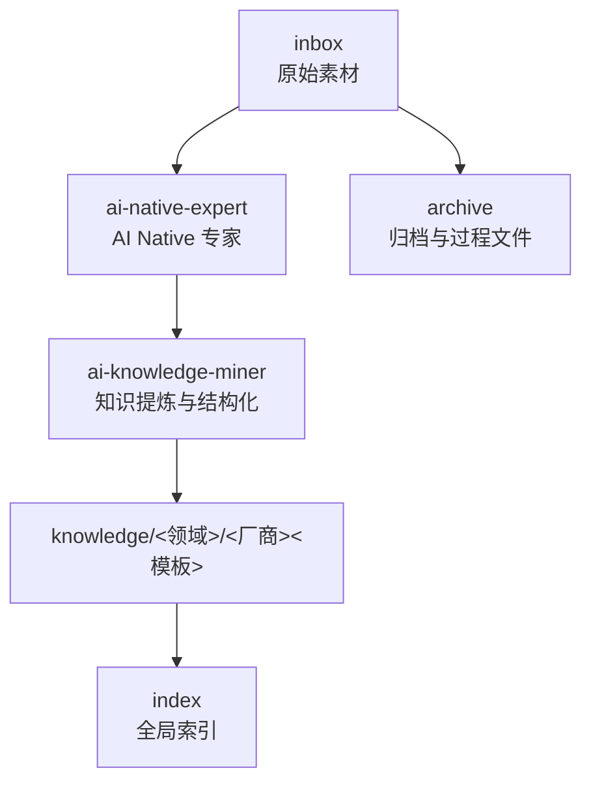
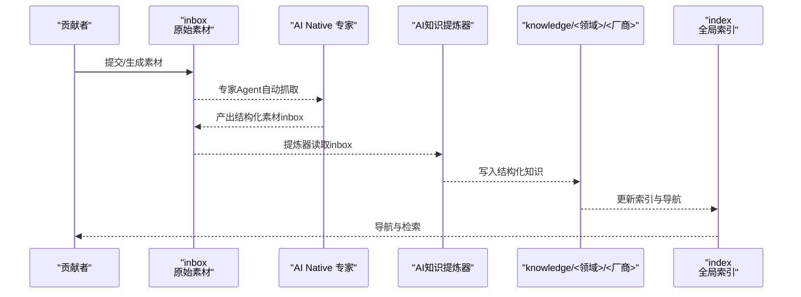
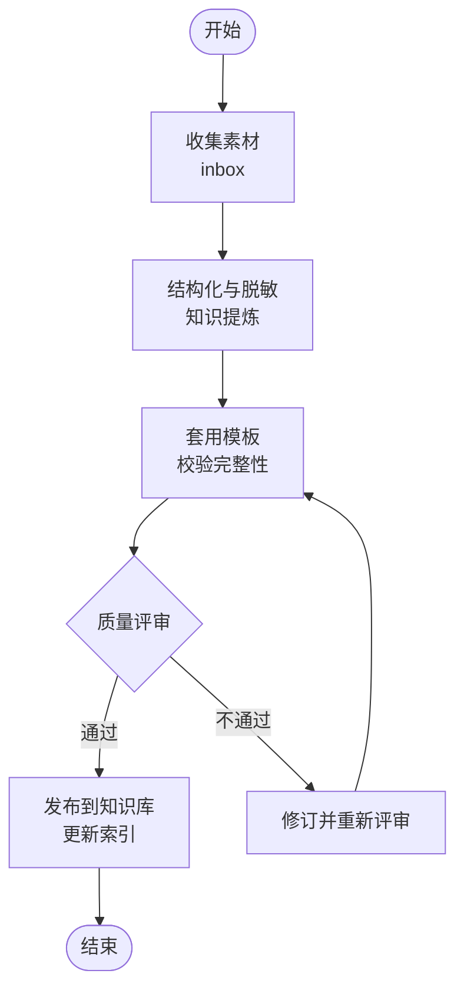
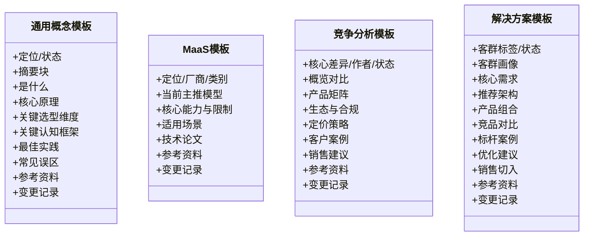
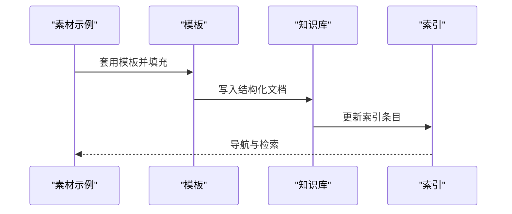
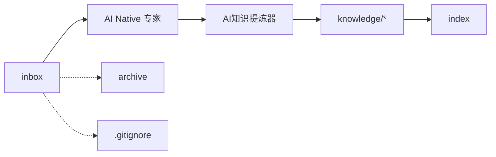

# 社区与贡献

<cite>
**本文引用的文件**   
- [README.md](file://README.md)
- [index.md](file://index.md)
- [inbox/ai-knowledge-by-qoder-ai-native-agent-20260522.md](file://inbox/ai-knowledge-by-qoder-ai-native-agent-20260522.md)
- [knowledge/_maas_template.md](file://knowledge/_maas_template.md)
- [knowledge/ai-general-notes/_template.md](file://knowledge/ai-general-notes/_template.md)
- [knowledge/alibaba-cloud/competitive-analysis/_template.md](file://knowledge/alibaba-cloud/competitive-analysis/_template.md)
- [knowledge/solutions/_template.md](file://knowledge/solutions/_template.md)
- [knowledge/ai-general-notes/agent-def.md](file://knowledge/ai-general-notes/agent-def.md)
- [knowledge/alibaba-cloud/maas/overview.md](file://knowledge/alibaba-cloud/maas/overview.md)
- [knowledge/solutions/enterprise-ai-platform/overview.md](file://knowledge/solutions/enterprise-ai-platform/overview.md)
- [.gitignore](file://.gitignore)
- [archive/20260518.md](file://archive/20260518.md)
</cite>

## 目录
1. [简介](#简介)
2. [项目结构](#项目结构)
3. [核心组件](#核心组件)
4. [架构总览](#架构总览)
5. [详细组件分析](#详细组件分析)
6. [依赖分析](#依赖分析)
7. [性能考量](#性能考量)
8. [故障排查指南](#故障排查指南)
9. [结论](#结论)
10. [附录](#附录)

## 简介
本指南面向希望参与AI知识库社区建设与贡献的成员，系统阐述内容贡献流程、质量控制与协作机制，帮助你高效地从素材收集、知识整理到质量审核与发布。同时提供社区建设策略、知识分享平台、行为准则与合作伙伴关系建议，以及社区活动与知识交流机会，全面展示社区在知识库发展中的作用与价值。

## 项目结构
项目采用“素材—沉淀—结构化知识”的流水线式组织方式：
- inbox：原始素材暂存区，由AI专家Agent产出或外部输入
- archive：历史归档与过程文件，便于追溯与复用
- knowledge：结构化知识库，按领域与厂商分类组织，包含模板与示例
- index：全局索引，提供知识导航与模板参考

图表来源
- [README.md:13-18](file://README.md#L13-L18)
- [index.md:1-69](file://index.md#L1-L69)

章节来源
- [README.md:13-18](file://README.md#L13-L18)
- [index.md:1-69](file://index.md#L1-L69)

## 核心组件
- AI Native 专家：聚焦MaaS与AI Coding，回答模型能力、选型、API问题与竞品分析，产出inbox素材
- AI知识提炼器：将inbox素材脱敏、结构化，沉淀到knowledge对应目录
- 知识库与索引：按领域/厂商/主题分类，提供模板与示例，支撑高质量知识沉淀
- 归档与过程文件：archive与.gitignore等，确保过程可追溯、敏感信息受控

章节来源
- [README.md:7-11](file://README.md#L7-L11)
- [README.md:15-17](file://README.md#L15-L17)
- [.gitignore:23-31](file://.gitignore#L23-L31)

## 架构总览
以下序列图展示了从素材到知识发布的典型流程：

图表来源
- [README.md:7-11](file://README.md#L7-L11)
- [README.md:15-17](file://README.md#L15-L17)
- [index.md:1-69](file://index.md#L1-L69)

## 详细组件分析

### 内容贡献流程与质量控制
- 素材来源与归档
  - 素材来自AI Native专家产出或外部输入，统一进入inbox
  - 归档建议在素材中明确指向knowledge目录与相关模板位置
- 知识提炼与结构化
  - 提炼器将inbox素材脱敏、结构化，写入knowledge对应目录
  - 使用模板确保格式一致性与完整性
- 质量审核与发布
  - 通过模板的“状态”字段（草稿/评审/发布）控制发布节奏
  - changelog记录变更，便于追溯

图表来源
- [inbox/ai-knowledge-by-qoder-ai-native-agent-20260522.md:10-14](file://inbox/ai-knowledge-by-qoder-ai-native-agent-20260522.md#L10-L14)
- [knowledge/_maas_template.md:1-65](file://knowledge/_maas_template.md#L1-L65)
- [knowledge/ai-general-notes/_template.md:1-75](file://knowledge/ai-general-notes/_template.md#L1-L75)
- [knowledge/alibaba-cloud/competitive-analysis/_template.md:1-46](file://knowledge/alibaba-cloud/competitive-analysis/_template.md#L1-L46)
- [knowledge/solutions/_template.md:1-108](file://knowledge/solutions/_template.md#L1-L108)

章节来源
- [inbox/ai-knowledge-by-qoder-ai-native-agent-20260522.md:10-14](file://inbox/ai-knowledge-by-qoder-ai-native-agent-20260522.md#L10-L14)
- [README.md:7-11](file://README.md#L7-L11)

### 模板体系与示例
- 通用概念模板：覆盖“是什么/核心原理/关键选型维度/认知框架/最佳实践/常见误区/参考资料/变更记录”
- MaaS产品模板：覆盖“定位/主推模型/能力与限制/适用场景/技术论文/参考资料/变更记录”
- 竞争分析模板：覆盖“概览对比/产品矩阵/生态与合规/定价/客户案例/销售建议/参考资料/变更记录”
- 解决方案模板：覆盖“客群画像/核心需求/推荐架构/产品组合/竞品对比/标杆案例/优化建议/销售切入/参考资料/变更记录”

图表来源
- [knowledge/ai-general-notes/_template.md:1-75](file://knowledge/ai-general-notes/_template.md#L1-L75)
- [knowledge/_maas_template.md:1-65](file://knowledge/_maas_template.md#L1-L65)
- [knowledge/alibaba-cloud/competitive-analysis/_template.md:1-46](file://knowledge/alibaba-cloud/competitive-analysis/_template.md#L1-L46)
- [knowledge/solutions/_template.md:1-108](file://knowledge/solutions/_template.md#L1-L108)

章节来源
- [knowledge/ai-general-notes/_template.md:1-75](file://knowledge/ai-general-notes/_template.md#L1-L75)
- [knowledge/_maas_template.md:1-65](file://knowledge/_maas_template.md#L1-L65)
- [knowledge/alibaba-cloud/competitive-analysis/_template.md:1-46](file://knowledge/alibaba-cloud/competitive-analysis/_template.md#L1-L46)
- [knowledge/solutions/_template.md:1-108](file://knowledge/solutions/_template.md#L1-L108)

### 示例：知识沉淀与索引导航
- 示例素材：多账号限流扩展方案设计，包含“所以然/之所以然/洞察提炼/数据源”等结构化要点
- 索引导航：index提供全局索引，按“道/线/体/点”四个层级组织，便于检索与复用

图表来源
- [inbox/ai-knowledge-by-qoder-ai-native-agent-20260522.md:15-48](file://inbox/ai-knowledge-by-qoder-ai-native-agent-20260522.md#L15-L48)
- [index.md:1-69](file://index.md#L1-L69)

章节来源
- [inbox/ai-knowledge-by-qoder-ai-native-agent-20260522.md:15-48](file://inbox/ai-knowledge-by-qoder-ai-native-agent-20260522.md#L15-L48)
- [index.md:1-69](file://index.md#L1-L69)

## 依赖分析
- 组件耦合
  - inbox与知识库通过模板与索引形成松耦合：素材来源多样，但统一结构化输出
  - 索引对知识库形成单向依赖，支撑检索与导航
- 外部依赖
  - 专家Agent与知识提炼器作为上游工具，驱动知识库内容增长
  - 归档与过程文件确保可追溯性与敏感信息受控

图表来源
- [README.md:7-11](file://README.md#L7-L11)
- [README.md:15-17](file://README.md#L15-L17)
- [.gitignore:23-31](file://.gitignore#L23-L31)

章节来源
- [README.md:7-11](file://README.md#L7-L11)
- [.gitignore:23-31](file://.gitignore#L23-L31)

## 性能考量
- 知识沉淀效率
  - 使用模板标准化结构，减少重复劳动，提升提炼速度
  - 通过索引导航快速定位已有知识，避免重复劳动
- 索引维护成本
  - 定期更新索引，保持导航准确性
  - changelog与状态字段有助于快速识别最新版本与待办事项
- 归档与过程文件
  - archive与.gitignore配合，确保历史可追溯且敏感信息不外泄

## 故障排查指南
- 素材未被正确提炼
  - 检查inbox中是否包含“归档建议”与“类型”字段
  - 确认知识库目录结构与模板匹配
- 知识库索引缺失
  - 确认文档末尾的“变更记录”与“状态”字段已更新
  - 检查index中对应条目是否已添加或更新
- 归档与敏感信息
  - 确保敏感信息未进入inbox与知识库，遵循.gitignore规则

章节来源
- [inbox/ai-knowledge-by-qoder-ai-native-agent-20260522.md:10-14](file://inbox/ai-knowledge-by-qoder-ai-native-agent-20260522.md#L10-L14)
- [index.md:1-69](file://index.md#L1-L69)
- [.gitignore:23-31](file://.gitignore#L23-L31)

## 结论
社区通过“素材—提炼—结构化—索引”的闭环，实现了知识的高效沉淀与传播。贡献者只需遵循模板与流程，即可快速产出高质量内容；索引与导航则确保知识可发现、可复用。建议持续完善模板、强化评审与归档机制，推动社区知识库的可持续演进。

## 附录

### 贡献者指南与行为准则
- 贡献流程
  - 从inbox收集素材，使用模板结构化填充
  - 通过评审与修改，更新状态与变更记录
  - 发布到知识库并更新索引
- 行为准则
  - 尊重知识产权，优先引用官方与权威来源
  - 保持客观中立，避免主观臆断
  - 注重可操作性与可迁移性，强调“怎么做”
  - 严格遵守敏感信息处理规范，避免泄露

章节来源
- [knowledge/ai-general-notes/_template.md:66-75](file://knowledge/ai-general-notes/_template.md#L66-L75)
- [knowledge/_maas_template.md:56-65](file://knowledge/_maas_template.md#L56-L65)
- [knowledge/alibaba-cloud/competitive-analysis/_template.md:41-46](file://knowledge/alibaba-cloud/competitive-analysis/_template.md#L41-L46)
- [knowledge/solutions/_template.md:99-108](file://knowledge/solutions/_template.md#L99-L108)

### 社区建设策略与知识分享平台
- 讨论机制
  - 基于索引与模板的结构化讨论，提高沟通效率
- 反馈渠道
  - 通过变更记录与状态字段收集反馈，持续改进
- 知识传播
  - 以索引为入口，结合案例与最佳实践进行传播
- 示例参考
  - 企业自建AI推理平台解决方案，提供架构、产品组合与优化建议

章节来源
- [index.md:1-69](file://index.md#L1-L69)
- [knowledge/solutions/enterprise-ai-platform/overview.md:1-273](file://knowledge/solutions/enterprise-ai-platform/overview.md#L1-L273)

### 代码贡献规范与协作机制
- Pull Request流程
  - 基于模板与索引进行内容评审，确保结构与质量
- 代码审查
  - 重点检查模板使用、数据源标注、变更记录与状态字段
- 版本管理
  - 使用变更记录与状态字段管理版本演进
- 示例参考
  - 多账号限流扩展方案设计，体现“所以然/之所以然/洞察提炼/数据源”的结构化表达

章节来源
- [inbox/ai-knowledge-by-qoder-ai-native-agent-20260522.md:18-48](file://inbox/ai-knowledge-by-qoder-ai-native-agent-20260522.md#L18-L48)
- [knowledge/ai-general-notes/agent-def.md:13-128](file://knowledge/ai-general-notes/agent-def.md#L13-L128)

### 建立合作伙伴关系与生态合作
- 合作伙伴识别
  - 基于索引中的“厂商/产品/平台”信息，识别潜在合作伙伴
- 生态协同
  - 通过“竞品分析/解决方案/产品组合”模板，形成互补与协同
- 示例参考
  - 百炼平台概述与企业自建AI推理平台解决方案，体现生态闭环与混合推理策略

章节来源
- [knowledge/alibaba-cloud/maas/overview.md:1-9](file://knowledge/alibaba-cloud/maas/overview.md#L1-L9)
- [knowledge/solutions/enterprise-ai-platform/overview.md:173-183](file://knowledge/solutions/enterprise-ai-platform/overview.md#L173-L183)

### 社区活动与知识交流
- 活动建议
  - 以“索引导航”为基础开展主题分享与案例复盘
  - 借助模板进行结构化讨论与知识沉淀
- 知识交流
  - 通过archive与过程文件沉淀经验，形成可复用的知识资产

章节来源
- [index.md:1-69](file://index.md#L1-L69)
- [archive/20260518.md:1-470](file://archive/20260518.md#L1-L470)