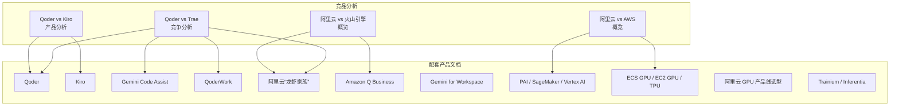
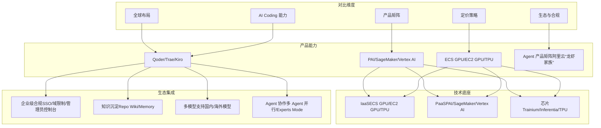
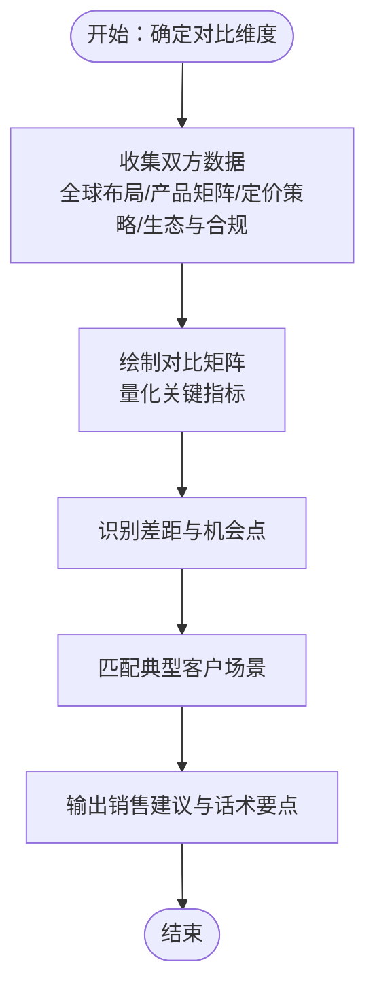
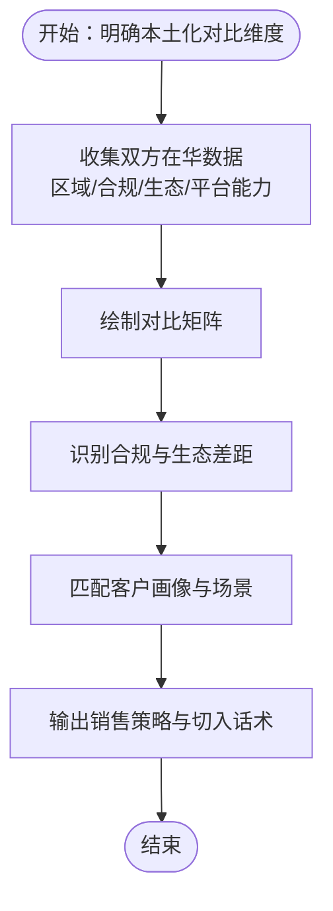
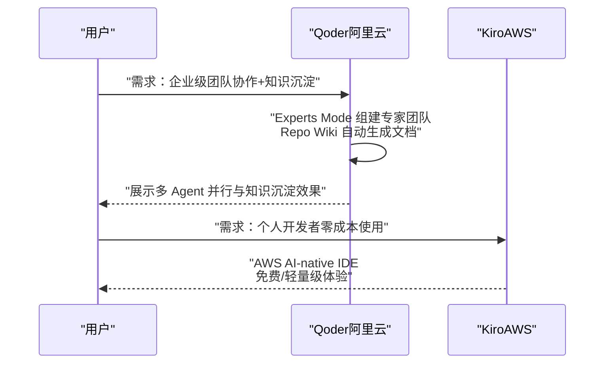
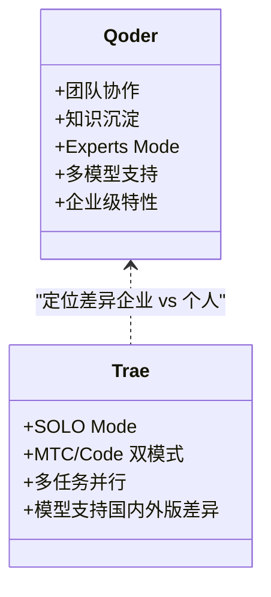
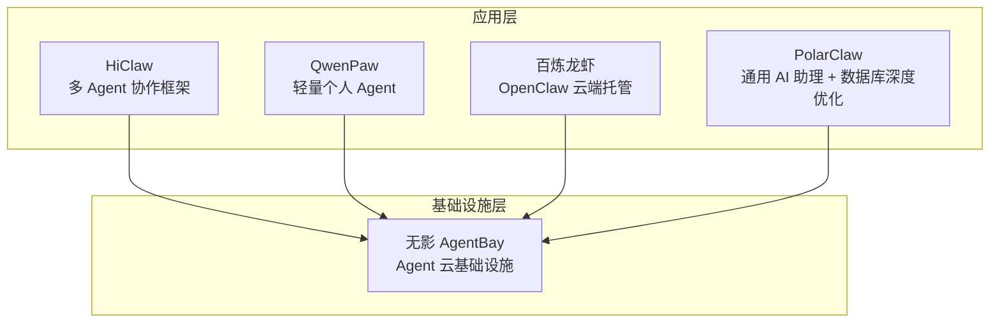
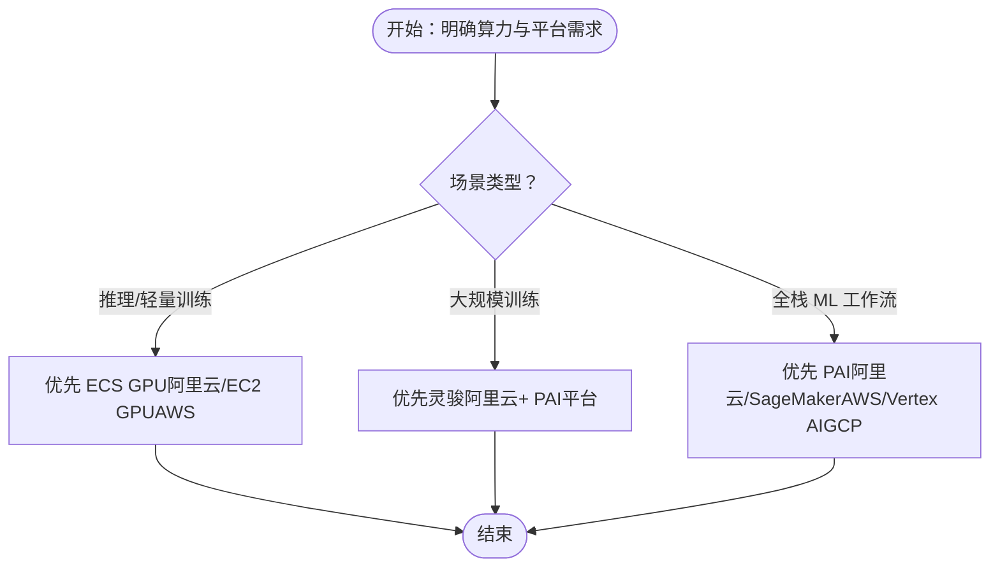
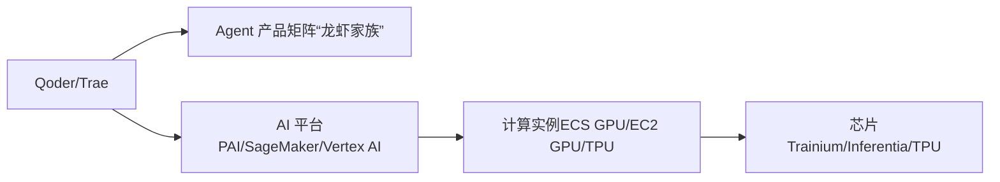

# 具体竞品分析案例

<cite>
**本文引用的文件**
- [阿里云 vs AWS 竞争分析概览](file://knowledge/alibaba-cloud/competitive-analysis/alibaba-vs-aws/overview.md)
- [阿里云 vs 火山引擎 竞争分析概览](file://knowledge/alibaba-cloud/competitive-analysis/alibaba-vs-volcengine/overview.md)
- [Qoder vs Kiro 产品分析](file://knowledge/alibaba-cloud/competitive-analysis/qoder-vs-kiro/overview.md)
- [Qoder vs Trae 竞争分析](file://knowledge/alibaba-cloud/competitive-analysis/qoder-vs-trae/overview.md)
- [Qoder 产品介绍](file://knowledge/alibaba-cloud/ai-coding/qoder.md)
- [Kiro 产品介绍](file://knowledge/aws/ai-coding/kiro.md)
- [Gemini Code Assist 产品介绍](file://knowledge/gcp/ai-coding/gemini-code-assist.md)
- [QoderWork 产品介绍](file://knowledge/alibaba-cloud/ai-application/qoder-work.md)
- [阿里云“龙虾家族”AI Agent 产品全景](file://knowledge/alibaba-cloud/ai-application/claw-family.md)
- [Amazon Q Business 产品介绍](file://knowledge/aws/ai-application/q-business.md)
- [Gemini for Workspace 产品介绍](file://knowledge/gcp/ai-application/gemini-workspace.md)
- [PAI 机器学习平台](file://knowledge/alibaba-cloud/ai-platform/pai.md)
- [SageMaker 机器学习平台](file://knowledge/aws/ai-platform/sagemaker.md)
- [Vertex AI 机器学习平台](file://knowledge/gcp/ai-platform/vertex-ai.md)
- [ECS GPU 计算实例](file://knowledge/alibaba-cloud/ai-infra/ecs-gpu.md)
- [EC2 GPU 计算实例](file://knowledge/aws/ai-infra/ec2-gpu.md)
- [TPU 加速芯片](file://knowledge/gcp/ai-infra/tpu.md)
- [阿里云 GPU 产品线选型：ECS GPU vs 灵骏 vs PAI](file://knowledge/alibaba-cloud/ai-infra/gpu-product-line.md)
- [Trainium 训练芯片](file://knowledge/aws/ai-infra/trainium.md)
- [Inferentia 推理芯片](file://knowledge/aws/ai-infra/inferentia.md)
</cite>

## 目录
1. [简介](#简介)
2. [项目结构](#项目结构)
3. [核心组件](#核心组件)
4. [架构总览](#架构总览)
5. [详细组件分析](#详细组件分析)
6. [依赖分析](#依赖分析)
7. [性能考量](#性能考量)
8. [故障排查指南](#故障排查指南)
9. [结论](#结论)
10. [附录](#附录)

## 简介
本文件聚焦于仓库中的三类具体竞品分析案例，旨在帮助读者系统掌握不同厂商组合的对比方法与分析要点，并形成可落地的决策支持建议。内容涵盖：
- 阿里云 vs AWS：全球布局、产品矩阵、定价策略等关键维度的对比分析框架
- 阿里云 vs 火山引擎：本土化优势、合规要求、生态建设等差异化分析
- Qoder vs Kiro、Qoder vs Trae：AI Coding 领域的技术路线、性能表现、应用场景等对比维度

## 项目结构
仓库围绕“知识库”组织，竞品分析案例主要位于“知识库/alibaba-cloud/competitive-analysis”目录下，配套的产品介绍与平台文档分布在“ai-coding”“ai-application”“ai-platform”“ai-infra”等子目录中。整体呈现“主题化知识 + 竞品对比”的结构化组织方式。

图表来源
- [阿里云 vs AWS 竞争分析概览:1-46](file://knowledge/alibaba-cloud/competitive-analysis/alibaba-vs-aws/overview.md#L1-L46)
- [阿里云 vs 火山引擎 竞争分析概览:1-46](file://knowledge/alibaba-cloud/competitive-analysis/alibaba-vs-volcengine/overview.md#L1-L46)
- [Qoder vs Kiro 产品分析:1-50](file://knowledge/alibaba-cloud/competitive-analysis/qoder-vs-kiro/overview.md#L1-L50)
- [Qoder vs Trae 竞争分析:1-214](file://knowledge/alibaba-cloud/competitive-analysis/qoder-vs-trae/overview.md#L1-L214)
- [Qoder 产品介绍:1-9](file://knowledge/alibaba-cloud/ai-coding/qoder.md#L1-L9)
- [Kiro 产品介绍:1-9](file://knowledge/aws/ai-coding/kiro.md#L1-L9)
- [Gemini Code Assist 产品介绍:1-9](file://knowledge/gcp/ai-coding/gemini-code-assist.md#L1-L9)
- [QoderWork 产品介绍:1-9](file://knowledge/alibaba-cloud/ai-application/qoder-work.md#L1-L9)
- [阿里云“龙虾家族”AI Agent 产品全景:1-137](file://knowledge/alibaba-cloud/ai-application/claw-family.md#L1-L137)
- [Amazon Q Business 产品介绍:1-9](file://knowledge/aws/ai-application/q-business.md#L1-L9)
- [Gemini for Workspace 产品介绍:1-9](file://knowledge/gcp/ai-application/gemini-workspace.md#L1-L9)
- [PAI 机器学习平台:1-9](file://knowledge/alibaba-cloud/ai-platform/pai.md#L1-L9)
- [SageMaker 机器学习平台:1-9](file://knowledge/aws/ai-platform/sagemaker.md#L1-L9)
- [Vertex AI 机器学习平台:1-9](file://knowledge/gcp/ai-platform/vertex-ai.md#L1-L9)
- [ECS GPU 计算实例:1-9](file://knowledge/alibaba-cloud/ai-infra/ecs-gpu.md#L1-L9)
- [EC2 GPU 计算实例:1-9](file://knowledge/aws/ai-infra/ec2-gpu.md#L1-L9)
- [TPU 加速芯片:1-9](file://knowledge/gcp/ai-infra/tpu.md#L1-L9)
- [阿里云 GPU 产品线选型：ECS GPU vs 灵骏 vs PAI:1-114](file://knowledge/alibaba-cloud/ai-infra/gpu-product-line.md#L1-L114)
- [Trainium 训练芯片:1-9](file://knowledge/aws/ai-infra/trainium.md#L1-L9)
- [Inferentia 推理芯片:1-9](file://knowledge/aws/ai-infra/inferentia.md#L1-L9)

章节来源
- [阿里云 vs AWS 竞争分析概览:1-46](file://knowledge/alibaba-cloud/competitive-analysis/alibaba-vs-aws/overview.md#L1-L46)
- [阿里云 vs 火山引擎 竞争分析概览:1-46](file://knowledge/alibaba-cloud/competitive-analysis/alibaba-vs-volcengine/overview.md#L1-L46)
- [Qoder vs Kiro 产品分析:1-50](file://knowledge/alibaba-cloud/competitive-analysis/qoder-vs-kiro/overview.md#L1-L50)
- [Qoder vs Trae 竞争分析:1-214](file://knowledge/alibaba-cloud/competitive-analysis/qoder-vs-trae/overview.md#L1-L214)

## 核心组件
- 竞品分析模板与框架：用于标准化对比维度与输出格式，便于横向比较与复用
- 产品介绍与定位：明确各厂商产品类别、所属厂商、状态与定位，作为对比基线
- 平台与基础设施：AI 平台（PAI/SageMaker/Vertex AI）、计算实例（ECS GPU/EC2 GPU/TPU）、训练/推理芯片（Trainium/Inferentia/TPU）构成技术底座
- 应用与生态：AI 应用（如 QoderWork、Amazon Q Business、Gemini for Workspace）、Agent 产品矩阵（“龙虾家族”）体现生态与集成能力

章节来源
- [阿里云“龙虾家族”AI Agent 产品全景:1-137](file://knowledge/alibaba-cloud/ai-application/claw-family.md#L1-L137)
- [阿里云 GPU 产品线选型：ECS GPU vs 灵骏 vs PAI:1-114](file://knowledge/alibaba-cloud/ai-infra/gpu-product-line.md#L1-L114)
- [Qoder 产品介绍:1-9](file://knowledge/alibaba-cloud/ai-coding/qoder.md#L1-L9)
- [Amazon Q Business 产品介绍:1-9](file://knowledge/aws/ai-application/q-business.md#L1-L9)
- [Gemini for Workspace 产品介绍:1-9](file://knowledge/gcp/ai-application/gemini-workspace.md#L1-L9)

## 架构总览
下图展示了竞品分析的“对比维度—产品能力—技术底座—生态集成”的映射关系，帮助在分析中建立系统性视角。

图表来源
- [Qoder vs Trae 竞争分析:1-214](file://knowledge/alibaba-cloud/competitive-analysis/qoder-vs-trae/overview.md#L1-L214)
- [Qoder vs Kiro 产品分析:1-50](file://knowledge/alibaba-cloud/competitive-analysis/qoder-vs-kiro/overview.md#L1-L50)
- [阿里云“龙虾家族”AI Agent 产品全景:1-137](file://knowledge/alibaba-cloud/ai-application/claw-family.md#L1-L137)
- [阿里云 GPU 产品线选型：ECS GPU vs 灵骏 vs PAI:1-114](file://knowledge/alibaba-cloud/ai-infra/gpu-product-line.md#L1-L114)
- [PAI 机器学习平台:1-9](file://knowledge/alibaba-cloud/ai-platform/pai.md#L1-L9)
- [SageMaker 机器学习平台:1-9](file://knowledge/aws/ai-platform/sagemaker.md#L1-L9)
- [Vertex AI 机器学习平台:1-9](file://knowledge/gcp/ai-platform/vertex-ai.md#L1-L9)
- [ECS GPU 计算实例:1-9](file://knowledge/alibaba-cloud/ai-infra/ecs-gpu.md#L1-L9)
- [EC2 GPU 计算实例:1-9](file://knowledge/aws/ai-infra/ec2-gpu.md#L1-L9)
- [TPU 加速芯片:1-9](file://knowledge/gcp/ai-infra/tpu.md#L1-L9)
- [Trainium 训练芯片:1-9](file://knowledge/aws/ai-infra/trainium.md#L1-L9)
- [Inferentia 推理芯片:1-9](file://knowledge/aws/ai-infra/inferentia.md#L1-L9)

## 详细组件分析

### 阿里云 vs AWS：全球布局、产品矩阵、定价策略
- 全球布局与区域覆盖：对比双方在“全球区域数量”“中国区域数量”“核心优势市场”“市场份额”等维度的现状与差异，结合各自生态与合规策略进行解读
- 产品矩阵：从计算、存储、网络、数据库、AI/ML、安全等维度梳理双方能力边界与互补性
- 定价策略：结合“按需/预留/承诺用量”“折扣/返点/打包”等策略，评估总体拥有成本与弹性
- 生态与合规：对比双方在数据主权、合规工具、企业级集成能力方面的差异
- 客户案例：选取典型行业/规模的客户画像，验证双方在不同场景下的适配度
- 销售建议：基于上述分析，给出“优势切入点、对方薄弱环节、建议话术要点”

图表来源
- [阿里云 vs AWS 竞争分析概览:1-46](file://knowledge/alibaba-cloud/competitive-analysis/alibaba-vs-aws/overview.md#L1-L46)

章节来源
- [阿里云 vs AWS 竞争分析概览:1-46](file://knowledge/alibaba-cloud/competitive-analysis/alibaba-vs-aws/overview.md#L1-L46)

### 阿里云 vs 火山引擎：本土化优势、合规要求、生态建设
- 本土化优势：聚焦“中国区域数量”“核心优势市场”“合规工具”“生态集成”等维度，评估双方在本土市场的覆盖与服务能力
- 合规要求：对比双方在“SSO/域限制/管理员控制台”“数据隐私模式”“模型合规”等方面的能力差异
- 生态建设：结合“企业级集成（钉钉/飞书）”“Agent 产品矩阵”“平台与基础设施”等，评估生态协同与扩展性
- 客户案例：针对“中大型互联网公司/金融/政企/外包/ISV”等客户画像，验证双方适配度
- 销售建议：基于“合规优先、生态协同、平台能力”等维度，制定差异化切入策略

图表来源
- [阿里云 vs 火山引擎 竞争分析概览:1-46](file://knowledge/alibaba-cloud/competitive-analysis/alibaba-vs-volcengine/overview.md#L1-L46)
- [阿里云“龙虾家族”AI Agent 产品全景:1-137](file://knowledge/alibaba-cloud/ai-application/claw-family.md#L1-L137)

章节来源
- [阿里云 vs 火山引擎 竞争分析概览:1-46](file://knowledge/alibaba-cloud/competitive-analysis/alibaba-vs-volcengine/overview.md#L1-L46)
- [阿里云“龙虾家族”AI Agent 产品全景:1-137](file://knowledge/alibaba-cloud/ai-application/claw-family.md#L1-L137)

### Qoder vs Kiro：AI Coding 领域的技术路线与场景适配
- 产品定位：Qoder（阿里云）定位企业级 Agentic Coding 平台；Kiro（AWS）定位 AWS AI-native IDE
- 核心功能：对比“多模型支持”“Agent 自主编程”“团队协作/知识沉淀”“企业级特性”等维度
- 技术架构：Qoder 的 Experts Mode（主 Agent + 多子 Agent 并行）与 Kiro 的能力边界
- 性能/体验：结合“多任务并行”“模型响应速度/稳定性”“IDE 交互流畅度”等进行对比
- 生态集成：对比双方在“企业集成（SSO/域限制/管理员控制台）”“模型生态（国内/海外）”上的差异
- 优劣势总结：基于功能矩阵与客户画像，总结双方优劣势
- 销售建议：针对“企业级团队协作/合规要求/知识沉淀”等场景，给出推荐策略与话术

图表来源
- [Qoder vs Kiro 产品分析:1-50](file://knowledge/alibaba-cloud/competitive-analysis/qoder-vs-kiro/overview.md#L1-L50)
- [Qoder vs Trae 竞争分析:1-214](file://knowledge/alibaba-cloud/competitive-analysis/qoder-vs-trae/overview.md#L1-L214)
- [Qoder 产品介绍:1-9](file://knowledge/alibaba-cloud/ai-coding/qoder.md#L1-L9)
- [Kiro 产品介绍:1-9](file://knowledge/aws/ai-coding/kiro.md#L1-L9)

章节来源
- [Qoder vs Kiro 产品分析:1-50](file://knowledge/alibaba-cloud/competitive-analysis/qoder-vs-kiro/overview.md#L1-L50)
- [Qoder vs Trae 竞争分析:1-214](file://knowledge/alibaba-cloud/competitive-analysis/qoder-vs-trae/overview.md#L1-L214)
- [Qoder 产品介绍:1-9](file://knowledge/alibaba-cloud/ai-coding/qoder.md#L1-L9)
- [Kiro 产品介绍:1-9](file://knowledge/aws/ai-coding/kiro.md#L1-L9)

### Qoder vs Trae：AI Coding 领域的技术路线、性能表现、应用场景
- 产品定位：Qoder 定位企业级 Agentic Coding 平台（团队协作+知识沉淀+Experts Mode）；Trae 定位个人开发者 AI IDE（免费+轻量级）
- 核心能力矩阵：对比“团队协作/知识沉淀/多模型支持/Agent 自主编程/专家团模式/Skills 技能系统/多任务并行/企业级特性”
- 技术架构：Qoder 的 Experts Mode（Spec 驱动 + Experts Mode + Repo Wiki + 自优化 Memory）与 Trae 的 SOLO Mode（MTC/Code 双模式）
- 底层逻辑：Qoder 专注企业级市场（付费意愿强、粘性高、需要团队协作和知识沉淀）；Trae 专注个人开发者市场（免费策略、模型成本控制、国际版差异化）
- 生态与合规：Qoder 支持 SSO/域限制/管理员控制台/数据隐私模式；Trae 无企业级特性
- 定价策略：Qoder 企业付费（按团队规模）；Trae 中国版免费，国际版年付优惠
- 客户案例：分别列出适用的客户画像与原因
- 销售建议：基于“团队协作场景/复杂项目场景/企业合规场景/知识资产沉淀”等切入点，给出优势与话术要点

图表来源
- [Qoder vs Trae 竞争分析:1-214](file://knowledge/alibaba-cloud/competitive-analysis/qoder-vs-trae/overview.md#L1-L214)

章节来源
- [Qoder vs Trae 竞争分析:1-214](file://knowledge/alibaba-cloud/competitive-analysis/qoder-vs-trae/overview.md#L1-L214)

### 阿里云“龙虾家族”：Agent 产品矩阵与生态协同
- 产品清单：HiClaw、QwenPaw、百炼龙虾、PolarClaw、无影 AgentBay 的定位、层级、发布时间与性质
- 与 OpenClaw 的关系：HiClaw 基于 OpenClaw 的架构升级分支；QwenPaw 基于 AgentScope Runtime；百炼龙虾为 OpenClaw 原版云端托管；PolarClaw 为企业级 PaaS；无影 AgentBay 为 Agent 基础设施层
- 产品原理解析：多 Agent 协作、轻量 Agent、数据库 AI 化、Agent 执行环境等
- 综合对比：核心优势、定价、运维、SLA、安全、SSO/AD 等维度的横向对比
- 适用场景：体验 OpenClaw 原版、多 Agent 协作、数据库 AI 化、超低内存、Agent 云端执行环境等

图表来源
- [阿里云“龙虾家族”AI Agent 产品全景:1-137](file://knowledge/alibaba-cloud/ai-application/claw-family.md#L1-L137)

章节来源
- [阿里云“龙虾家族”AI Agent 产品全景:1-137](file://knowledge/alibaba-cloud/ai-application/claw-family.md#L1-L137)

### AI 平台与基础设施：PAI vs SageMaker vs Vertex AI；ECS GPU vs EC2 GPU vs TPU
- AI 平台：PAI（阿里云）、SageMaker（AWS）、Vertex AI（GCP）在“训练/调优/部署/全链路”能力上的差异与定位
- 计算实例：ECS GPU（阿里云）、EC2 GPU（AWS）、TPU（GCP）在“网络能力/管理粒度/运维要求/灵活度”上的差异
- GPU 产品线选型：ECS GPU（虚拟化）、灵骏（裸金属）、PAI（PaaS）在“网络拓扑能力/管理粒度/运维能力”上的取舍与组合
- 芯片：Trainium（AWS 训练芯片）、Inferentia（AWS 推理芯片）、TPU（GCP 自研芯片）在性能与生态上的差异

图表来源
- [阿里云 GPU 产品线选型：ECS GPU vs 灵骏 vs PAI:1-114](file://knowledge/alibaba-cloud/ai-infra/gpu-product-line.md#L1-L114)
- [PAI 机器学习平台:1-9](file://knowledge/alibaba-cloud/ai-platform/pai.md#L1-L9)
- [SageMaker 机器学习平台:1-9](file://knowledge/aws/ai-platform/sagemaker.md#L1-L9)
- [Vertex AI 机器学习平台:1-9](file://knowledge/gcp/ai-platform/vertex-ai.md#L1-L9)
- [ECS GPU 计算实例:1-9](file://knowledge/alibaba-cloud/ai-infra/ecs-gpu.md#L1-L9)
- [EC2 GPU 计算实例:1-9](file://knowledge/aws/ai-infra/ec2-gpu.md#L1-L9)
- [TPU 加速芯片:1-9](file://knowledge/gcp/ai-infra/tpu.md#L1-L9)
- [Trainium 训练芯片:1-9](file://knowledge/aws/ai-infra/trainium.md#L1-L9)
- [Inferentia 推理芯片:1-9](file://knowledge/aws/ai-infra/inferentia.md#L1-L9)

章节来源
- [阿里云 GPU 产品线选型：ECS GPU vs 灵骏 vs PAI:1-114](file://knowledge/alibaba-cloud/ai-infra/gpu-product-line.md#L1-L114)
- [PAI 机器学习平台:1-9](file://knowledge/alibaba-cloud/ai-platform/pai.md#L1-L9)
- [SageMaker 机器学习平台:1-9](file://knowledge/aws/ai-platform/sagemaker.md#L1-L9)
- [Vertex AI 机器学习平台:1-9](file://knowledge/gcp/ai-platform/vertex-ai.md#L1-L9)
- [ECS GPU 计算实例:1-9](file://knowledge/alibaba-cloud/ai-infra/ecs-gpu.md#L1-L9)
- [EC2 GPU 计算实例:1-9](file://knowledge/aws/ai-infra/ec2-gpu.md#L1-L9)
- [TPU 加速芯片:1-9](file://knowledge/gcp/ai-infra/tpu.md#L1-L9)
- [Trainium 训练芯片:1-9](file://knowledge/aws/ai-infra/trainium.md#L1-L9)
- [Inferentia 推理芯片:1-9](file://knowledge/aws/ai-infra/inferentia.md#L1-L9)

## 依赖分析
- 组件耦合与协同：Qoder/Trae 的企业级特性（SSO/域限制/管理员控制台/数据隐私模式）与 Agent 产品矩阵（“龙虾家族”）存在协同关系；AI 平台（PAI/SageMaker/Vertex AI）与计算实例（ECS GPU/EC2 GPU/TPU）共同构成技术底座
- 外部依赖与集成：竞品分析依赖公开文档与第三方技术文章，需注意数据时效性与准确性
- 潜在循环依赖：竞品分析模板与产品文档之间为单向依赖（模板指导分析，产品文档提供输入）

图表来源
- [Qoder vs Trae 竞争分析:1-214](file://knowledge/alibaba-cloud/competitive-analysis/qoder-vs-trae/overview.md#L1-L214)
- [阿里云“龙虾家族”AI Agent 产品全景:1-137](file://knowledge/alibaba-cloud/ai-application/claw-family.md#L1-L137)
- [阿里云 GPU 产品线选型：ECS GPU vs 灵骏 vs PAI:1-114](file://knowledge/alibaba-cloud/ai-infra/gpu-product-line.md#L1-L114)
- [PAI 机器学习平台:1-9](file://knowledge/alibaba-cloud/ai-platform/pai.md#L1-L9)
- [SageMaker 机器学习平台:1-9](file://knowledge/aws/ai-platform/sagemaker.md#L1-L9)
- [Vertex AI 机器学习平台:1-9](file://knowledge/gcp/ai-platform/vertex-ai.md#L1-L9)
- [ECS GPU 计算实例:1-9](file://knowledge/alibaba-cloud/ai-infra/ecs-gpu.md#L1-L9)
- [EC2 GPU 计算实例:1-9](file://knowledge/aws/ai-infra/ec2-gpu.md#L1-L9)
- [TPU 加速芯片:1-9](file://knowledge/gcp/ai-infra/tpu.md#L1-L9)
- [Trainium 训练芯片:1-9](file://knowledge/aws/ai-infra/trainium.md#L1-L9)
- [Inferentia 推理芯片:1-9](file://knowledge/aws/ai-infra/inferentia.md#L1-L9)

章节来源
- [Qoder vs Trae 竞争分析:1-214](file://knowledge/alibaba-cloud/competitive-analysis/qoder-vs-trae/overview.md#L1-L214)
- [阿里云“龙虾家族”AI Agent 产品全景:1-137](file://knowledge/alibaba-cloud/ai-application/claw-family.md#L1-L137)
- [阿里云 GPU 产品线选型：ECS GPU vs 灵骏 vs PAI:1-114](file://knowledge/alibaba-cloud/ai-infra/gpu-product-line.md#L1-L114)

## 性能考量
- 算力与网络：ECS GPU/EC2 GPU/TPU 的网络能力（NVLink/RoCE/IB/eRDMA）直接影响大规模训练与推理性能
- 平台与底座：PAI/灵骏/裸金属的选择需综合考虑“网络拓扑能力/管理粒度/运维要求/灵活度”
- 模型与生态：多模型支持（国内/海外）与企业合规（SSO/域限制/管理员控制台）影响实际部署与使用体验
- 企业级特性：知识沉淀（Repo Wiki/Memory）、专家团模式（Experts Mode）等能力对团队效率与迁移成本具有长期影响

## 故障排查指南
- 数据来源校验：优先参考官方文档与公开技术文章，确保数据时效性与准确性
- 场景适配验证：结合“适用场景/不适用场景/常见误解”，避免误判产品能力边界
- 销售话术核验：基于“优势切入点/对方薄弱环节/建议话术要点”，确保与客户沟通的一致性与针对性

章节来源
- [Qoder vs Trae 竞争分析:166-201](file://knowledge/alibaba-cloud/competitive-analysis/qoder-vs-trae/overview.md#L166-L201)
- [阿里云 GPU 产品线选型：ECS GPU vs 灵骏 vs PAI:73-80](file://knowledge/alibaba-cloud/ai-infra/gpu-product-line.md#L73-L80)

## 结论
通过对三类具体竞品分析案例的系统梳理，可形成以下结论与建议：
- 阿里云 vs AWS：建议以“全球布局、产品矩阵、定价策略、生态与合规”为对比框架，结合客户画像与场景进行差异化切入
- 阿里云 vs 火山引擎：建议聚焦“本土化优势、合规能力、生态协同”，在企业级市场突出“SSO/域限制/管理员控制台/数据隐私模式”
- Qoder vs Kiro、Qoder vs Trae：建议以“企业级团队协作/知识沉淀/合规要求/多模型支持/Agent 自主编程”为核心对比维度，针对不同场景给出明确的选型建议与销售话术

## 附录
- 参考资料与链接：竞品分析中引用的官方文档与公开技术文章，建议在实际工作中定期更新与交叉验证
- 更新日志：依据各文件的“Changelog”维护分析版本与修订记录，确保分析结果的可追溯性