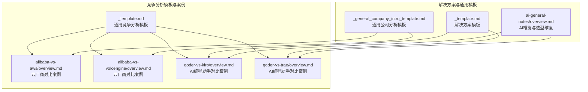
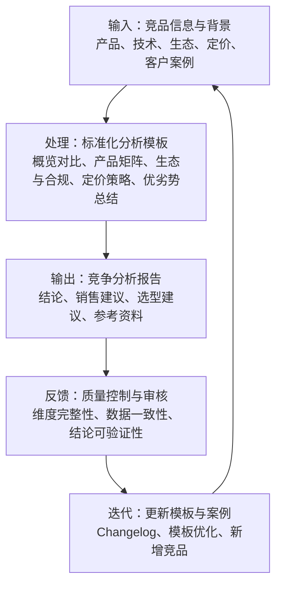
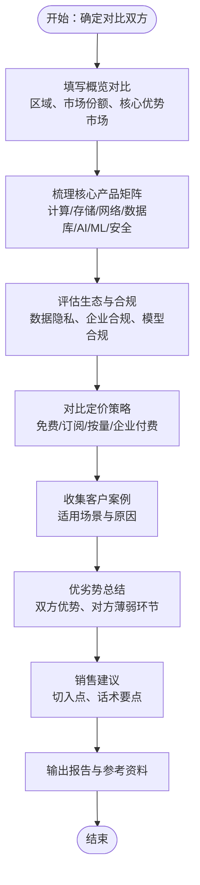
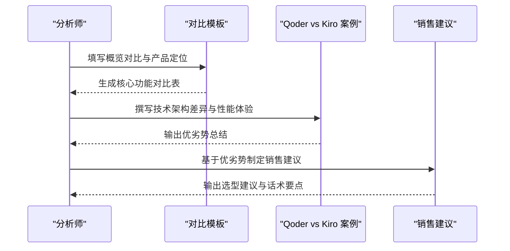
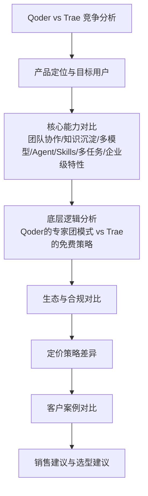
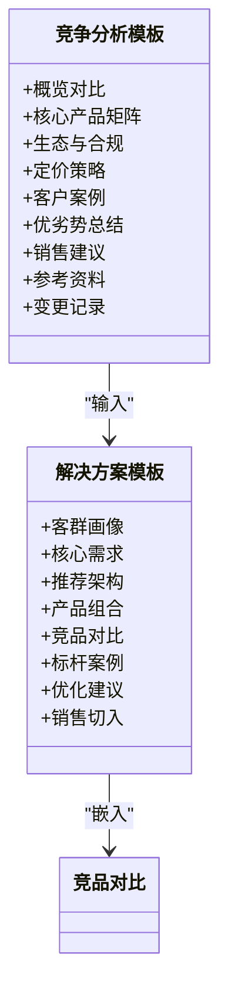
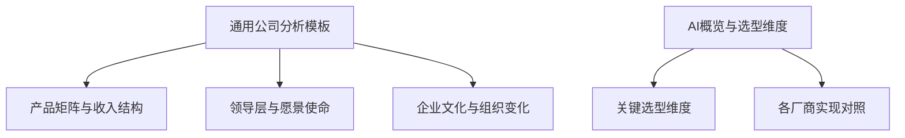
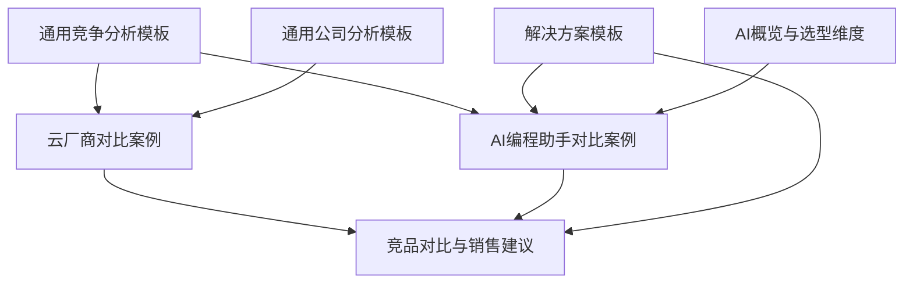

# 竞争分析方法论

<cite>
**本文引用的文件**
- [_template.md](file://knowledge/alibaba-cloud/competitive-analysis/_template.md)
- [overview.md](file://knowledge/alibaba-cloud/competitive-analysis/alibaba-vs-aws/overview.md)
- [overview.md](file://knowledge/alibaba-cloud/competitive-analysis/alibaba-vs-volcengine/overview.md)
- [overview.md](file://knowledge/alibaba-cloud/competitive-analysis/qoder-vs-kiro/overview.md)
- [overview.md](file://knowledge/alibaba-cloud/competitive-analysis/qoder-vs-trae/overview.md)
- [_template.md](file://knowledge/solutions/_template.md)
- [_general_company_intro_template.md](file://knowledge/_general_company_intro_template.md)
- [overview.md](file://knowledge/ai-general-notes/overview.md)
</cite>

## 目录
1. [引言](#引言)
2. [项目结构](#项目结构)
3. [核心组件](#核心组件)
4. [架构总览](#架构总览)
5. [详细组件分析](#详细组件分析)
6. [依赖分析](#依赖分析)
7. [性能考虑](#性能考虑)
8. [故障排查指南](#故障排查指南)
9. [结论](#结论)
10. [附录](#附录)

## 引言
本方法论旨在系统化地构建竞争分析的框架与评估体系，覆盖分析维度设计、评估标准制定、指标权重分配、标准化分析模板、流程标准化步骤、质量控制与审核标准，以及分析工具与方法论的最佳实践。通过对现有知识库中的竞争分析模板与案例进行归纳总结，形成可复用、可落地的方法论，帮助在不同行业与产品类别中开展高质量的竞争分析工作。

## 项目结构
知识库中与竞争分析直接相关的内容主要集中在“阿里云-竞争分析”专题下的多个模板与案例中，同时“解决方案模板”“通用公司分析模板”“AI概览”等也为方法论提供了补充视角。下图展示了与竞争分析相关的主要文件及其关系。

图表来源
- [_template.md:1-46](file://knowledge/alibaba-cloud/competitive-analysis/_template.md#L1-L46)
- [overview.md:1-46](file://knowledge/alibaba-cloud/competitive-analysis/alibaba-vs-aws/overview.md#L1-L46)
- [overview.md:1-46](file://knowledge/alibaba-cloud/competitive-analysis/alibaba-vs-volcengine/overview.md#L1-L46)
- [overview.md:1-50](file://knowledge/alibaba-cloud/competitive-analysis/qoder-vs-kiro/overview.md#L1-L50)
- [overview.md:1-214](file://knowledge/alibaba-cloud/competitive-analysis/qoder-vs-trae/overview.md#L1-L214)
- [_template.md:1-108](file://knowledge/solutions/_template.md#L1-L108)
- [_general_company_intro_template.md:1-234](file://knowledge/_general_company_intro_template.md#L1-L234)
- [overview.md:1-42](file://knowledge/ai-general-notes/overview.md#L1-L42)

章节来源
- [_template.md:1-46](file://knowledge/alibaba-cloud/competitive-analysis/_template.md#L1-L46)
- [overview.md:1-46](file://knowledge/alibaba-cloud/competitive-analysis/alibaba-vs-aws/overview.md#L1-L46)
- [overview.md:1-46](file://knowledge/alibaba-cloud/competitive-analysis/alibaba-vs-volcengine/overview.md#L1-L46)
- [overview.md:1-50](file://knowledge/alibaba-cloud/competitive-analysis/qoder-vs-kiro/overview.md#L1-L50)
- [overview.md:1-214](file://knowledge/alibaba-cloud/competitive-analysis/qoder-vs-trae/overview.md#L1-L214)
- [_template.md:1-108](file://knowledge/solutions/_template.md#L1-L108)
- [_general_company_intro_template.md:1-234](file://knowledge/_general_company_intro_template.md#L1-L234)
- [overview.md:1-42](file://knowledge/ai-general-notes/overview.md#L1-L42)

## 核心组件
围绕竞争分析的“方法论”与“模板”，知识库提供了以下关键组件：
- 通用竞争分析模板：定义了概览对比、产品矩阵、生态与合规、定价策略、客户案例、销售建议、参考资料与变更记录等结构化字段，便于标准化输出。
- 典型案例模板：以“云厂商 vs 云厂商”“AI编程助手 vs AI编程助手”的形式呈现，包含产品定位、核心功能对比、技术架构差异、性能体验对比、生态集成、优劣势总结、销售策略建议等。
- 解决方案模板：提供“客群画像—核心需求—推荐架构—产品组合—竞品对比—标杆案例—优化建议—销售切入”的完整闭环，可作为竞争分析的输入与输出载体之一。
- 通用公司分析模板：涵盖公司概况、领导层、愿景使命、企业文化、产品矩阵、收入与用户数据、算力规划、战略转型、数据使用建议等，有助于从宏观层面理解竞争主体。
- AI概览与选型维度：提供“关键选型维度”“各厂商实现对照”等表格化对比入口，便于在AI领域快速建立对比框架。

章节来源
- [_template.md:1-46](file://knowledge/alibaba-cloud/competitive-analysis/_template.md#L1-L46)
- [overview.md:1-46](file://knowledge/alibaba-cloud/competitive-analysis/alibaba-vs-aws/overview.md#L1-L46)
- [overview.md:1-46](file://knowledge/alibaba-cloud/competitive-analysis/alibaba-vs-volcengine/overview.md#L1-L46)
- [overview.md:1-50](file://knowledge/alibaba-cloud/competitive-analysis/qoder-vs-kiro/overview.md#L1-L50)
- [overview.md:1-214](file://knowledge/alibaba-cloud/competitive-analysis/qoder-vs-trae/overview.md#L1-L214)
- [_template.md:1-108](file://knowledge/solutions/_template.md#L1-L108)
- [_general_company_intro_template.md:1-234](file://knowledge/_general_company_intro_template.md#L1-L234)
- [overview.md:1-42](file://knowledge/ai-general-notes/overview.md#L1-L42)

## 架构总览
竞争分析方法论的总体架构由“输入—处理—输出—反馈”四个阶段构成，结合知识库中的模板与案例，形成如下闭环：

该架构映射到知识库中的模板字段与案例结构，确保分析过程可复制、可追溯、可复用。

## 详细组件分析

### 组件A：通用竞争分析模板
- 结构化字段：概览对比、核心产品矩阵、生态与合规、定价策略、客户案例、销售建议、参考资料、变更记录等。
- 设计原则：以“横向对比、纵向拆解”为主线，既覆盖宏观维度（区域、市场份额、合规），也深入到产品能力（计算、存储、网络、数据库、AI/ML、安全）。
- 适用范围：适用于云厂商、AI平台、SaaS产品等多类别的竞争分析。

图表来源
- [_template.md:12-46](file://knowledge/alibaba-cloud/competitive-analysis/_template.md#L12-L46)

章节来源
- [_template.md:1-46](file://knowledge/alibaba-cloud/competitive-analysis/_template.md#L1-L46)

### 组件B：AI编程助手对比案例（Qoder vs Kiro）
- 产品定位：Qoder为企业级Agentic Coding平台；Kiro为个人开发者AI IDE。
- 核心功能对比：包含产品定位、核心功能、技术架构、性能体验、生态集成等维度。
- 优劣势总结：分别列出双方优势与劣势，支撑销售策略建议。
- 销售建议：针对适用客户画像、推荐场景与竞品应对话术给出建议。

图表来源
- [overview.md:12-50](file://knowledge/alibaba-cloud/competitive-analysis/qoder-vs-kiro/overview.md#L12-L50)

章节来源
- [overview.md:1-50](file://knowledge/alibaba-cloud/competitive-analysis/qoder-vs-kiro/overview.md#L1-L50)

### 组件C：AI编程助手对比案例（Qoder vs Trae）
- 产品定位：Qoder为企业级Agentic Coding平台；Trae为个人开发者AI IDE。
- 核心能力对比：团队协作、知识沉淀、多模型支持、Agent自主编程、专家团模式、Skills系统、多任务并行、企业级特性等。
- 底层逻辑分析：解释Qoder做Experts Mode的原因与商业逻辑，以及Trae专注个人开发者的策略取舍。
- 生态与合规：数据隐私、企业合规、模型合规的对比。
- 定价策略差异：企业付费 vs 中国版免费 vs 国际版年付优惠。
- 客户案例对比：分别列出适用客户类型与选择原因。
- 销售建议：优势切入点、对方薄弱环节、建议话术要点。
- 选型建议：根据不同场景给出推荐产品与原因。

图表来源
- [overview.md:12-214](file://knowledge/alibaba-cloud/competitive-analysis/qoder-vs-trae/overview.md#L12-L214)

章节来源
- [overview.md:1-214](file://knowledge/alibaba-cloud/competitive-analysis/qoder-vs-trae/overview.md#L1-L214)

### 组件D：解决方案模板与竞品对比
- 结构化输入：客群画像、核心需求、推荐架构、产品组合、竞品对比、标杆案例、优化建议、销售切入。
- 竞品对比：以“能力层”为维度，对比阿里云优势与竞品/原方案局限，形成可操作的销售切入路径。
- 与竞争分析模板的关系：解决方案模板可作为竞争分析的输入来源，将竞品对比嵌入到“产品组合—竞品对比—销售切入”环节。

图表来源
- [_template.md:1-108](file://knowledge/solutions/_template.md#L1-L108)
- [_template.md:1-46](file://knowledge/alibaba-cloud/competitive-analysis/_template.md#L1-L46)

章节来源
- [_template.md:1-108](file://knowledge/solutions/_template.md#L1-L108)
- [_template.md:1-46](file://knowledge/alibaba-cloud/competitive-analysis/_template.md#L1-L46)

### 组件E：通用公司分析模板与AI概览
- 通用公司分析模板：提供公司概况、领导层、愿景使命、企业文化、产品矩阵、收入与用户数据、算力规划、战略转型、数据使用建议等，有助于从宏观层面理解竞争主体。
- AI概览与选型维度：提供“关键选型维度”“各厂商实现对照”等表格化入口，便于在AI领域快速建立对比框架。

图表来源
- [_general_company_intro_template.md:1-234](file://knowledge/_general_company_intro_template.md#L1-L234)
- [overview.md:1-42](file://knowledge/ai-general-notes/overview.md#L1-L42)

章节来源
- [_general_company_intro_template.md:1-234](file://knowledge/_general_company_intro_template.md#L1-L234)
- [overview.md:1-42](file://knowledge/ai-general-notes/overview.md#L1-L42)

## 依赖分析
竞争分析方法论的依赖关系体现在：模板与案例之间的相互引用、输入与输出之间的闭环、以及不同模板之间的互补关系。

图表来源
- [_template.md:1-46](file://knowledge/alibaba-cloud/competitive-analysis/_template.md#L1-L46)
- [overview.md:1-46](file://knowledge/alibaba-cloud/competitive-analysis/alibaba-vs-aws/overview.md#L1-L46)
- [overview.md:1-46](file://knowledge/alibaba-cloud/competitive-analysis/alibaba-vs-volcengine/overview.md#L1-L46)
- [overview.md:1-50](file://knowledge/alibaba-cloud/competitive-analysis/qoder-vs-kiro/overview.md#L1-L50)
- [overview.md:1-214](file://knowledge/alibaba-cloud/competitive-analysis/qoder-vs-trae/overview.md#L1-L214)
- [_template.md:1-108](file://knowledge/solutions/_template.md#L1-L108)
- [_general_company_intro_template.md:1-234](file://knowledge/_general_company_intro_template.md#L1-L234)
- [overview.md:1-42](file://knowledge/ai-general-notes/overview.md#L1-L42)

章节来源
- [_template.md:1-46](file://knowledge/alibaba-cloud/competitive-analysis/_template.md#L1-L46)
- [overview.md:1-46](file://knowledge/alibaba-cloud/competitive-analysis/alibaba-vs-aws/overview.md#L1-L46)
- [overview.md:1-46](file://knowledge/alibaba-cloud/competitive-analysis/alibaba-vs-volcengine/overview.md#L1-L46)
- [overview.md:1-50](file://knowledge/alibaba-cloud/competitive-analysis/qoder-vs-kiro/overview.md#L1-L50)
- [overview.md:1-214](file://knowledge/alibaba-cloud/competitive-analysis/qoder-vs-trae/overview.md#L1-L214)
- [_template.md:1-108](file://knowledge/solutions/_template.md#L1-L108)
- [_general_company_intro_template.md:1-234](file://knowledge/_general_company_intro_template.md#L1-L234)
- [overview.md:1-42](file://knowledge/ai-general-notes/overview.md#L1-L42)

## 性能考虑
- 模板复用效率：通过统一模板减少重复劳动，提升分析速度与一致性。
- 数据一致性：在概览对比与产品矩阵中保持维度一致，避免信息割裂。
- 输出可读性：采用表格化与分层结构，便于销售与管理层快速抓取关键信息。
- 可追溯性：通过“参考资料”“变更记录”确保分析过程透明、结论可验证。

## 故障排查指南
- 维度缺失：检查是否遗漏“概览对比—产品矩阵—生态与合规—定价策略—客户案例—优劣势总结—销售建议—参考资料—变更记录”等关键字段。
- 数据不一致：核对“概览对比”与“产品矩阵”中的数据口径，确保前后一致。
- 结论不可验证：确保结论有据可依，引用“参考资料”与“客户案例”支撑。
- 模板误用：区分“通用竞争分析模板”“解决方案模板”“通用公司分析模板”的适用场景，避免混用导致结构混乱。

章节来源
- [_template.md:1-46](file://knowledge/alibaba-cloud/competitive-analysis/_template.md#L1-L46)
- [overview.md:1-214](file://knowledge/alibaba-cloud/competitive-analysis/qoder-vs-trae/overview.md#L1-L214)
- [_template.md:1-108](file://knowledge/solutions/_template.md#L1-L108)

## 结论
通过整合知识库中的竞争分析模板与案例，本方法论形成了“输入—处理—输出—反馈”的闭环：以通用模板为骨架，以典型案例为范式，以解决方案模板为输入载体，以通用公司分析与AI概览为背景支撑，最终输出可执行、可验证、可复用的竞争分析成果。建议在实践中持续完善模板字段、优化流程节点、强化质量控制与审核标准，以提升分析工作的系统性与专业性。

## 附录
- 方法论最佳实践清单
  - 明确分析目标与受众，选择合适的模板与案例。
  - 统一维度与口径，确保数据一致性与可比性。
  - 强化证据链，结论必须可追溯、可验证。
  - 建立质量控制与审核机制，定期回顾与迭代模板。
  - 注重销售与交付衔接，将分析结果转化为可执行的销售建议。