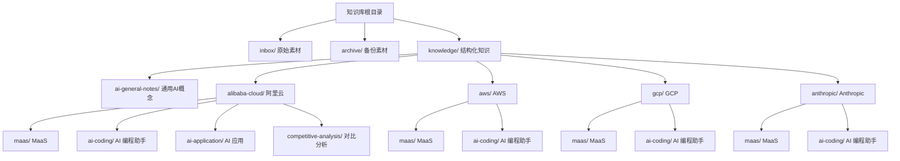
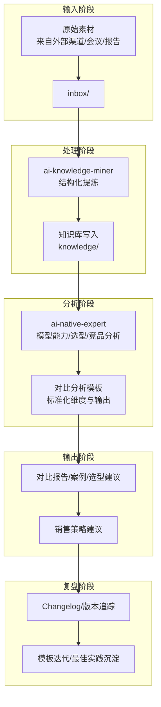
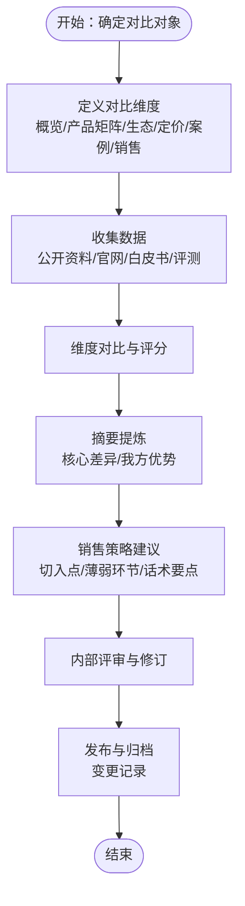
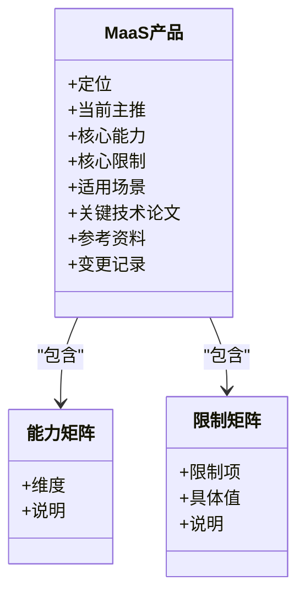
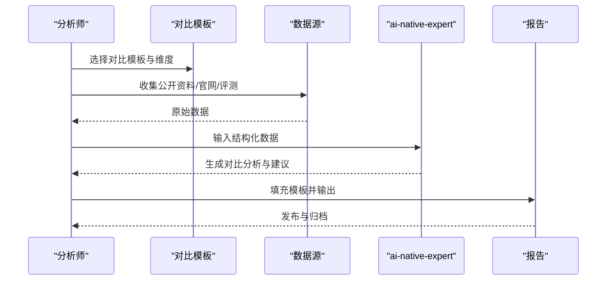
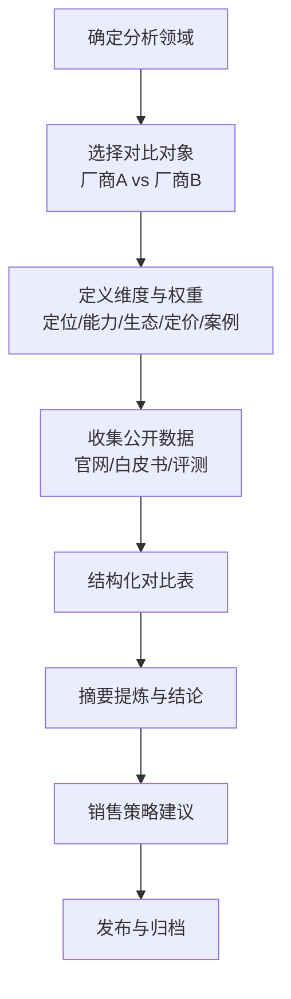
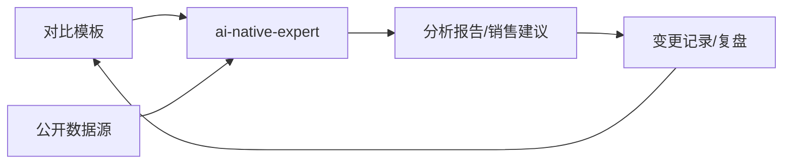

# 竞争分析系统

<cite>
**本文引用的文件**
- [README.md](file://README.md)
- [index.md](file://index.md)
- [_maas_template.md](file://knowledge/_maas_template.md)
- [alibaba-cloud/competitive-analysis/_template.md](file://knowledge/alibaba-cloud/competitive-analysis/_template.md)
- [alibaba-cloud/competitive-analysis/alibaba-vs-aws/overview.md](file://knowledge/alibaba-cloud/competitive-analysis/alibaba-vs-aws/overview.md)
- [alibaba-cloud/competitive-analysis/qoder-vs-kiro/overview.md](file://knowledge/alibaba-cloud/competitive-analysis/qoder-vs-kiro/overview.md)
- [alibaba-cloud/ai-coding/qoder.md](file://knowledge/alibaba-cloud/ai-coding/qoder.md)
- [aws/ai-coding/kiro.md](file://knowledge/aws/ai-coding/kiro.md)
- [anthropic/ai-coding/claude-code.md](file://knowledge/anthropic/ai-coding/claude-code.md)
- [gcp/ai-coding/gemini-code-assist.md](file://knowledge/gcp/ai-coding/gemini-code-assist.md)
- [alibaba-cloud/maas/overview.md](file://knowledge/alibaba-cloud/maas/overview.md)
- [aws/maas/overview.md](file://knowledge/aws/maas/overview.md)
- [gcp/maas/overview.md](file://knowledge/gcp/maas/overview.md)
- [anthropic/maas/claude-api.md](file://knowledge/anthropic/maas/claude-api.md)
- [alibaba-cloud/ai-application/qoder-work.md](file://knowledge/alibaba-cloud/ai-application/qoder-work.md)
</cite>

## 目录
1. [简介](#简介)
2. [项目结构](#项目结构)
3. [核心组件](#核心组件)
4. [架构总览](#架构总览)
5. [详细组件分析](#详细组件分析)
6. [依赖分析](#依赖分析)
7. [性能考虑](#性能考虑)
8. [故障排查指南](#故障排查指南)
9. [结论](#结论)
10. [附录](#附录)

## 简介
本项目旨在构建一套可复用、可扩展的AI竞争分析系统，围绕MaaS（模型即服务）、AI Coding（AI编程助手）、AI Application（AI应用）等关键领域，形成标准化的“采集-提炼-对比-输出”的闭环。系统通过两类Agent协同工作：ai-knowledge-miner负责将原始素材结构化沉淀至知识库；ai-native-expert聚焦于MaaS与AI Coding的模型能力、选型与竞品分析，产出高质量的对比分析与案例材料。知识库采用按厂商与领域分层的目录结构，便于跨厂商、跨平台的横向对比。

## 项目结构
知识库以“领域-厂商-产品”三层组织方式为主，辅以对比分析与模板文件，确保分析过程可复制、可追溯、可复盘。

**图示来源**
- [index.md:13-69](file://index.md#L13-L69)
- [README.md:13-20](file://README.md#L13-L20)

**章节来源**
- [README.md:1-20](file://README.md#L1-L20)
- [index.md:1-69](file://index.md#L1-L69)

## 核心组件
- 知识沉淀与结构化：ai-knowledge-miner将inbox中的原始素材提炼为脱敏、结构化的知识文档，写入knowledge对应目录，支撑后续分析。
- AI Native专家：聚焦MaaS与AI Coding的模型能力、API特性、选型建议与竞品对比，输出高质量分析材料。
- 模板与框架：提供MaaS与对比分析模板，确保分析维度、评估标准与输出格式一致。
- 跨厂商对比：以“概览对比-产品矩阵-生态合规-定价-案例-销售策略”为主线，形成标准化对比流程。
- 领域覆盖：涵盖MaaS、AI Coding、AI Application三大领域，支持多厂商并行对比。

**章节来源**
- [README.md:7-11](file://README.md#L7-L11)
- [index.md:62-68](file://index.md#L62-L68)

## 架构总览
系统采用“输入-处理-输出-复盘”的流水线式架构，结合模板与目录规范，实现跨厂商、跨平台的标准化竞争分析。

**图示来源**
- [README.md:7-11](file://README.md#L7-L11)
- [index.md:62-68](file://index.md#L62-L68)

## 详细组件分析

### 组件A：对比分析模板与标准化流程
- 模板结构：包含概览对比、核心产品矩阵、生态与合规、定价策略、客户案例、销售建议、参考资料与变更记录等模块。
- 流程规范：以“维度-数据-结论-建议”为主线，确保分析可量化、可对比、可落地。
- 质量控制：摘要区用于提炼核心差异与我方优势；变更记录用于版本追踪与复盘。

**图示来源**
- [alibaba-cloud/competitive-analysis/_template.md:1-46](file://knowledge/alibaba-cloud/competitive-analysis/_template.md#L1-L46)

**章节来源**
- [alibaba-cloud/competitive-analysis/_template.md:1-46](file://knowledge/alibaba-cloud/competitive-analysis/_template.md#L1-L46)
- [alibaba-cloud/competitive-analysis/alibaba-vs-aws/overview.md:1-46](file://knowledge/alibaba-cloud/competitive-analysis/alibaba-vs-aws/overview.md#L1-L46)

### 组件B：MaaS产品模板与评估框架
- 模板结构：包含产品定位、当前主推模型、核心能力与限制、适用场景、关键技术论文、参考资料与变更记录。
- 评估维度：定位匹配度、上下文长度、参数规模、场景适配度、技术亮点与限制项。
- 输出形态：标准化的产品卡片与能力矩阵，便于跨厂商横向比较。

**图示来源**
- [_maas_template.md:1-65](file://knowledge/_maas_template.md#L1-L65)

**章节来源**
- [_maas_template.md:1-65](file://knowledge/_maas_template.md#L1-L65)

### 组件C：AI Coding领域对比案例
- 案例一：Qoder vs Kiro（阿里云 vs AWS）
  - 对比维度：产品定位、核心功能、技术架构、性能/体验、生态集成、优劣势总结、销售推荐策略。
  - 输出形态：对比表格、优势劣势清单、销售建议。
- 案例二：Claude Code（Anthropic）在真实代码库上的先发优势与追赶者的应对。

**图示来源**
- [alibaba-cloud/competitive-analysis/qoder-vs-kiro/overview.md:1-50](file://knowledge/alibaba-cloud/competitive-analysis/qoder-vs-kiro/overview.md#L1-L50)
- [anthropic/ai-coding/claude-code.md:1-52](file://knowledge/anthropic/ai-coding/claude-code.md#L1-L52)

**章节来源**
- [alibaba-cloud/competitive-analysis/qoder-vs-kiro/overview.md:1-50](file://knowledge/alibaba-cloud/competitive-analysis/qoder-vs-kiro/overview.md#L1-L50)
- [anthropic/ai-coding/claude-code.md:1-52](file://knowledge/anthropic/ai-coding/claude-code.md#L1-L52)

### 组件D：跨厂商、跨平台对比方法
- MaaS对比：以平台定位、模型系列、上下文长度、参数规模、定价与生态为关键维度，结合官网与白皮书进行量化对比。
- AI Coding对比：以真实代码库应用、编程竞赛指标、混乱代码库处理能力、综合对比为维度，结合厂商官方评价与第三方评测。
- AI Application对比：以目标用户、定位、核心功能、生态集成、适用场景为维度，结合产品演示与客户案例。

**图示来源**
- [alibaba-cloud/competitive-analysis/_template.md:12-32](file://knowledge/alibaba-cloud/competitive-analysis/_template.md#L12-L32)

**章节来源**
- [alibaba-cloud/competitive-analysis/_template.md:12-32](file://knowledge/alibaba-cloud/competitive-analysis/_template.md#L12-L32)

### 组件E：标准化流程与质量控制机制
- 标准化流程：模板驱动、维度统一、数据来源可追溯、结论可验证、建议可执行。
- 质量控制：摘要区用于提炼核心差异与我方优势；变更记录用于版本追踪与复盘；模板迭代沉淀最佳实践。
- 输出物：对比报告、案例材料、选型建议、销售策略建议。

**章节来源**
- [alibaba-cloud/competitive-analysis/_template.md:7-10](file://knowledge/alibaba-cloud/competitive-analysis/_template.md#L7-L10)
- [alibaba-cloud/competitive-analysis/_template.md:43-46](file://knowledge/alibaba-cloud/competitive-analysis/_template.md#L43-L46)

### 组件F：分析结果解读与决策支持
- 结果解读：基于对比维度的量化差异识别优势与劣势，结合场景需求给出倾向性建议。
- 决策支持：销售策略建议包括切入点、薄弱环节与话术要点；选型建议包括定位匹配度、能力覆盖度与成本效益分析。

**章节来源**
- [alibaba-cloud/competitive-analysis/_template.md:36-39](file://knowledge/alibaba-cloud/competitive-analysis/_template.md#L36-L39)

### 组件G：实践指导与案例展示
- 实战案例：Qoder vs Kiro、Claude Code在真实代码库上的先发优势与追赶者应对。
- 实践要点：以模板为纲，以数据为据，以结论为导向，以建议为落点。

**章节来源**
- [alibaba-cloud/competitive-analysis/qoder-vs-kiro/overview.md:1-50](file://knowledge/alibaba-cloud/competitive-analysis/qoder-vs-kiro/overview.md#L1-L50)
- [anthropic/ai-coding/claude-code.md:20-41](file://knowledge/anthropic/ai-coding/claude-code.md#L20-L41)

## 依赖分析
- 组件耦合：对比模板是分析流程的契约，各领域模板（MaaS、对比分析）共同构成分析框架；ai-native-expert依赖模板与数据源完成分析输出。
- 外部依赖：厂商官网、白皮书、评测报告、第三方研究机构数据。
- 质量保障：模板约束、摘要提炼、变更记录、复盘迭代。

**图示来源**
- [alibaba-cloud/competitive-analysis/_template.md:1-46](file://knowledge/alibaba-cloud/competitive-analysis/_template.md#L1-L46)
- [anthropic/ai-coding/claude-code.md:1-52](file://knowledge/anthropic/ai-coding/claude-code.md#L1-L52)

**章节来源**
- [alibaba-cloud/competitive-analysis/_template.md:1-46](file://knowledge/alibaba-cloud/competitive-analysis/_template.md#L1-L46)
- [anthropic/ai-coding/claude-code.md:1-52](file://knowledge/anthropic/ai-coding/claude-code.md#L1-L52)

## 性能考虑
- 数据采集效率：优先使用官方白皮书与公开评测，减少重复调研成本。
- 分析自动化：在模板与数据源稳定的情况下，逐步引入结构化数据抽取与对比计算，降低人工成本。
- 复盘迭代：通过变更记录与最佳实践沉淀，持续优化模板与流程。

## 故障排查指南
- 常见问题
  - 数据缺失：优先补充官方白皮书与评测报告，必要时通过公开渠道补充。
  - 维度不一致：回到模板，统一维度与权重，确保可比性。
  - 结论漂移：通过摘要区提炼核心差异，避免细节淹没结论。
- 处理建议
  - 引入交叉验证：同一维度由多人独立校验，减少偏差。
  - 建立数据溯源：为每条结论标注来源，便于回溯与修正。
  - 模板迭代：根据实战反馈持续优化模板与流程。

**章节来源**
- [alibaba-cloud/competitive-analysis/_template.md:7-10](file://knowledge/alibaba-cloud/competitive-analysis/_template.md#L7-L10)
- [alibaba-cloud/competitive-analysis/_template.md:43-46](file://knowledge/alibaba-cloud/competitive-analysis/_template.md#L43-L46)

## 结论
本竞争分析系统以模板为纲、以流程为轴、以质量为本，覆盖MaaS、AI Coding、AI Application三大关键领域，形成可复制、可扩展、可复盘的标准化分析范式。通过跨厂商、跨平台的对比，系统能够为产品选型与战略制定提供坚实的竞争情报与决策支持。

## 附录
- 术语
  - MaaS：模型即服务，提供统一的模型接入与管理能力。
  - AI Coding：AI编程助手，提升开发者编码效率。
  - AI Application：AI应用，面向业务用户的智能化工具。
- 参考路径
  - MaaS产品模板：[_maas_template.md](file://knowledge/_maas_template.md)
  - 对比分析模板：[alibaba-cloud/competitive-analysis/_template.md](file://knowledge/alibaba-cloud/competitive-analysis/_template.md)
  - 典型对比案例：[alibaba-cloud/competitive-analysis/qoder-vs-kiro/overview.md](file://knowledge/alibaba-cloud/competitive-analysis/qoder-vs-kiro/overview.md)，[anthropic/ai-coding/claude-code.md](file://knowledge/anthropic/ai-coding/claude-code.md)
  - 领域概览：[alibaba-cloud/maas/overview.md](file://knowledge/alibaba-cloud/maas/overview.md)，[aws/maas/overview.md](file://knowledge/aws/maas/overview.md)，[gcp/maas/overview.md](file://knowledge/gcp/maas/overview.md)，[anthropic/maas/claude-api.md](file://knowledge/anthropic/maas/claude-api.md)