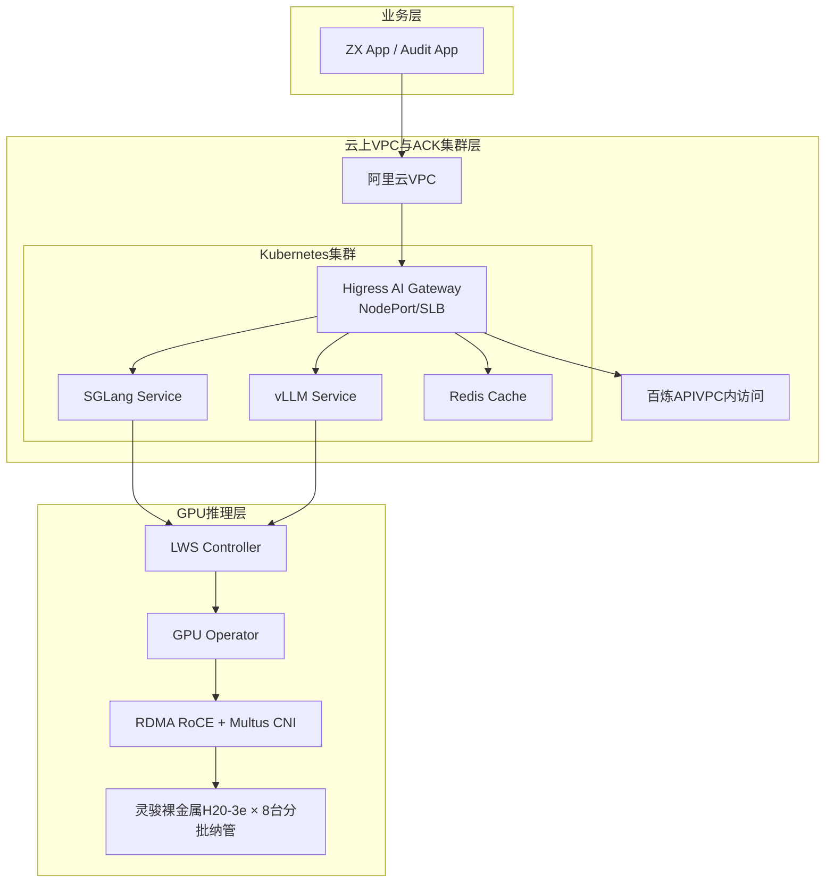
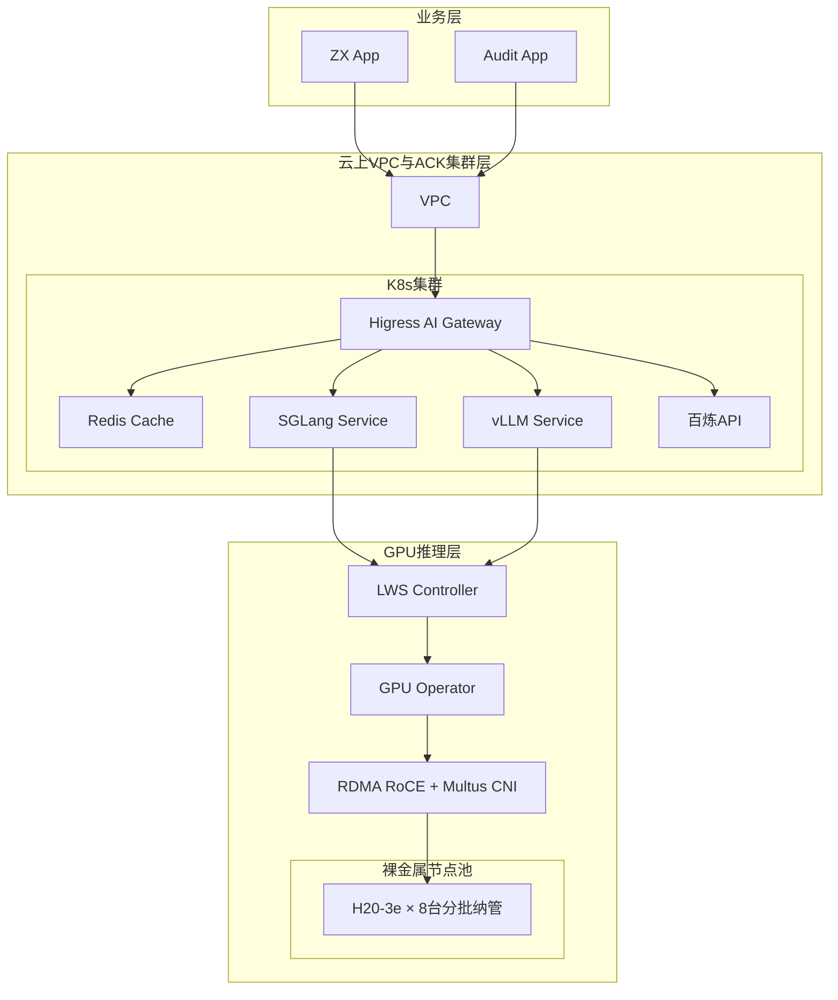
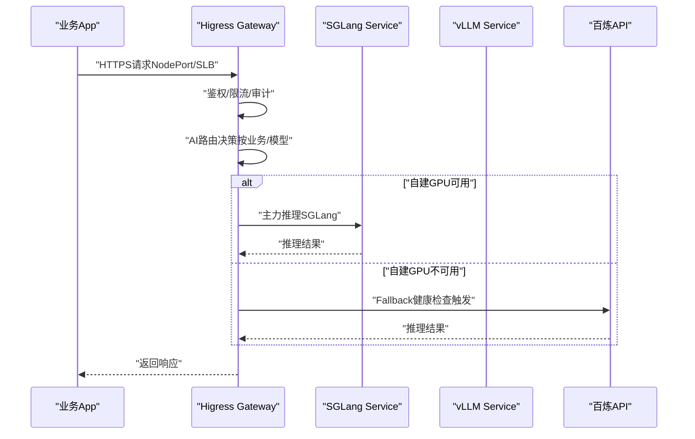
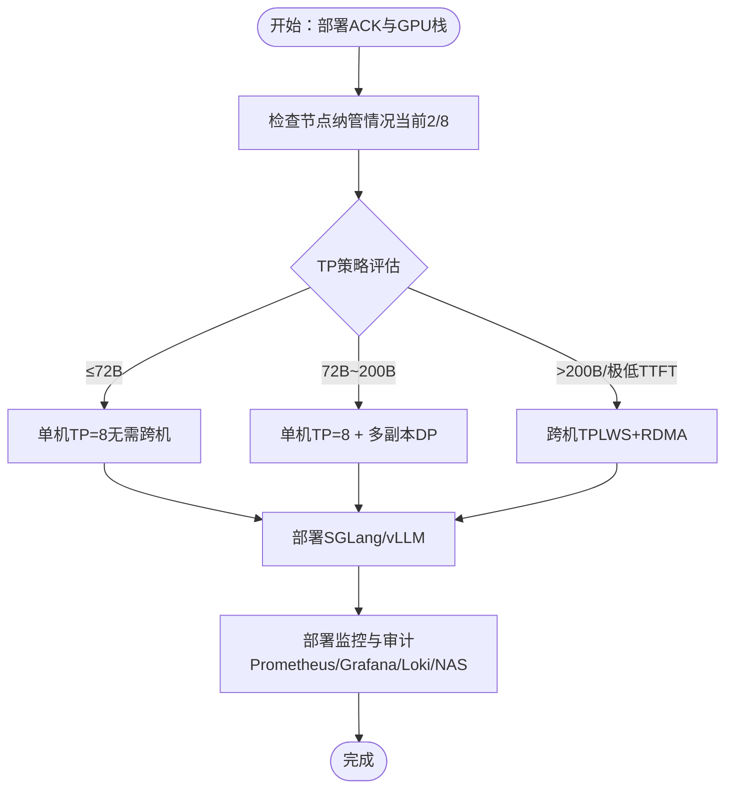
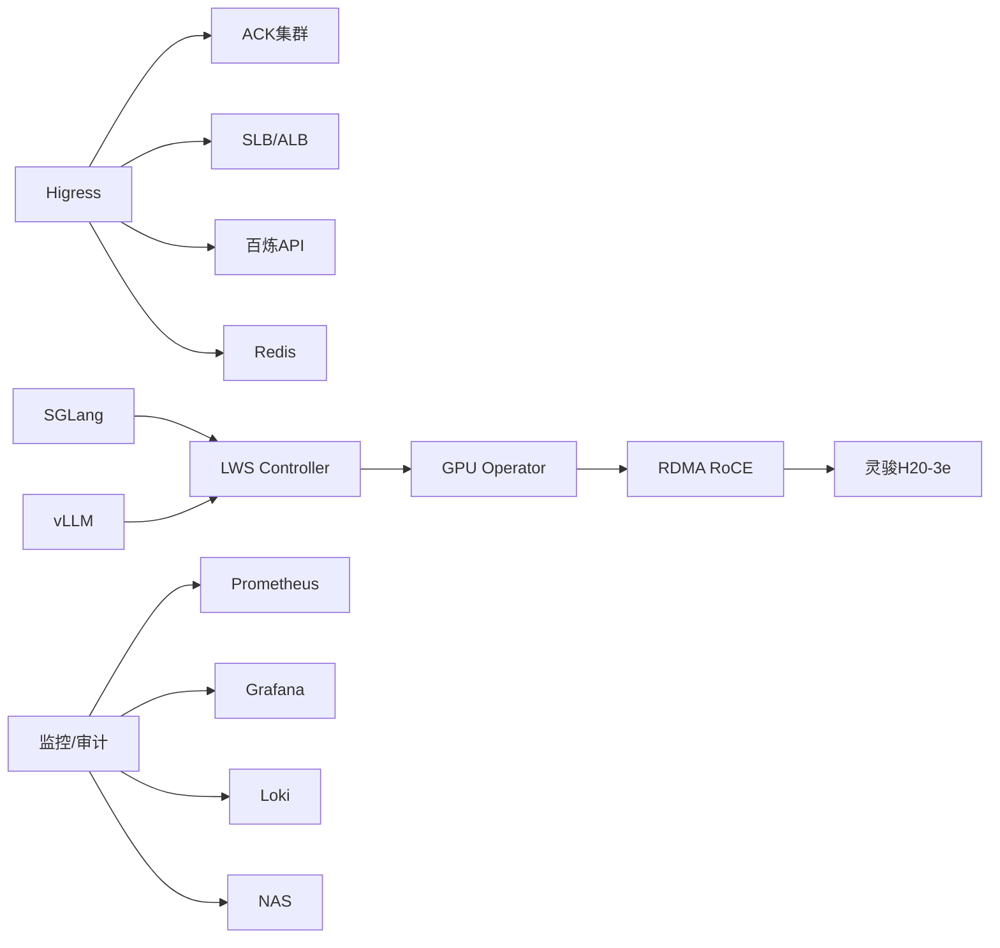

# 企业自建AI推理平台

<cite>
**本文引用的文件**
- [企业自建 AI 推理平台解决方案.md](file://knowledge/solutions/enterprise-ai-platform/overview.md)
- [企业自建 AI 推理平台 — 项目案例.html](file://knowledge/solutions/enterprise-ai-platform/case-report.html)
- [20260518.md](file://archive/20260518.md)
- [gpu-product-line.md](file://knowledge/alibaba-cloud/ai-infra/gpu-product-line.md)
- [pai.md](file://knowledge/alibaba-cloud/ai-platform/pai.md)
- [ecs-gpu.md](file://knowledge/alibaba-cloud/ai-infra/ecs-gpu.md)
- [lingjun.md](file://knowledge/alibaba-cloud/ai-infra/lingjun.md)
</cite>

## 目录
1. [简介](#简介)
2. [项目结构](#项目结构)
3. [核心组件](#核心组件)
4. [架构总览](#架构总览)
5. [详细组件分析](#详细组件分析)
6. [依赖分析](#依赖分析)
7. [性能考量](#性能考量)
8. [故障排查指南](#故障排查指南)
9. [结论](#结论)
10. [附录](#附录)

## 简介
本方案面向企业级AI应用开发商，提供从AWS迁移至阿里云的自建GPU推理平台完整实施路径。核心目标是实现统一AI网关、全链路可观测、内容合规审计、K8s统一GPU调度以及混合推理架构（自建GPU与云端API双轨）。推荐以阿里云灵骏裸金属H20为基础，结合ACK、Higress AI Gateway、SGLang/vLLM与百炼API，构建三层架构：业务层、云上VPC与ACK集群层、GPU推理层。通过分批纳管与TP策略建议，兼顾性能、成本与可运维性。

## 项目结构
该知识库围绕“企业自建AI推理平台”主题，形成“总体方案 + 标杆案例 + 历史沉淀 + 产品线选型”的结构化内容：
- 总体方案：概述需求、架构、产品组合、竞品对比、优化建议与销售策略
- 标杆案例：某ZX企业客户从AWS迁移至阿里云的实战进度与优化项
- 历史沉淀：早期版本的详细落地文档，补充组件清单、路由策略、待办事项
- 产品线选型：阿里云GPU产品线（ECS GPU、灵骏裸金属、PAI）的适用边界与搭配

图表来源
- [企业自建 AI 推理平台解决方案.md:48-127](file://knowledge/solutions/enterprise-ai-platform/overview.md#L48-L127)
- [20260518.md:40-114](file://archive/20260518.md#L40-L114)

章节来源
- [企业自建 AI 推理平台解决方案.md:15-43](file://knowledge/solutions/enterprise-ai-platform/overview.md#L15-L43)
- [企业自建 AI 推理平台 — 项目案例.html:397-436](file://knowledge/solutions/enterprise-ai-platform/case-report.html#L397-L436)

## 核心组件
- AI网关统一入口：Higress AI Gateway，提供AI路由、负载均衡、限流/鉴权、审计日志与监控，业务App无需感知后端推理引擎变更
- 自建GPU推理集群：ACK + 灵骏裸金属H20 + SGLang/vLLM，实现高性能本地推理，数据不出集群
- 云端API Fallback：百炼API，内网VPC访问，健康检查自动熔断切换，保障业务连续性
- 全链路可观测：Prometheus + Grafana + DCGM Exporter + Loki，覆盖网关→推理引擎→GPU卡级指标
- 内容合规审计：Higress审计日志+NAS持久化，满足国内监管要求
- K8s统一GPU调度：ACK + GPU Operator + LWS Controller，统一资源视图与弹性扩缩
- 跨机高性能互联：RDMA RoCE + Multus CNI + Mellanox ConnectX，按需启用Tensor Parallel跨机通信

章节来源
- [企业自建 AI 推理平台解决方案.md:31-43](file://knowledge/solutions/enterprise-ai-platform/overview.md#L31-L43)
- [企业自建 AI 推理平台解决方案.md:157-170](file://knowledge/solutions/enterprise-ai-platform/overview.md#L157-L170)
- [20260518.md:118-136](file://archive/20260518.md#L118-L136)

## 架构总览
三层架构设计强调“统一网关、混合推理双轨、全链路可观测、内容合规、高性能互联”。业务App通过Higress统一接入，流量根据业务与模型类型路由至SGLang/vLLM或百炼API；GPU侧通过GPU Operator/LWS/RDMA实现统一调度与跨机互联；监控与审计贯穿全链路，NAS提供持久化存储。

图表来源
- [企业自建 AI 推理平台解决方案.md:48-127](file://knowledge/solutions/enterprise-ai-platform/overview.md#L48-L127)
- [20260518.md:40-114](file://archive/20260518.md#L40-L114)

## 详细组件分析

### AI网关（Higress）统一入口
- 组件职责：统一接入点、AI路由、负载均衡、限流/鉴权、审计日志、监控
- 部署形态：ECS普通节点池，Helm v2.1.9，NodePort对外暴露
- 运行现状：控制面2副本HA，数据面当前1副本（单点风险），自带Prometheus/Grafana/Loki
- 优化建议：扩容至2-3副本+反亲和+SLB四层负载；明确百炼Fallback触发条件（健康检查/限流降级/熔断）

图表来源
- [企业自建 AI 推理平台解决方案.md:129-136](file://knowledge/solutions/enterprise-ai-platform/overview.md#L129-L136)
- [20260518.md:227-256](file://archive/20260518.md#L227-L256)

章节来源
- [企业自建 AI 推理平台解决方案.md:35-36](file://knowledge/solutions/enterprise-ai-platform/overview.md#L35-L36)
- [20260518.md:120-150](file://archive/20260518.md#L120-L150)

### 自建GPU推理集群（ACK + 灵骏H20 + SGLang/vLLM）
- 节点规划：3控制面ECS + 2业务节点ECS + 8台灵骏H20-3e（分批纳管）
- 硬件规格：Hopper CC 9.0、CUDA 13.0、驱动580.105、单机8卡×141GB HBM3
- 网络配置：Calico主网卡 + Multus macvlan网卡（ens4f0/RDMA RoCE）
- 编排与调度：GPU Operator + LWS Controller（LeaderWorkerSet）+ RDMA Shared Device Plugin
- 推理框架：SGLang（主）/ vLLM（辅），支持多副本DP与TP策略

图表来源
- [企业自建 AI 推理平台解决方案.md:147-154](file://knowledge/solutions/enterprise-ai-platform/overview.md#L147-L154)
- [20260518.md:151-198](file://archive/20260518.md#L151-L198)

章节来源
- [企业自建 AI 推理平台解决方案.md:137-154](file://knowledge/solutions/enterprise-ai-platform/overview.md#L137-L154)
- [20260518.md:151-198](file://archive/20260518.md#L151-L198)

### 云端API Fallback（百炼API）
- 作用：自建GPU不可用时自动切换，保障业务连续性
- 接入方式：VPC内访问，健康检查触发熔断降级
- 优化建议：明确触发条件（超时N次/队列深度/错误率），避免“双轨冷备”

章节来源
- [企业自建 AI 推理平台解决方案.md:37-37](file://knowledge/solutions/enterprise-ai-platform/overview.md#L37-L37)
- [20260518.md:365-374](file://archive/20260518.md#L365-L374)

### 全链路可观测与内容合规
- 可观测：Prometheus（集群级2副本）+ Grafana + DCGM Exporter + Loki（Higress自带+集群级）
- 合规：Higress审计日志+NAS持久化，支持按App维度访问控制与操作审计
- 优化建议：收敛两套Prometheus为一套；明确审计日志容量与保留策略

章节来源
- [企业自建 AI 推理平台解决方案.md:38-42](file://knowledge/solutions/enterprise-ai-platform/overview.md#L38-L42)
- [20260518.md:273-287](file://archive/20260518.md#L273-L287)

### K8s统一GPU调度与弹性扩缩
- 统一调度：ACK一套集群统一纳管ECS+灵骏裸金属+百炼API
- 弹性扩缩：HPA策略（GPU利用率/Token用量/队列深度）按推理负载自动扩缩
- 优化建议：RDMA DP nodeSelector仅调度到GPU节点；GPU成本归集用于业务定价

章节来源
- [企业自建 AI 推理平台解决方案.md:40-42](file://knowledge/solutions/enterprise-ai-platform/overview.md#L40-L42)
- [20260518.md:399-403](file://archive/20260518.md#L399-L403)

## 依赖分析
- 产品组合依赖关系
  - Higress依赖ACK集群与SLB/ALB
  - SGLang/vLLM依赖GPU Operator/LWS/RDMA
  - 百炼API依赖VPC内访问与健康检查
  - 监控与审计依赖Prometheus/Grafana/Loki/NAS
- 耦合与风险
  - Higress数据面单副本存在单点风险
  - DCGM Exporter DaemonSet AVAILABLE=0，需确认探针配置
  - RDMA Shared DP当前包含ECS节点，应加nodeSelector仅调度到GPU节点

图表来源
- [企业自建 AI 推理平台解决方案.md:157-170](file://knowledge/solutions/enterprise-ai-platform/overview.md#L157-L170)
- [20260518.md:199-216](file://archive/20260518.md#L199-L216)

章节来源
- [企业自建 AI 推理平台解决方案.md:157-170](file://knowledge/solutions/enterprise-ai-platform/overview.md#L157-L170)
- [20260518.md:291-316](file://archive/20260518.md#L291-L316)

## 性能考量
- TP策略建议
  - ≤72B：单机TP=8，避免跨机通信开销
  - 72B~200B：单机TP=8 + 多副本DP，ROI更高
  - >200B或追求极低TTFT：跨机TP（LWS+RDMA）
- 灵骏AI扩展内核（6.8.0-aiext）对H20优化，推理性能领先通用内核
- 跨机TP代价：RDMA通信延迟、NCCL调度复杂度、故障域放大，需权衡

章节来源
- [企业自建 AI 推理平台解决方案.md:147-154](file://knowledge/solutions/enterprise-ai-platform/overview.md#L147-L154)
- [20260518.md:384-396](file://archive/20260518.md#L384-L396)

## 故障排查指南
- Higress数据面单副本（单点风险）：扩容至2-3副本+反亲和+SLB四层负载
- 百炼Fallback触发条件缺失：“双轨”即冷备，需明确健康检查/限流降级/熔断保护三档
- DCGM Exporter DaemonSet AVAILABLE=0：疑似readiness probe配置问题，需核查探针
- RDMA Shared DP包含ECS节点：添加nodeSelector仅调度到GPU节点，避免资源浪费
- 两套Prometheus独立运行：建议收敛为一套，降低运维与存储成本

章节来源
- [企业自建 AI 推理平台解决方案.md:204-208](file://knowledge/solutions/enterprise-ai-platform/overview.md#L204-L208)
- [20260518.md:293-310](file://archive/20260518.md#L293-L310)

## 结论
通过统一网关、混合推理双轨、全链路可观测与内容合规、K8s统一GPU调度与弹性扩缩，以及按需启用的高性能互联，企业可在阿里云上构建稳定、可控且具备成本优势的自建GPU推理平台。建议以灵骏H20为基础，结合ACK、Higress、SGLang/vLLM与百炼API，分批纳管节点并明确TP策略与Fallback触发条件，持续优化监控与审计体系，确保平台在合规前提下实现高性能与高可用。

## 附录

### 标杆案例：某ZX企业客户（2026年5月）
- 背景：从AWS H20集群迁移至阿里云，运营ZX App与Audit App两条业务线
- 架构实施：ACK集群（3Master+4Worker ECS+2灵骏GPU节点）+ Higress v2.1.9 + GPU栈全栈就绪 + Prometheus（HA双副本）+ Loki（10TB）+ NAS存储
- 当前进度：已完成集群搭建、GPU节点接入（2/8）、Higress全组件部署、监控体系；SGLang部署与Higress路由配置进行中；剩余6台GPU节点纳管、百炼API Fallback接入、HPA弹性伸缩规划中
- 关键优化项：Higress Gateway扩至2-3副本+反亲和+SLB；明确百炼Fallback触发条件；DCGM Exporter探针问题；RDMA DP nodeSelector优化

章节来源
- [企业自建 AI 推理平台解决方案.md:186-209](file://knowledge/solutions/enterprise-ai-platform/overview.md#L186-L209)
- [企业自建 AI 推理平台 — 项目案例.html:666-720](file://knowledge/solutions/enterprise-ai-platform/case-report.html#L666-L720)

### 产品组合与竞品对比
- 产品组合推荐：Higress AI Gateway、灵骏H20-3e、SGLang/vLLM、ACK托管版、RDMA RoCE+Multus CNI、百炼API、Redis、NAS、Prometheus/Grafana/DCGM/Loki
- 与AWS原方案对比：统一网关、全链路可观测、内容合规、K8s统一GPU调度、混合推理双轨、灵骏AI扩展内核优化

章节来源
- [企业自建 AI 推理平台解决方案.md:157-183](file://knowledge/solutions/enterprise-ai-platform/overview.md#L157-L183)
- [20260518.md:17-26](file://archive/20260518.md#L17-L26)

### 产品线选型：ECS GPU vs 灵骏 vs PAI
- ECS GPU：虚拟化实例，部分规格支持NVLink/RoCE，适合轻量推理与开发测试
- 灵骏：裸金属GPU集群，IB/eRDMA全支持，适合H200/H20-141G等大卡场景
- PAI：PaaS平台，自动调度底层资源，适合零运维需求与全流程MLOps
- 搭配建议：PAI+灵骏（平台+底座）、ECS GPU+百炼（推理+MaaS）

章节来源
- [gpu-product-line.md:16-93](file://knowledge/alibaba-cloud/ai-infra/gpu-product-line.md#L16-L93)
- [ecs-gpu.md:1-9](file://knowledge/alibaba-cloud/ai-infra/ecs-gpu.md#L1-L9)
- [lingjun.md:1-9](file://knowledge/alibaba-cloud/ai-infra/lingjun.md#L1-L9)
- [pai.md:1-9](file://knowledge/alibaba-cloud/ai-platform/pai.md#L1-L9)