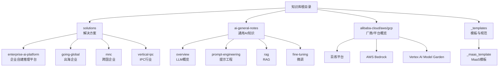
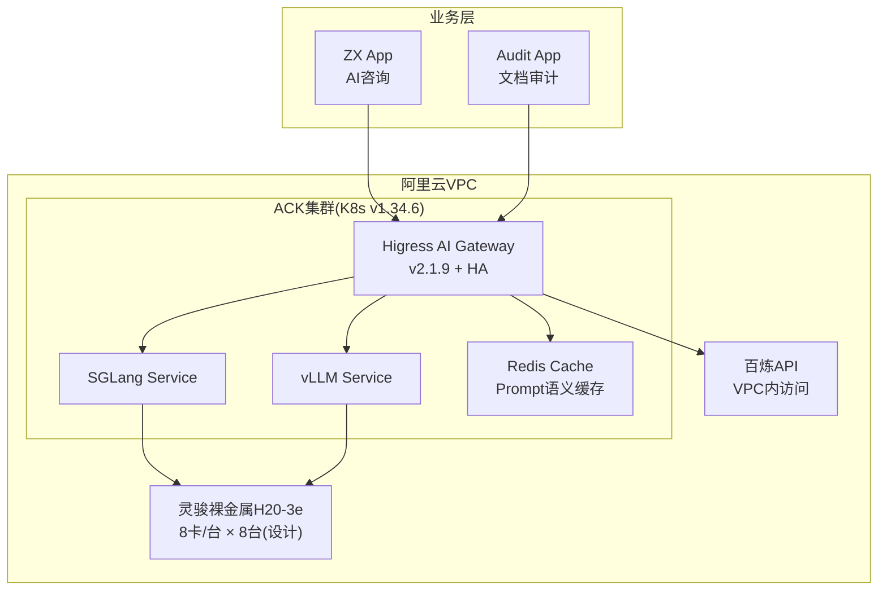
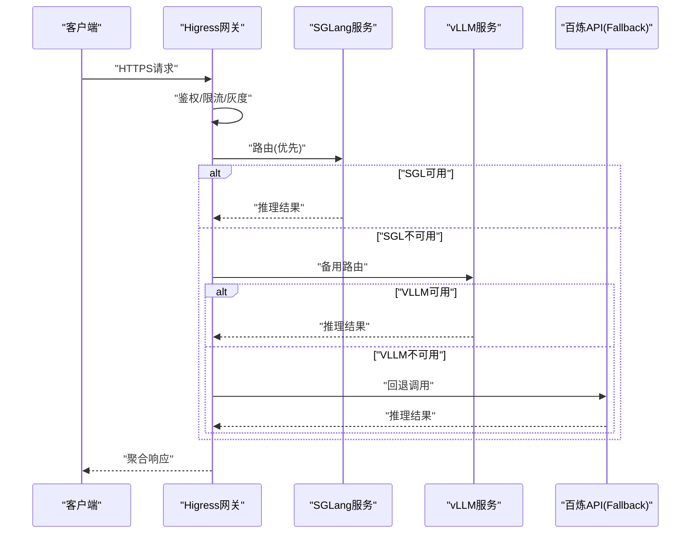
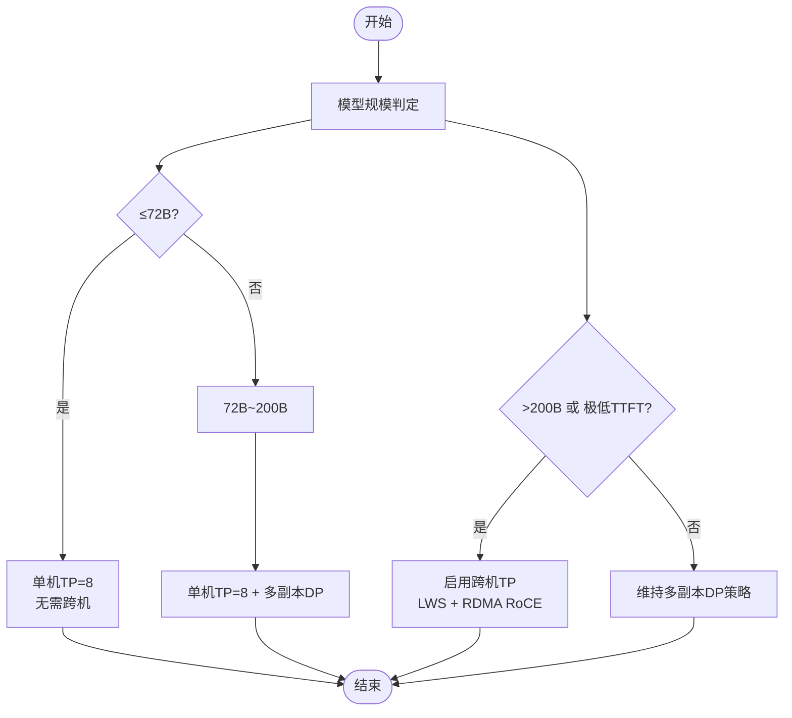
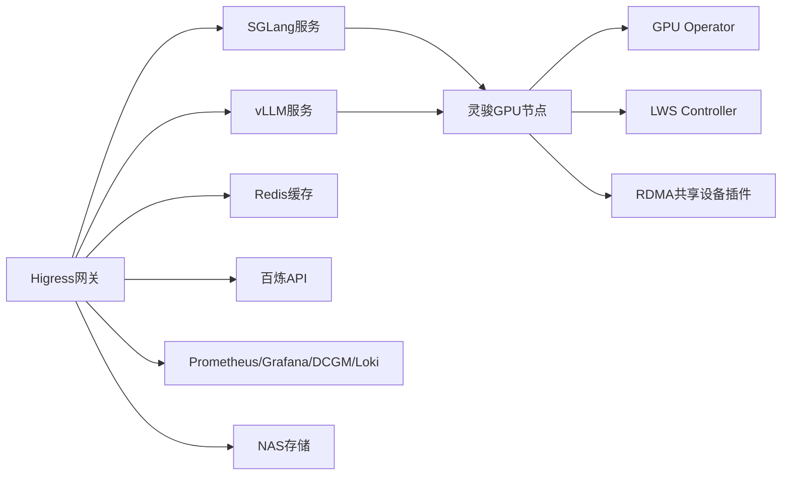

# 出海业务AI解决方案

<cite>
**本文引用的文件**   
- [README.md](file://README.md)
- [企业自建 AI 推理平台解决方案](file://knowledge/solutions/enterprise-ai-platform/overview.md)
- [企业自建 AI 推理平台 — 项目案例](file://knowledge/solutions/enterprise-ai-platform/case-report.html)
- [出海企业（Going Global）解决方案分析](file://knowledge/solutions/going-global/overview.md)
- [MNC（跨国企业）解决方案分析](file://knowledge/solutions/mnc/overview.md)
- [LLM 概览](file://knowledge/ai-general-notes/overview.md)
- [Fine-tuning](file://knowledge/ai-general-notes/fine-tuning.md)
- [RAG](file://knowledge/ai-general-notes/rag.md)
- [Prompt Engineering](file://knowledge/ai-general-notes/prompt-engineering.md)
- [百炼平台](file://knowledge/alibaba-cloud/maas/overview.md)
- [AWS Bedrock](file://knowledge/aws/maas/overview.md)
- [Vertex AI Model Garden](file://knowledge/gcp/maas/overview.md)
- [IPC 智能安防行业解决方案](file://knowledge/solutions/vertical-ipc/overview.md)
- [_maas_template.md](file://knowledge/_maas_template.md)
- [Qoder vs Trae 生态与合规](file://knowledge/alibaba-cloud/competitive-analysis/qoder-vs-trae/overview.md)
</cite>

## 目录
1. [简介](#简介)
2. [项目结构](#项目结构)
3. [核心组件](#核心组件)
4. [架构总览](#架构总览)
5. [详细组件分析](#详细组件分析)
6. [依赖分析](#依赖分析)
7. [性能考量](#性能考量)
8. [故障排查指南](#故障排查指南)
9. [结论](#结论)
10. [附录](#附录)

## 简介
本文件面向“出海业务”的AI解决方案，系统梳理多语言支持、跨文化适配、本地化部署、合规要求等关键要素，结合企业自建推理平台的实战案例，总结全球化部署的技术架构与实施策略，并提供经验总结与风险控制建议，帮助在不同地区平衡全球统一性与本地化需求。

## 项目结构
该知识库以“解决方案 + 通用AI知识 + 厂商/平台模板”为主线组织内容，便于快速定位出海所需的架构、合规与实施要点。

**图表来源**
- [README.md:13-19](file://README.md#L13-L19)
- [企业自建 AI 推理平台解决方案:1-273](file://knowledge/solutions/enterprise-ai-platform/overview.md#L1-L273)
- [出海企业（Going Global）解决方案分析:1-53](file://knowledge/solutions/going-global/overview.md#L1-L53)
- [MNC（跨国企业）解决方案分析:1-53](file://knowledge/solutions/mnc/overview.md#L1-L53)
- [LLM 概览:1-42](file://knowledge/ai-general-notes/overview.md#L1-L42)
- [百炼平台:1-9](file://knowledge/alibaba-cloud/maas/overview.md#L1-L9)
- [AWS Bedrock:1-9](file://knowledge/aws/maas/overview.md#L1-L9)
- [Vertex AI Model Garden:1-9](file://knowledge/gcp/maas/overview.md#L1-L9)

**章节来源**
- [README.md:1-20](file://README.md#L1-L20)

## 核心组件
- 统一AI网关（Higress AI Gateway）：统一入口、路由、鉴权、审计、灰度与熔断，支撑混合推理双轨。
- 自建GPU推理集群（ACK + 灵骏裸金属 + SGLang/vLLM）：高性能本地推理，数据不出境，满足合规与低延迟。
- 云端API回退（百炼 API）：在自建不可用时自动切换，保障业务连续性。
- 全链路可观测（Prometheus + Grafana + DCGM + Loki）：从网关到GPU卡级指标一体化。
- 内容合规（全量Prompt/Response审计 + NAS持久化）：满足国内监管要求。
- 跨机高性能互联（RDMA RoCE + Multus CNI）：按需启用，保障TP通信性能。
- 多业务App资源隔离（Higress限流 + SGLang硬隔离）：避免相互阻塞。

**章节来源**
- [企业自建 AI 推理平台解决方案:31-43](file://knowledge/solutions/enterprise-ai-platform/overview.md#L31-L43)
- [企业自建 AI 推理平台 — 项目案例:440-496](file://knowledge/solutions/enterprise-ai-platform/case-report.html#L440-L496)

## 架构总览
下图展示“统一网关 + 自建GPU + 云端回退”的混合推理架构，强调合规、可观测与高可用。

**图表来源**
- [企业自建 AI 推理平台解决方案:46-127](file://knowledge/solutions/enterprise-ai-platform/overview.md#L46-L127)
- [企业自建 AI 推理平台 — 项目案例:503-568](file://knowledge/solutions/enterprise-ai-platform/case-report.html#L503-L568)

## 详细组件分析

### 组件A：统一AI网关（Higress）
- 职责：统一接入点、AI路由、限流/鉴权、审计日志、灰度发布、熔断降级。
- 设计原则：所有LLM请求经网关，业务App无需感知后端推理引擎变更。
- 优化建议：Gateway副本扩容至2-3副本+反亲和+SLB四层负载；明确Fallback触发条件（健康检查/队列深度/错误率三档）。

**图表来源**
- [企业自建 AI 推理平台解决方案:129-135](file://knowledge/solutions/enterprise-ai-platform/overview.md#L129-L135)
- [企业自建 AI 推理平台 — 项目案例:666-720](file://knowledge/solutions/enterprise-ai-platform/case-report.html#L666-L720)

**章节来源**
- [企业自建 AI 推理平台解决方案:129-135](file://knowledge/solutions/enterprise-ai-platform/overview.md#L129-L135)
- [企业自建 AI 推理平台 — 项目案例:708-720](file://knowledge/solutions/enterprise-ai-platform/case-report.html#L708-L720)

### 组件B：自建GPU推理集群（ACK + 灵骏裸金属 + SGLang/vLLM）
- 节点规划：控制面3节点、业务节点2台、GPU推理节点8台（设计，分批纳管）。
- 跨机互联：RDMA RoCE + Multus CNI + Mellanox NIC，按需启用。
- TP策略：≤72B单机TP=8；72B~200B采用单机TP+多副本DP；>200B或追求极低TTFT才启用跨机TP。

**图表来源**
- [企业自建 AI 推理平台解决方案:147-153](file://knowledge/solutions/enterprise-ai-platform/overview.md#L147-L153)

**章节来源**
- [企业自建 AI 推理平台解决方案:137-146](file://knowledge/solutions/enterprise-ai-platform/overview.md#L137-L146)
- [企业自建 AI 推理平台解决方案:147-153](file://knowledge/solutions/enterprise-ai-platform/overview.md#L147-L153)

### 组件C：云端API回退（百炼API）
- 作用：在自建推理不可用时自动切换，保障业务连续性。
- 建议：明确健康检查超时次数、队列深度阈值、错误率熔断三档触发条件，避免“双轨冷备”。

**章节来源**
- [企业自建 AI 推理平台解决方案:204-208](file://knowledge/solutions/enterprise-ai-platform/overview.md#L204-L208)
- [企业自建 AI 推理平台 — 项目案例:708-720](file://knowledge/solutions/enterprise-ai-platform/case-report.html#L708-L720)

### 组件D：全链路可观测（Prometheus + Grafana + DCGM + Loki）
- 目标：从网关到GPU卡级指标一体化，避免监控散装拼凑。
- 建议：收敛两套Prometheus为一套集群级ServiceMonitor；完善DCGM Exporter配置。

**章节来源**
- [企业自建 AI 推理平台解决方案:38-42](file://knowledge/solutions/enterprise-ai-platform/overview.md#L38-L42)
- [企业自建 AI 推理平台 — 项目案例:768-793](file://knowledge/solutions/enterprise-ai-platform/case-report.html#L768-L793)

### 组件E：内容合规（审计日志 + NAS持久化）
- 要点：全量Prompt/Response审计，NAS持久化，满足国内监管；按App维度访问控制。
- 建议：明确合规存储范围（全量/元数据+异常全量），评估容量与成本。

**章节来源**
- [企业自建 AI 推理平台解决方案:39-42](file://knowledge/solutions/enterprise-ai-platform/overview.md#L39-L42)
- [企业自建 AI 推理平台 — 项目案例:768-793](file://knowledge/solutions/enterprise-ai-platform/case-report.html#L768-L793)

### 组件F：多业务App资源隔离
- 策略：早期软隔离（Higress限流配额），业务量大后考虑SGLang硬隔离或多实例部署。

**章节来源**
- [企业自建 AI 推理平台解决方案:42-42](file://knowledge/solutions/enterprise-ai-platform/overview.md#L42-L42)

## 依赖分析
- 产品组合与依赖关系
  - Higress网关依赖ACK集群、Redis缓存、百炼API回退。
  - 自建GPU推理依赖GPU Operator、LWS Controller、RDMA共享设备插件。
  - 可观测依赖Prometheus/Grafana/DCGM/Loki。
  - 存储依赖NAS（RWX静态PV）与动态供给。

**图表来源**
- [企业自建 AI 推理平台解决方案:157-169](file://knowledge/solutions/enterprise-ai-platform/overview.md#L157-L169)
- [企业自建 AI 推理平台 — 项目案例:641-664](file://knowledge/solutions/enterprise-ai-platform/case-report.html#L641-L664)

**章节来源**
- [企业自建 AI 推理平台解决方案:157-169](file://knowledge/solutions/enterprise-ai-platform/overview.md#L157-L169)

## 性能考量
- 推理性能优化
  - 灵骏AI扩展内核（6.8.0-aiext）针对H20优化，推理性能领先通用内核。
  - SGLang/vLLM版本与CUDA/驱动版本匹配，确保稳定性与性能。
- 网络与TP
  - RDMA RoCE仅在必要时启用，避免跨机通信开销；≤72B模型优先单机TP。
- 成本与弹性
  - HPA弹性伸缩策略、GPU成本归集（DCGM+业务标签）支撑精细化定价与成本核算。

**章节来源**
- [企业自建 AI 推理平台解决方案:211-238](file://knowledge/solutions/enterprise-ai-platform/overview.md#L211-L238)
- [企业自建 AI 推理平台 — 项目案例:768-793](file://knowledge/solutions/enterprise-ai-platform/case-report.html#L768-L793)

## 故障排查指南
- 常见问题与处理
  - Higress Gateway单副本风险：扩至2-3副本+反亲和+SLB四层负载。
  - 百炼Fallback触发条件不明：明确健康检查/队列深度/错误率三档。
  - DCGM Exporter可用性为0：检查readiness probe配置。
  - RDMA共享设备插件调度到非GPU节点：增加nodeSelector仅调度到GPU节点。
- 实施进度与优化建议
  - 已完成：集群搭建、GPU节点接入、Higress部署、监控体系。
  - 进行中：SGLang部署、Higress路由配置。
  - 规划中：剩余GPU节点纳管、百炼API回退接入、HPA弹性策略。

**章节来源**
- [企业自建 AI 推理平台解决方案:204-208](file://knowledge/solutions/enterprise-ai-platform/overview.md#L204-L208)
- [企业自建 AI 推理平台 — 项目案例:666-720](file://knowledge/solutions/enterprise-ai-platform/case-report.html#L666-L720)

## 结论
- 出海AI解决方案的关键在于：统一网关、混合推理双轨、全链路可观测、内容合规与跨机高性能互联。
- 通过企业自建推理平台的实战案例，可复用“统一网关 + 自建GPU + 云端回退”的架构，兼顾性能、成本与合规。
- 在不同地区落地时，应结合当地法规与市场特点，平衡全球统一性与本地化需求，持续优化TP策略与成本归集。

## 附录

### 出海企业与跨国企业解决方案要点
- 出海企业（Going Global）：海外拓展、全球化基础设施、合规压力与成本优化。
- 跨国企业（MNC）：多区域部署、合规要求高、预算规模区间与客群画像。

**章节来源**
- [出海企业（Going Global）解决方案分析:1-53](file://knowledge/solutions/going-global/overview.md#L1-L53)
- [MNC（跨国企业）解决方案分析:1-53](file://knowledge/solutions/mnc/overview.md#L1-L53)

### 通用AI知识与方法论
- LLM概览、Prompt Engineering、RAG、Fine-tuning：为出海AI应用提供方法论支撑，降低幻觉、提升可控性与可信度。

**章节来源**
- [LLM 概览:1-42](file://knowledge/ai-general-notes/overview.md#L1-L42)
- [Prompt Engineering:1-193](file://knowledge/ai-general-notes/prompt-engineering.md#L1-L193)
- [RAG:1-42](file://knowledge/ai-general-notes/rag.md#L1-L42)
- [Fine-tuning:1-42](file://knowledge/ai-general-notes/fine-tuning.md#L1-L42)

### MaaS平台与合规对比
- 百炼平台、AWS Bedrock、Vertex AI Model Garden：提供统一模型访问与合规能力，满足不同区域监管要求。
- Qoder vs Trae：在数据隐私、企业合规、模型合规与定价策略上的差异，可作为出海选型参考。

**章节来源**
- [百炼平台:1-9](file://knowledge/alibaba-cloud/maas/overview.md#L1-L9)
- [AWS Bedrock:1-9](file://knowledge/aws/maas/overview.md#L1-L9)
- [Vertex AI Model Garden:1-9](file://knowledge/gcp/maas/overview.md#L1-L9)
- [Qoder vs Trae 生态与合规:132-164](file://knowledge/alibaba-cloud/competitive-analysis/qoder-vs-trae/overview.md#L132-L164)

### IPC行业全球化部署参考
- 全球化部署（出海IPC品牌低延迟）：全球加速GA + CDN + 多Region百炼API，为出海业务提供网络与区域化部署思路。

**章节来源**
- [IPC 智能安防行业解决方案:40](file://knowledge/solutions/vertical-ipc/overview.md#L40)

### MaaS模板与标准化
- MaaS模板：统一模型系列命名、能力与限制、适用场景与关键技术论文，便于出海标准化交付。

**章节来源**
- [_maas_template.md:1-65](file://knowledge/_maas_template.md#L1-L65)