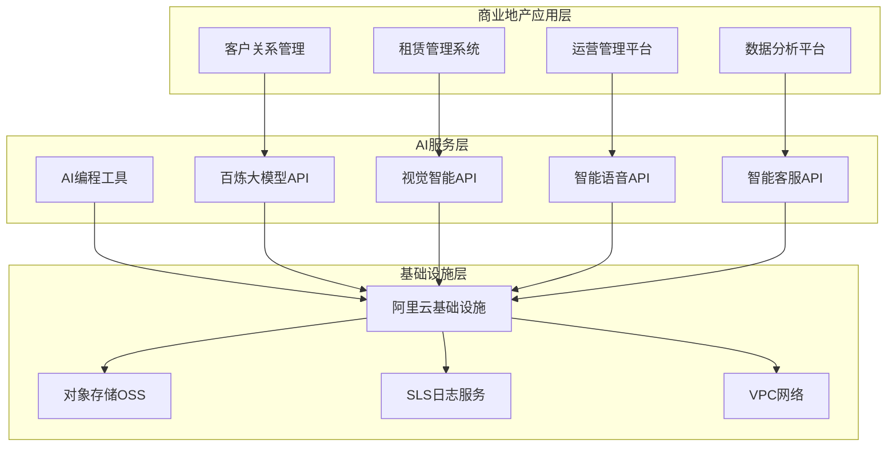
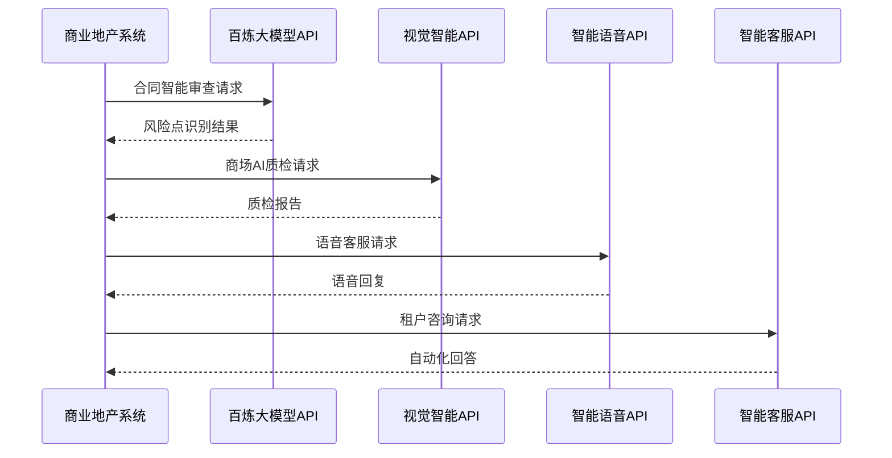
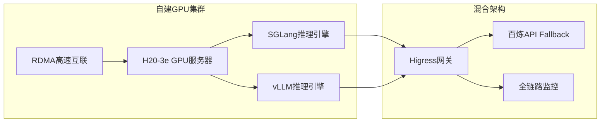
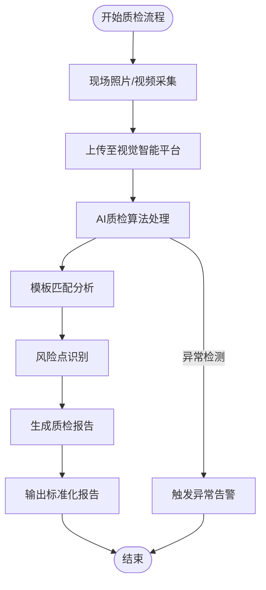
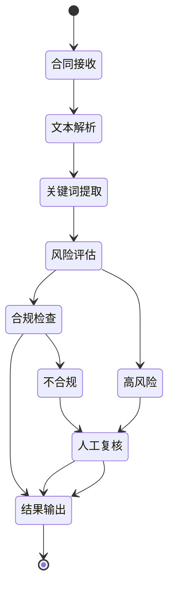
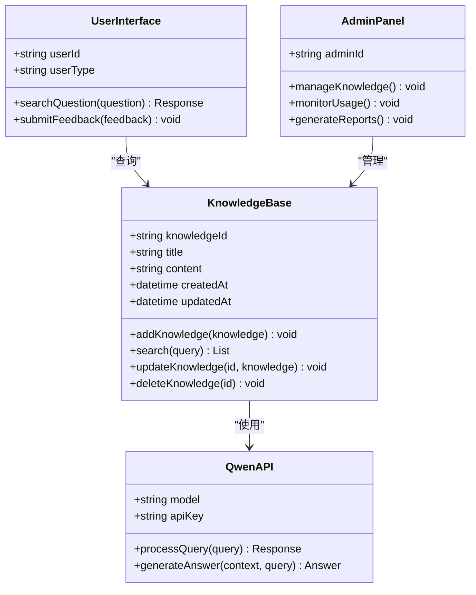
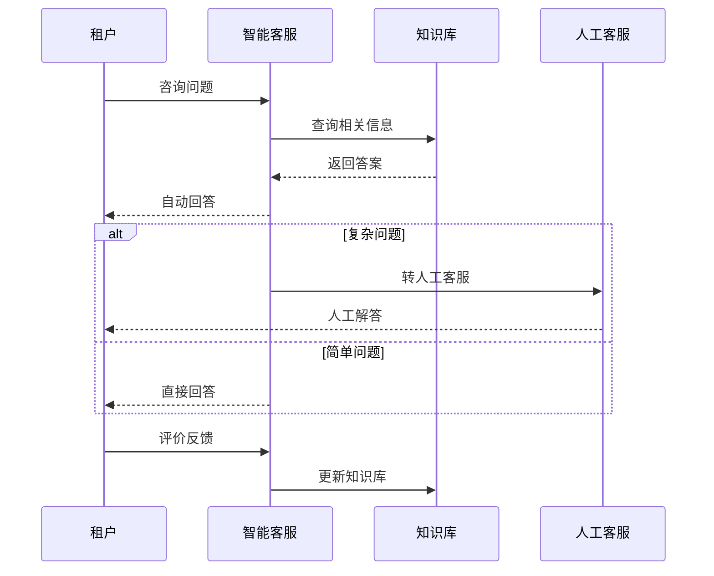
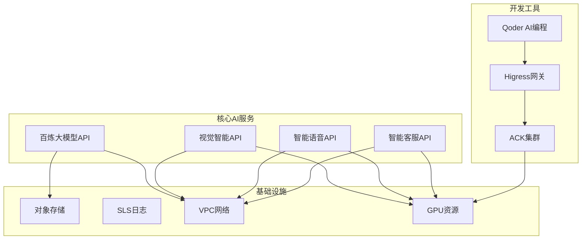

# 商业地产AI应用

<cite>
**本文档引用的文件**
- [商业地产行业AI解决方案](file://knowledge/solutions/commercial-real-estate/overview.md)
- [企业自建AI推理平台解决方案](file://knowledge/solutions/enterprise-ai-platform/overview.md)
- [企业自建AI推理平台-项目案例](file://knowledge/solutions/enterprise-ai-platform/case-report.html)
- [AI应用概览](file://knowledge/ai-general-notes/overview.md)
- [阿里云"龙虾家族"AI Agent产品全景](file://knowledge/alibaba-cloud/ai-application/claw-family.md)
</cite>

## 目录
1. [简介](#简介)
2. [项目结构](#项目结构)
3. [核心组件](#核心组件)
4. [架构概览](#架构概览)
5. [详细组件分析](#详细组件分析)
6. [依赖分析](#依赖分析)
7. [性能考虑](#性能考虑)
8. [故障排除指南](#故障排除指南)
9. [结论](#结论)
10. [附录](#附录)

## 简介

商业地产AI应用解决方案是一个综合性的技术架构，旨在通过人工智能技术提升商业地产（商场、购物中心、写字楼）的运营效率和客户体验。该解决方案涵盖了智能楼宇管理、客户行为分析、租赁优化、能耗管理等多个核心应用场景。

该方案基于阿里云的完整AI产品生态，包括百炼大模型平台、视觉智能开放平台、智能语音交互、智能客服以及Qoder AI编程工具。通过API调用为主的架构设计，实现了零GPU投入、按量付费、灵活扩展的部署模式。

## 项目结构

商业地产AI应用解决方案采用分层架构设计，从底层基础设施到上层应用服务形成了完整的AI生态系统：

**图表来源**
- [商业地产行业AI解决方案:88-122](file://knowledge/solutions/commercial-real-estate/overview.md#L88-L122)

**章节来源**
- [商业地产行业AI解决方案:1-50](file://knowledge/solutions/commercial-real-estate/overview.md#L1-L50)

## 核心组件

### AI产品组合架构

商业地产AI应用解决方案的核心产品组合包括五个主要层次：

#### 1. AI基础层 - 百炼大模型（qwen3.6-plus）
- **功能特性**：支持文本生成、多模态处理、代码解释器
- **计费模式**：按TOKEN消耗计费，大客户享受0.6-0.8折优惠
- **应用场景**：合同智能审查、知识库问答、数据分析助手

#### 2. AI视觉层 - 视觉智能开放平台
- **功能特性**：商场AI质检、客流统计、异常行为检测
- **计费模式**：按API调用次数计费
- **应用场景**：智能巡检、客流量分析、安全监控

#### 3. AI语音层 - 智能语音交互（TTS+ASR）
- **功能特性**：语音客服、语音导航、智能外呼
- **计费模式**：按调用时长计费
- **应用场景**：商场语音导航、租户咨询服务

#### 4. AI客服层 - 智能客服
- **功能特性**：7×24小时响应、多轮对话、问题分类
- **计费模式**：按坐席/对话次数计费
- **应用场景**：租户咨询、会员服务、投诉处理

#### 5. AI编程层 - Qoder（PPL模式）
- **功能特性**：AI编程提效、外包团队管理
- **计费模式**：¥200/人/月
- **应用场景**：AI场景落地、开发效率提升

**章节来源**
- [商业地产行业AI解决方案:111-122](file://knowledge/solutions/commercial-real-estate/overview.md#L111-L122)

## 架构概览

### API调用为主架构（推荐方案）

该架构采用"零GPU投入、按量付费、灵活扩展"的设计理念，适用于当前阶段的全部商业地产客户：

**图表来源**
- [商业地产行业AI解决方案:90-101](file://knowledge/solutions/commercial-real-estate/overview.md#L90-L101)

### GPU自建架构（未来评估方案）

当API月调用量超过50万次/日时，可评估自建GPU方案：

**图表来源**
- [企业自建AI推理平台解决方案:46-127](file://knowledge/solutions/enterprise-ai-platform/overview.md#L46-L127)

**章节来源**
- [商业地产行业AI解决方案:102-110](file://knowledge/solutions/commercial-real-estate/overview.md#L102-L110)

## 详细组件分析

### 商场AI质检系统

#### 系统架构设计

**图表来源**
- [商业地产行业AI解决方案:152-164](file://knowledge/solutions/commercial-real-estate/overview.md#L152-L164)

#### 核心功能特性
- **自动化巡检**：通过AI算法自动检查商场运营状况
- **标准化输出**：按照预设模板生成统一格式的质检报告
- **风险识别**：自动识别潜在的安全隐患和运营问题
- **效率提升**：相比人工巡检，效率提升3-5倍

**章节来源**
- [商业地产行业AI解决方案:156-157](file://knowledge/solutions/commercial-real-estate/overview.md#L156-L157)

### 合同智能审查系统

#### 审查流程设计

**图表来源**
- [商业地产行业AI解决方案:59-66](file://knowledge/solutions/commercial-real-estate/overview.md#L59-L66)

#### 审查能力
- **文本智能审查**：自动识别合同条款中的风险点
- **合规性检查**：确保合同符合法律法规要求
- **效率提升**：相比人工审查，效率提升5-8倍
- **准确性保证**：基于机器学习算法，减少人为疏漏

**章节来源**
- [商业地产行业AI解决方案:157-158](file://knowledge/solutions/commercial-real-estate/overview.md#L157-L158)

### 企业知识库系统

#### 知识管理架构

**图表来源**
- [商业地产行业AI解决方案:158-159](file://knowledge/solutions/commercial-real-estate/overview.md#L158-L159)

#### 系统特性
- **智能问答**：支持自然语言查询，提供准确答案
- **知识分类**：自动对知识内容进行分类和标签化
- **持续学习**：基于用户反馈不断优化回答质量
- **权限管理**：支持多层级的知识访问控制

**章节来源**
- [商业地产行业AI解决方案:158-159](file://knowledge/solutions/commercial-real-estate/overview.md#L158-L159)

### 智能客服系统

#### 客服流程设计

**图表来源**
- [企业自建AI推理平台解决方案:50-127](file://knowledge/solutions/enterprise-ai-platform/overview.md#L50-L127)

#### 服务能力
- **7×24小时服务**：全天候自动响应租户咨询
- **多轮对话**：支持复杂问题的多轮交互
- **情感分析**：识别用户情绪状态，调整回复策略
- **智能转接**：复杂问题自动转接人工客服

**章节来源**
- [商业地产行业AI解决方案:159-160](file://knowledge/solutions/commercial-real-estate/overview.md#L159-L160)

## 依赖分析

### 技术依赖关系

**图表来源**
- [商业地产行业AI解决方案:111-122](file://knowledge/solutions/commercial-real-estate/overview.md#L111-L122)

### 产品组合依赖

商业地产AI解决方案的产品组合具有以下依赖关系：

1. **基础依赖**：百炼大模型API是所有AI场景的基础
2. **功能互补**：视觉、语音、客服API相互补充，形成完整的服务体系
3. **开发支撑**：Qoder工具提升开发效率，支撑AI场景落地
4. **基础设施**：OSS和SLS提供数据存储和日志监控能力

**章节来源**
- [商业地产行业AI解决方案:140-151](file://knowledge/solutions/commercial-real-estate/overview.md#L140-L151)

## 性能考虑

### TOKEN消耗优化

根据行业使用模式分析，不同AI场景的TOKEN消耗量级如下：

| AI场景 | 预估调用量 | 收入贡献 | 优化建议 |
|--------|------------|----------|----------|
| 合同智能审查 | 每合同3-8次调用 | 高 | 批量处理、缓存机制 |
| 企业知识库问答 | 每日1000-5000次 | 高 | 语义缓存、智能索引 |
| 商场AI质检报告 | 每日100-500次 | 中 | 图像压缩、批量处理 |
| 智能客服 | 每日2000-10000次 | 高 | 会话复用、上下文优化 |
| 营销文案生成 | 每日500-2000次 | 中 | 模板化生成、参数优化 |
| 数据分析助手 | 每日200-1000次 | 中 | 查询优化、结果缓存 |

### 成本控制策略

1. **分层计费**：根据场景重要性和使用频率采用不同的计费策略
2. **批量处理**：对相似任务进行批量处理，减少API调用次数
3. **缓存机制**：建立多层次缓存，减少重复计算
4. **智能降级**：在高峰期自动降级非关键功能

**章节来源**
- [商业地产行业AI解决方案:55-87](file://knowledge/solutions/commercial-real-estate/overview.md#L55-L87)

## 故障排除指南

### 常见问题诊断

#### API调用失败
- **症状**：API返回错误码或超时
- **原因**：网络连接问题、API配额限制、认证失败
- **解决**：检查网络连通性、确认API配额、重新认证

#### TOKEN消耗异常
- **症状**：TOKEN消耗超出预期
- **原因**：API调用频繁、参数设置不当、缓存失效
- **解决**：优化调用频率、调整API参数、完善缓存策略

#### 性能下降
- **症状**：响应时间延长、处理速度变慢
- **原因**：并发量过大、资源不足、算法效率低
- **解决**：增加资源、优化算法、实施限流

### 监控和告警

建立完善的监控体系，包括：
- **API调用监控**：实时监控各API的调用情况
- **性能指标监控**：跟踪响应时间、成功率等关键指标
- **成本监控**：监控TOKEN消耗和费用变化
- **异常告警**：设置阈值告警，及时发现和处理问题

**章节来源**
- [企业自建AI推理平台解决方案:211-239](file://knowledge/solutions/enterprise-ai-platform/overview.md#L211-L239)

## 结论

商业地产AI应用解决方案通过构建完整的AI产品生态，为商业地产运营提供了全方位的智能化支撑。该方案具有以下优势：

1. **技术先进性**：基于阿里云领先的AI技术和产品组合
2. **部署灵活性**：支持API调用和GPU自建两种部署模式
3. **成本效益**：按量付费，零GPU投入，降低初期投资
4. **扩展性强**：支持业务快速发展和场景扩展
5. **运维简便**：云端托管，减少运维负担

随着AI技术在商业地产领域的深入应用，该解决方案将成为提升运营效率、改善客户体验、实现数字化转型的重要工具。通过持续优化和迭代，将为商业地产行业的智能化发展提供强有力的技术支撑。

## 附录

### 实施最佳实践

1. **分阶段推进**：从试点项目开始，逐步扩大应用范围
2. **数据治理**：建立完善的数据收集、存储和管理机制
3. **团队培训**：加强员工AI技能培训，提升使用效率
4. **持续优化**：基于使用反馈不断优化算法和流程
5. **安全保障**：建立完善的数据安全和隐私保护机制

### 成功案例参考

- **凯德集团**：已成功落地AI质检、合同审查、企业知识库三个场景
- **华润万象生活**：在多个商场推广AI应用，实现运营效率显著提升
- **龙湖智创生活**：通过AI技术优化客户服务体验

这些案例证明了AI技术在商业地产领域的巨大潜力和应用价值。