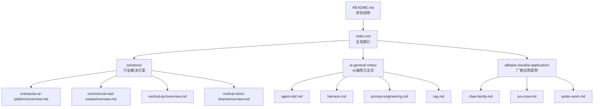
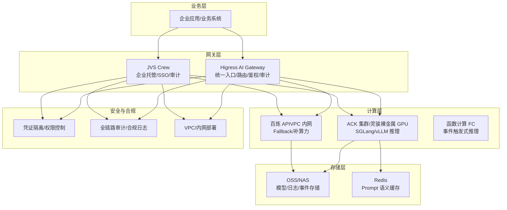
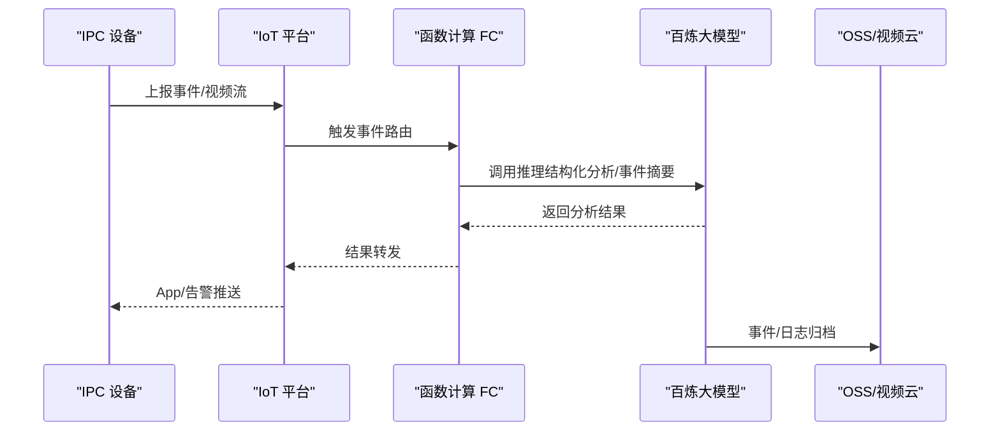
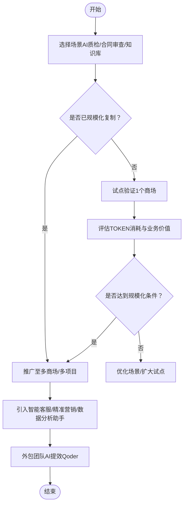
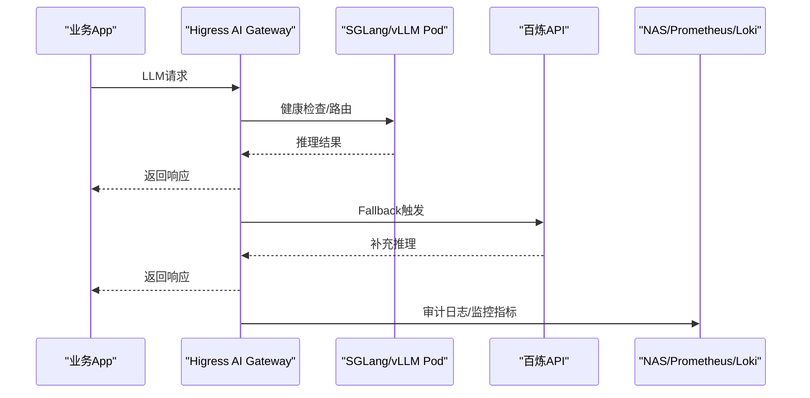
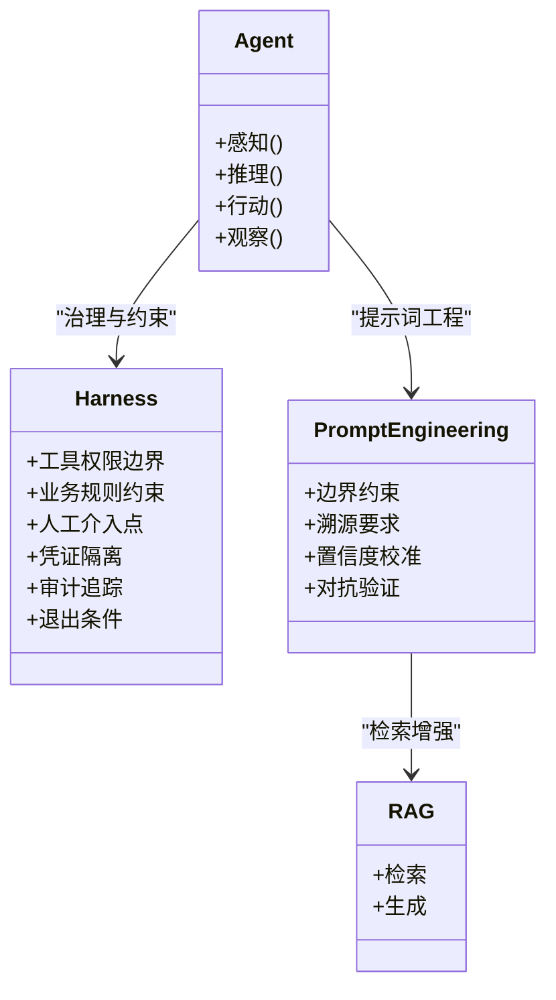
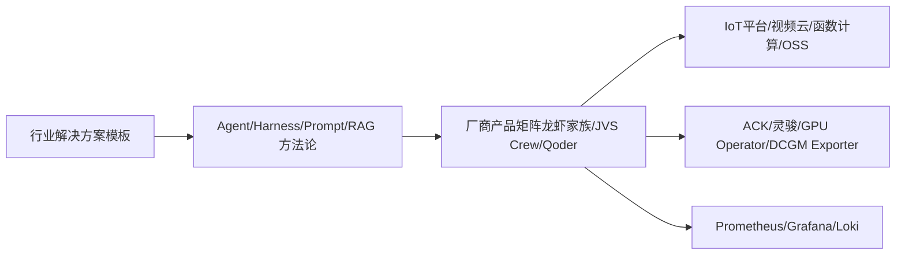

# 垂直行业应用案例

<cite>
**本文引用的文件**
- [README.md](file://README.md)
- [index.md](file://index.md)
- [解决方案模板](file://knowledge/solutions/_template.md)
- [企业自建 AI 推理平台解决方案](file://knowledge/solutions/enterprise-ai-platform/overview.md)
- [商业地产行业解决方案](file://knowledge/solutions/commercial-real-estate/overview.md)
- [IPC 智能安防行业解决方案](file://knowledge/solutions/vertical-ipc/overview.md)
- [短剧出海行业解决方案](file://knowledge/solutions/vertical-short-drama/overview.md)
- [Agent](file://knowledge/ai-general-notes/agent-def.md)
- [Harness（AI Agent 缰绳）](file://knowledge/ai-general-notes/harness.md)
- [Prompt Engineering](file://knowledge/ai-general-notes/prompt-engineering.md)
- [RAG](file://knowledge/ai-general-notes/rag.md)
- [阿里云“龙虾家族”AI Agent 产品全景](file://knowledge/alibaba-cloud/ai-application/claw-family.md)
- [JVS Crew](file://knowledge/alibaba-cloud/ai-application/jvs-crew.md)
- [QoderWork](file://knowledge/alibaba-cloud/ai-application/qoder-work.md)
</cite>

## 目录
1. [简介](#简介)
2. [项目结构](#项目结构)
3. [核心组件](#核心组件)
4. [架构总览](#架构总览)
5. [详细组件分析](#详细组件分析)
6. [依赖分析](#依赖分析)
7. [性能考量](#性能考量)
8. [故障排查指南](#故障排查指南)
9. [结论](#结论)
10. [附录](#附录)

## 简介
本文件面向垂直行业（智能安防、商业地产、企业自建推理平台等）的AI应用案例，系统化梳理AI技术在不同行业中的落地方法、技术挑战、实施难点与标准化流程。结合知识库中的行业解决方案与AI通用方法论（Agent、Harness、Prompt Engineering、RAG），提供可复用的最佳实践与销售策略建议，帮助读者快速理解如何根据行业特点定制AI解决方案，并满足合规与性能要求。

## 项目结构
该知识库采用“领域/厂商/主题”的层次化组织方式，垂直行业解决方案集中在 solutions 目录下，AI通用方法论集中在 ai-general-notes 目录下，厂商产品与应用案例集中在对应 cloud/ai-* 目录下。全局索引文件提供快速导航与模板参考。

**图表来源**
- [README.md:1-20](file://README.md#L1-L20)
- [index.md:1-69](file://index.md#L1-L69)

**章节来源**
- [README.md:1-20](file://README.md#L1-L20)
- [index.md:1-69](file://index.md#L1-L69)

## 核心组件
- 行业解决方案模板：提供标准化的“客群画像—核心需求—推荐架构—产品组合—标杆案例—优化建议—销售策略”结构，便于快速套用与复用。
- AI通用方法论：Agent平台化、Harness治理、Prompt工程四层机制、RAG检索增强，为行业定制提供方法论支撑。
- 厂商应用案例：阿里云“龙虾家族”Agent产品矩阵、JVS Crew企业级托管平台、QoderWork AI协作工具，体现从个人Agent到企业级托管的演进路径。

**章节来源**
- [解决方案模板:1-108](file://knowledge/solutions/_template.md#L1-L108)
- [Agent:1-128](file://knowledge/ai-general-notes/agent-def.md#L1-L128)
- [Harness（AI Agent 缰绳）:1-108](file://knowledge/ai-general-notes/harness.md#L1-L108)
- [Prompt Engineering:1-193](file://knowledge/ai-general-notes/prompt-engineering.md#L1-L193)
- [RAG:1-42](file://knowledge/ai-general-notes/rag.md#L1-L42)
- [阿里云“龙虾家族”AI Agent 产品全景:1-137](file://knowledge/alibaba-cloud/ai-application/claw-family.md#L1-L137)
- [JVS Crew:1-96](file://knowledge/alibaba-cloud/ai-application/jvs-crew.md#L1-L96)
- [QoderWork:1-9](file://knowledge/alibaba-cloud/ai-application/qoder-work.md#L1-L9)

## 架构总览
垂直行业AI应用的通用架构由“业务层→网关层→计算层→存储层→安全与合规层”组成。不同行业在产品组合与部署形态上有所差异，但核心原则一致：统一入口、可观测、合规审计、弹性扩展与成本可控。

**图表来源**
- [企业自建 AI 推理平台解决方案:46-127](file://knowledge/solutions/enterprise-ai-platform/overview.md#L46-L127)
- [JVS Crew:16-57](file://knowledge/alibaba-cloud/ai-application/jvs-crew.md#L16-L57)

## 详细组件分析

### 智能安防（IPC）行业
- 客群画像：IoT平台层、品牌商层、制造+品牌层、纯制造层，呈现“硬件销售”向“硬件+AI服务”转型。
- 核心需求：TOKEN规模化消耗、视频结构化分析、行业大模型微调、云存储+AI检索。
- 推荐架构：IoT平台统一供给TOKEN→函数计算事件路由→百炼大模型推理→结果返回设备/App；或品牌商层的AI增值服务订阅模式；或制造+品牌层的行业大模型微调。
- 产品组合：百炼大模型（qwen3.6-plus）+ IoT平台 + 函数计算FC + OSS + 视频直播/流媒体服务 + PAI。
- 竞品对比：阿里云在多模态大模型、IoT平台、视频云与开源生态方面具备优势。
- 销售策略：切入时机为新产品线规划期、政企项目招标期、IoT平台扩容期；POC建议分别验证TOKEN统一供给、AI场景验证与行业模型微调。

**图表来源**
- [IPC 智能安防行业解决方案:56-76](file://knowledge/solutions/vertical-ipc/overview.md#L56-L76)

**章节来源**
- [IPC 智能安防行业解决方案:1-167](file://knowledge/solutions/vertical-ipc/overview.md#L1-L167)

### 商业地产行业
- 客群画像：头部企业（华润万象生活、龙湖智创生活、凯德）已进入“规模化期”，AI应用从试点向复制推广过渡。
- 核心需求：已落地场景规模化复制（AI质检/合同审查/知识库）、外包团队AI提效（Qoder）、新增场景拓展（智能客服/精准营销/数据分析助手）。
- 推荐架构：API调用为主（零GPU投入，按量付费，灵活扩展）；未来在API月调用量超过阈值时评估自建GPU。
- 产品组合：百炼大模型（qwen3.6-plus）+ 视觉智能开放平台 + 智能语音交互 + 智能客服 + Qoder。
- 竞品对比：阿里云在多模态能力、定价灵活性与Qwen开源生态方面具备优势。
- 销售策略：切入时机为云资源续约/扩容期、IT系统升级/外包项目启动期、新商场开业/存量改造期；POC建议验证AI场景与Qoder提效。

**图表来源**
- [商业地产行业解决方案:88-110](file://knowledge/solutions/commercial-real-estate/overview.md#L88-L110)

**章节来源**
- [商业地产行业解决方案:1-217](file://knowledge/solutions/commercial-real-estate/overview.md#L1-L217)

### 企业自建 AI 推理平台
- 客群画像：拥有自建LLM推理需求的互联网/企业服务公司，业务涵盖AI咨询应用与合规审计应用。
- 核心需求：统一AI网关、自建GPU推理集群、云端API Fallback、全链路可观测、内容合规、K8s统一GPU调度、跨机高性能互联、多业务App资源隔离。
- 推荐架构：三层架构（业务层→网关层→计算层→存储层），统一网关+混合推理双轨+全链路可观测+内容合规+高性能互联。
- 产品组合：Higress AI Gateway + 灵骏裸金属H20 + ACK + SGLang/vLLM + 百炼API + Redis + NAS + Prometheus/Grafana/DCGM Exporter/Loki。
- 标杆案例：某ZX企业客户（2026年5月）从AWS H20集群迁移至阿里云，已完成集群搭建、GPU节点接入、Higress部署与监控体系，正在进行SGLang部署与AI路由配置。
- 销售策略：差异化卖点在于灵骏AI扩展内核、Higress原生集成百炼API、ACK+灵骏+百炼统一管理；POC建议验证SGLang性能、Fallback自动切换与GPU卡级可观测。

**图表来源**
- [企业自建 AI 推理平台解决方案:46-127](file://knowledge/solutions/enterprise-ai-platform/overview.md#L46-L127)

**章节来源**
- [企业自建 AI 推理平台解决方案:1-273](file://knowledge/solutions/enterprise-ai-platform/overview.md#L1-L273)

### 通用方法论与最佳实践
- Agent平台化：以“感知-推理-行动-观察”循环为核心，强调Harness治理层的重要性，Harness决定Agent能做什么、不能做什么、何时需要人工介入。
- Prompt工程四层机制：边界约束、溯源要求、置信度校准、对抗验证，系统性降低幻觉率。
- RAG检索增强：结合检索与生成，利用外部知识增强模型输出，减少幻觉；建议与四层Prompt约束结合使用。
- 厂商产品矩阵：阿里云“龙虾家族”覆盖从轻量个人Agent到企业多Agent协作与云端托管全栈；JVS Crew提供企业级托管、SSO、审计与内网支持；QoderWork面向业务用户的AI协作工具。

**图表来源**
- [Agent:60-68](file://knowledge/ai-general-notes/agent-def.md#L60-L68)
- [Harness（AI Agent 缰绳）:37-47](file://knowledge/ai-general-notes/harness.md#L37-L47)
- [Prompt Engineering:46-79](file://knowledge/ai-general-notes/prompt-engineering.md#L46-L79)
- [RAG:13-16](file://knowledge/ai-general-notes/rag.md#L13-L16)

**章节来源**
- [Agent:1-128](file://knowledge/ai-general-notes/agent-def.md#L1-L128)
- [Harness（AI Agent 缰绳）:1-108](file://knowledge/ai-general-notes/harness.md#L1-L108)
- [Prompt Engineering:1-193](file://knowledge/ai-general-notes/prompt-engineering.md#L1-L193)
- [RAG:1-42](file://knowledge/ai-general-notes/rag.md#L1-L42)
- [阿里云“龙虾家族”AI Agent 产品全景:1-137](file://knowledge/alibaba-cloud/ai-application/claw-family.md#L1-L137)
- [JVS Crew:1-96](file://knowledge/alibaba-cloud/ai-application/jvs-crew.md#L1-L96)
- [QoderWork:1-9](file://knowledge/alibaba-cloud/ai-application/qoder-work.md#L1-L9)

## 依赖分析
- 行业解决方案与AI通用方法论的耦合关系：行业定制方案以Agent/Harness/Prompt/RAG为方法论基础，确保可解释性、可控性与合规性。
- 厂商产品与行业方案的映射关系：不同行业在产品组合与部署形态上差异较大，但均可通过统一网关与可观测体系实现一致性管理。
- 外部依赖与集成点：IoT平台、视频云、函数计算、对象存储、Kubernetes、GPU调度器、监控与日志系统等。

**图表来源**
- [解决方案模板:1-108](file://knowledge/solutions/_template.md#L1-L108)
- [企业自建 AI 推理平台解决方案:157-170](file://knowledge/solutions/enterprise-ai-platform/overview.md#L157-L170)
- [IPC 智能安防行业解决方案:77-88](file://knowledge/solutions/vertical-ipc/overview.md#L77-L88)
- [JVS Crew:16-57](file://knowledge/alibaba-cloud/ai-application/jvs-crew.md#L16-L57)

**章节来源**
- [解决方案模板:1-108](file://knowledge/solutions/_template.md#L1-L108)
- [企业自建 AI 推理平台解决方案:157-170](file://knowledge/solutions/enterprise-ai-platform/overview.md#L157-L170)
- [IPC 智能安防行业解决方案:77-88](file://knowledge/solutions/vertical-ipc/overview.md#L77-L88)
- [JVS Crew:16-57](file://knowledge/alibaba-cloud/ai-application/jvs-crew.md#L16-L57)

## 性能考量
- 推理性能：企业自建GPU方案中，跨机Tensor Parallel通信需结合RDMA RoCE与Multus CNI；单机TP=8对≤72B模型更优，避免跨机通信开销。
- 成本控制：API调用模式适合当前阶段，自建GPU需在API月调用量超过阈值时评估ROI；通过Prompt缓存与资源隔离降低Token消耗与资源争用。
- 可观测性：统一Prometheus/Grafana/DCGM Exporter/Loki，实现从网关到GPU卡级指标一体化监控，支撑容量规划与故障定位。

**章节来源**
- [企业自建 AI 推理平台解决方案:147-154](file://knowledge/solutions/enterprise-ai-platform/overview.md#L147-L154)
- [企业自建 AI 推理平台解决方案:211-238](file://knowledge/solutions/enterprise-ai-platform/overview.md#L211-L238)
- [商业地产行业解决方案:111-122](file://knowledge/solutions/commercial-real-estate/overview.md#L111-L122)

## 故障排查指南
- Higress网关高可用：副本数不足导致单点故障，需扩至2-3副本+反亲和+SLB四层负载。
- Fallback触发条件：需明确健康检查超时N次/队列深度超阈值/错误率熔断，避免“双轨”实为冷备。
- GPU兼容性：MOFED版本与aiext kernel需锁版本；NCCL_IB_HCA等参数需显式配置。
- 监控异常：DCGM Exporter DaemonSet AVAILABLE=0，疑似readiness probe配置问题，需核查探针与资源限制。

**章节来源**
- [企业自建 AI 推理平台解决方案:204-208](file://knowledge/solutions/enterprise-ai-platform/overview.md#L204-L208)
- [企业自建 AI 推理平台解决方案:217-220](file://knowledge/solutions/enterprise-ai-platform/overview.md#L217-L220)

## 结论
垂直行业AI应用的关键在于：以行业需求为导向，结合Agent/Harness/Prompt/RAG方法论，构建统一入口、可观测、合规与弹性扩展的架构；通过标准化流程与标杆案例沉淀最佳实践，并以销售策略与POC验证推动规模化复制。不同行业在产品组合与部署形态上各有侧重，但统一治理与可观测体系是实现长期稳定运营的核心。

## 附录
- 行业解决方案模板：提供标准化结构与填写指引，便于快速套用。
- 厂商应用案例：展示从个人Agent到企业级托管的演进路径与差异化能力。
- 销售策略与POC建议：结合行业特点与客户决策人关注点，提供可落地的切入时机与验证方案。

**章节来源**
- [解决方案模板:1-108](file://knowledge/solutions/_template.md#L1-L108)
- [阿里云“龙虾家族”AI Agent 产品全景:89-121](file://knowledge/alibaba-cloud/ai-application/claw-family.md#L89-L121)
- [JVS Crew:114-130](file://knowledge/alibaba-cloud/ai-application/jvs-crew.md#L114-L130)
- [QoderWork:8-9](file://knowledge/alibaba-cloud/ai-application/qoder-work.md#L8-L9)