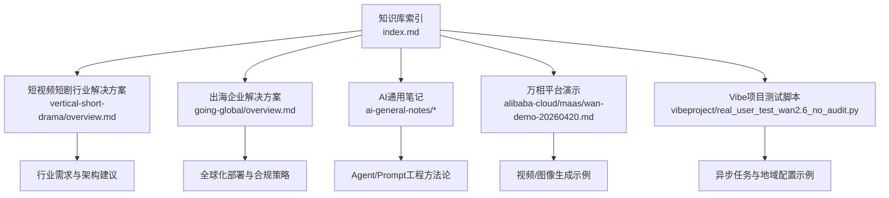
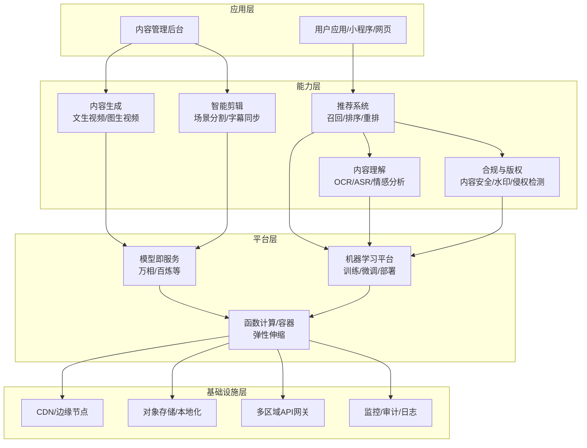
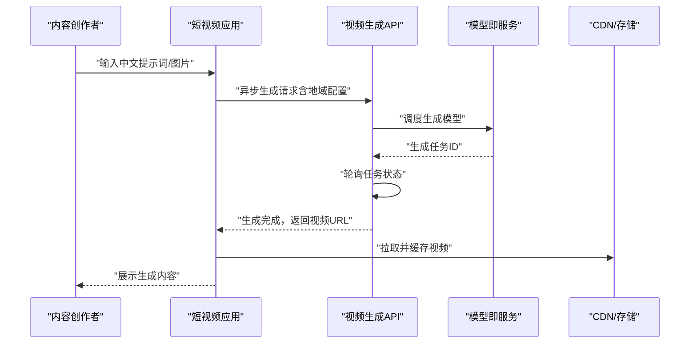
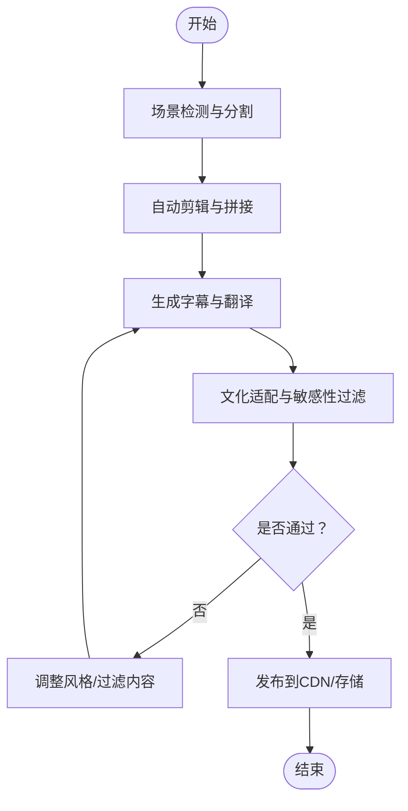
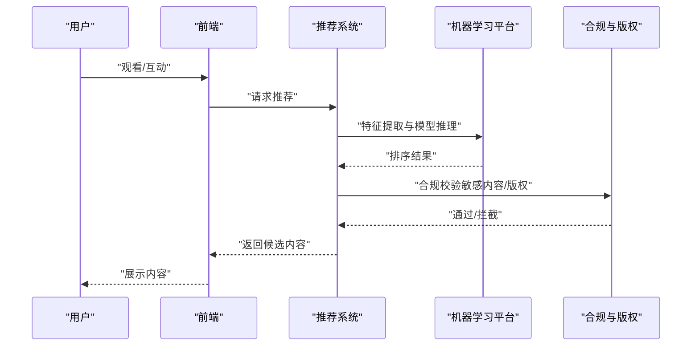
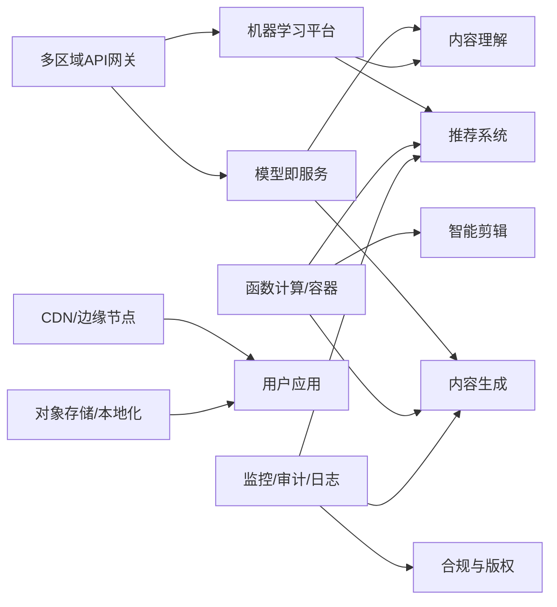

# 短视频出海解决方案

<cite>
**本文引用的文件**
- [README.md](file://README.md)
- [index.md](file://index.md)
- [万相2.6演示](file://knowledge/alibaba-cloud/maas/wan-demo-20260420.md)
- [Vibe项目-无审核测试脚本](file://vibeproject/real_user_test_wan2.6_no_audit.py)
- [短视频短剧行业解决方案概览](file://knowledge/solutions/vertical-short-drama/overview.md)
- [出海企业解决方案概览](file://knowledge/solutions/going-global/overview.md)
- [AI通用笔记-概览](file://knowledge/ai-general-notes/overview.md)
- [AI通用笔记-Agent定义](file://knowledge/ai-general-notes/agent-def.md)
- [AI通用笔记-Prompt工程](file://knowledge/ai-general-notes/prompt-engineering.md)
- [IPC行业解决方案概览](file://knowledge/solutions/vertical-ipc/overview.md)
</cite>

## 目录
1. [简介](#简介)
2. [项目结构](#项目结构)
3. [核心组件](#核心组件)
4. [架构总览](#架构总览)
5. [详细组件分析](#详细组件分析)
6. [依赖分析](#依赖分析)
7. [性能考虑](#性能考虑)
8. [故障排查指南](#故障排查指南)
9. [结论](#结论)
10. [附录](#附录)

## 简介
本文件面向“短视频出海”场景，系统化阐述AI技术在短视频内容创作与分发中的应用方案，覆盖内容生成、智能剪辑、多语言字幕、跨文化传播等关键技术；并结合仓库现有知识，给出平台级AI技术架构与实施策略、内容合规与版权保护、算法推荐与个性化分发的解决方案。同时，提供短视频出海的标杆案例与经验总结，解释如何利用AI提升内容质量与用户体验，并应对不同市场的技术与监管挑战。

## 项目结构
该知识库采用“主题域 + 解决方案 + 产品/平台”的分层组织方式，便于在不同厂商与行业场景间进行横向对比与复用。短视频出海相关的关键入口包括：
- 短视频短剧行业解决方案：提供行业需求、架构与产品栈的框架性建议
- 出海企业解决方案：提供全球化基础设施与落地策略
- AI通用笔记：提供Agent、Prompt工程等通用方法论
- 万相平台演示与Vibe项目测试脚本：提供AI视频/图像生成的实操示例与出海地域配置参考

图表来源
- [index.md:1-69](file://index.md#L1-L69)
- [短视频短剧行业解决方案概览:1-52](file://knowledge/solutions/vertical-short-drama/overview.md#L1-L52)
- [出海企业解决方案概览:1-53](file://knowledge/solutions/going-global/overview.md#L1-L53)
- [AI通用笔记-概览:1-42](file://knowledge/ai-general-notes/overview.md#L1-L42)
- [AI通用笔记-Agent定义:1-128](file://knowledge/ai-general-notes/agent-def.md#L1-L128)
- [AI通用笔记-Prompt工程:1-193](file://knowledge/ai-general-notes/prompt-engineering.md#L1-L193)
- [万相2.6演示:1-57](file://knowledge/alibaba-cloud/maas/wan-demo-20260420.md#L1-L57)
- [Vibe项目-无审核测试脚本:1-105](file://vibeproject/real_user_test_wan2.6_no_audit.py#L1-L105)

章节来源
- [README.md:1-20](file://README.md#L1-L20)
- [index.md:1-69](file://index.md#L1-L69)

## 核心组件
围绕短视频出海，建议以“内容生产-AI生成与智能剪辑”、“内容理解-多模态与跨文化”、“内容分发-个性化推荐与合规”、“全球化基础设施-多区域部署与数据治理”四大支柱构建AI能力体系。

- 内容生产
  - 文生视频/图生视频：依托万相等平台的视频生成能力，支持中文提示词与高质量分辨率输出，满足出海内容本地化与风格化需求
  - 智能剪辑：基于时间轴与场景分割的自动化剪辑，结合多语言字幕同步生成，提升制作效率
- 内容理解
  - 多模态理解：结合OCR、语音识别与情感分析，实现跨语言字幕与文化适配
  - 跨文化传播：基于内容标签与受众画像，进行文化敏感性过滤与风格调整
- 内容分发
  - 个性化推荐：结合用户行为、内容特征与社交传播，构建多阶段排序与召回
  - 合规与版权：内容安全检测、版权水印与侵权识别，确保全球合规运营
- 全球化基础设施
  - 多区域部署：就近接入与边缘节点缓存，降低延迟并满足数据主权
  - 数据治理：跨境数据传输与本地化存储，配合隐私与版权策略

章节来源
- [万相2.6演示:1-57](file://knowledge/alibaba-cloud/maas/wan-demo-20260420.md#L1-L57)
- [Vibe项目-无审核测试脚本:1-105](file://vibeproject/real_user_test_wan2.6_no_audit.py#L1-L105)
- [短视频短剧行业解决方案概览:1-52](file://knowledge/solutions/vertical-short-drama/overview.md#L1-L52)
- [出海企业解决方案概览:1-53](file://knowledge/solutions/going-global/overview.md#L1-L53)
- [AI通用笔记-Prompt工程:1-193](file://knowledge/ai-general-notes/prompt-engineering.md#L1-L193)

## 架构总览
短视频出海的AI技术架构建议采用“平台层-能力层-应用层-基础设施层”的分层设计，强调可扩展、可治理与可落地。

图表来源
- [万相2.6演示:1-57](file://knowledge/alibaba-cloud/maas/wan-demo-20260420.md#L1-L57)
- [Vibe项目-无审核测试脚本:1-105](file://vibeproject/real_user_test_wan2.6_no_audit.py#L1-L105)
- [短视频短剧行业解决方案概览:1-52](file://knowledge/solutions/vertical-short-drama/overview.md#L1-L52)
- [出海企业解决方案概览:1-53](file://knowledge/solutions/going-global/overview.md#L1-L53)
- [AI通用笔记-Prompt工程:1-193](file://knowledge/ai-general-notes/prompt-engineering.md#L1-L193)

## 详细组件分析

### 组件A：AI内容生成（文生视频/图生视频）
- 能力概述
  - 文生视频：支持中文提示词，描述越详细画面越可控，适合剧情化短视频与品牌故事
  - 图生视频：适合电商产品展示与动态广告，强调光影与背景氛围
  - 图像生成：用于封面、海报与场景素材，支持高分辨率输出
- 实施要点
  - 提示词工程：遵循“边界约束+溯源要求+置信度校准+对抗验证”的四层机制，降低生成偏差
  - 异步任务与地域配置：结合测试脚本中的异步调用与地域API配置，保障大规模生成的稳定性与低延迟
- 适配出海
  - 多语言提示词与风格化参数，结合文化敏感性过滤，避免不当表达
  - 多区域部署与边缘缓存，缩短生成与分发延迟

图表来源
- [Vibe项目-无审核测试脚本:1-105](file://vibeproject/real_user_test_wan2.6_no_audit.py#L1-L105)
- [万相2.6演示:1-57](file://knowledge/alibaba-cloud/maas/wan-demo-20260420.md#L1-L57)

章节来源
- [万相2.6演示:1-57](file://knowledge/alibaba-cloud/maas/wan-demo-20260420.md#L1-L57)
- [Vibe项目-无审核测试脚本:1-105](file://vibeproject/real_user_test_wan2.6_no_audit.py#L1-L105)
- [AI通用笔记-Prompt工程:46-79](file://knowledge/ai-general-notes/prompt-engineering.md#L46-L79)

### 组件B：智能剪辑与多语言字幕
- 能力概述
  - 场景分割与自动剪辑：基于时间轴与内容相似度，自动切分镜头与片段
  - 字幕生成与翻译：实时生成多语言字幕，支持文化语境适配
- 实施要点
  - 多模态融合：结合OCR与语音识别，提升字幕准确度
  - 质量控制：通过Agent循环与工具调用，实现“感知-推理-行动-观察”的闭环，保障剪辑与字幕质量
- 适配出海
  - 针对不同市场调整字幕风格与文化表达，避免刻板印象
  - 本地化存储与边缘渲染，降低跨区域传输成本

图表来源
- [AI通用笔记-Agent定义:60-68](file://knowledge/ai-general-notes/agent-def.md#L60-L68)

章节来源
- [AI通用笔记-Agent定义:60-68](file://knowledge/ai-general-notes/agent-def.md#L60-L68)

### 组件C：个性化推荐与算法分发
- 能力概述
  - 多阶段排序：召回-粗排-精排-重排，结合用户画像与内容特征
  - 社交传播增强：基于社交关系与话题热度，提升内容曝光
- 实施要点
  - 数据治理：确保跨境数据传输合规，支持本地化存储与处理
  - 模型微调：结合平台机器学习能力，针对不同市场进行特征工程与模型优化
- 适配出海
  - 区域化推荐策略：针对不同地区的内容偏好与文化背景，定制化特征权重
  - 合规与审计：记录推荐过程与结果，满足监管要求

图表来源
- [短视频短剧行业解决方案概览:1-52](file://knowledge/solutions/vertical-short-drama/overview.md#L1-L52)
- [出海企业解决方案概览:1-53](file://knowledge/solutions/going-global/overview.md#L1-L53)

章节来源
- [短视频短剧行业解决方案概览:1-52](file://knowledge/solutions/vertical-short-drama/overview.md#L1-L52)
- [出海企业解决方案概览:1-53](file://knowledge/solutions/going-global/overview.md#L1-L53)

### 组件D：内容合规与版权保护
- 能力概述
  - 内容安全检测：自动识别敏感内容，触发人工复核或自动拦截
  - 版权保护：嵌入数字水印与版权元数据，支持侵权识别与追踪
- 实施要点
  - 提示词工程：通过四层机制降低生成内容的偏差与风险
  - 全球化部署：多区域API网关与本地化存储，满足数据主权与合规要求
- 适配出海
  - 不同国家/地区的法规差异：建立分级过滤策略与人工审核通道
  - 版权与内容治理：与当地版权机构合作，完善侵权处理流程

章节来源
- [AI通用笔记-Prompt工程:46-79](file://knowledge/ai-general-notes/prompt-engineering.md#L46-L79)
- [出海企业解决方案概览:1-53](file://knowledge/solutions/going-global/overview.md#L1-L53)

## 依赖分析
短视频出海的AI能力依赖于多层平台与工具链的协同，建议以“平台即服务 + 机器学习平台 + 函数计算/容器 + 全球化基础设施”为核心依赖。

图表来源
- [万相2.6演示:1-57](file://knowledge/alibaba-cloud/maas/wan-demo-20260420.md#L1-L57)
- [Vibe项目-无审核测试脚本:1-105](file://vibeproject/real_user_test_wan2.6_no_audit.py#L1-L105)
- [短视频短剧行业解决方案概览:1-52](file://knowledge/solutions/vertical-short-drama/overview.md#L1-L52)
- [出海企业解决方案概览:1-53](file://knowledge/solutions/going-global/overview.md#L1-L53)

章节来源
- [万相2.6演示:1-57](file://knowledge/alibaba-cloud/maas/wan-demo-20260420.md#L1-L57)
- [Vibe项目-无审核测试脚本:1-105](file://vibeproject/real_user_test_wan2.6_no_audit.py#L1-L105)
- [短视频短剧行业解决方案概览:1-52](file://knowledge/solutions/vertical-short-drama/overview.md#L1-L52)
- [出海企业解决方案概览:1-53](file://knowledge/solutions/going-global/overview.md#L1-L53)

## 性能考虑
- 生成性能
  - 异步任务与轮询：通过异步调用与定期轮询，降低单次请求延迟，提升吞吐
  - 多区域部署：就近接入与边缘缓存，显著降低跨区域传输时延
- 推荐性能
  - 多阶段排序与缓存：结合热门内容缓存与冷启动优化，平衡实时性与性能
  - 模型压缩与量化：在边缘侧部署轻量模型，提升响应速度
- 合规与版权
  - 流水线化处理：将内容安全检测与版权校验前置到生成环节，减少重复计算
  - 分布式审计：集中化日志与分布式审计，支撑大规模合规运营

## 故障排查指南
- 生成失败
  - 检查API密钥与地域配置，确认异步任务状态轮询逻辑
  - 关注提示词长度与复杂度，必要时简化提示词或拆分任务
- 推荐异常
  - 核查特征工程与模型版本，确认缓存一致性与冷启动策略
- 合规拦截
  - 审核敏感内容与版权标识，建立人工复核通道与申诉流程
- 全球化部署
  - 检查多区域API网关与本地化存储配置，确保数据主权与访问延迟

章节来源
- [Vibe项目-无审核测试脚本:1-105](file://vibeproject/real_user_test_wan2.6_no_audit.py#L1-L105)

## 结论
短视频出海需要以AI技术为核心驱动力，构建“内容生成—智能剪辑—个性化推荐—合规版权—全球化基础设施”的完整能力体系。通过平台即服务与机器学习平台的协同，结合Agent与Prompt工程的方法论，可在保证内容质量与用户体验的同时，满足不同市场的合规与文化要求。建议以渐进式落地策略，先在典型市场验证方案，再逐步扩展至全球。

## 附录
- 行业参考
  - IPC行业解决方案展示了多模态与平台化TOKEN分发的思路，可借鉴其“平台化供给+行业微调”的模式，应用于短视频内容理解与推荐
- 方法论参考
  - Agent循环与Prompt工程的四层机制，可直接迁移到短视频内容生产与审核流程中，提升可控性与可审计性

章节来源
- [IPC行业解决方案概览:1-52](file://knowledge/solutions/vertical-ipc/overview.md#L1-L52)
- [AI通用笔记-Agent定义:60-68](file://knowledge/ai-general-notes/agent-def.md#L60-L68)
- [AI通用笔记-Prompt工程:46-79](file://knowledge/ai-general-notes/prompt-engineering.md#L46-L79)