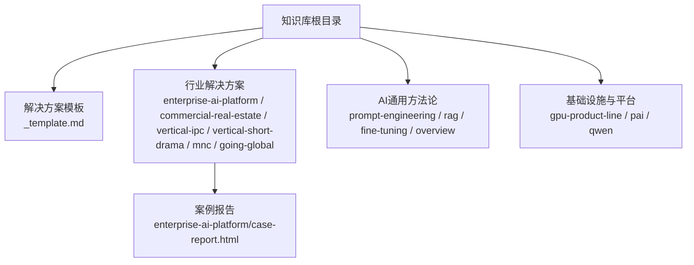
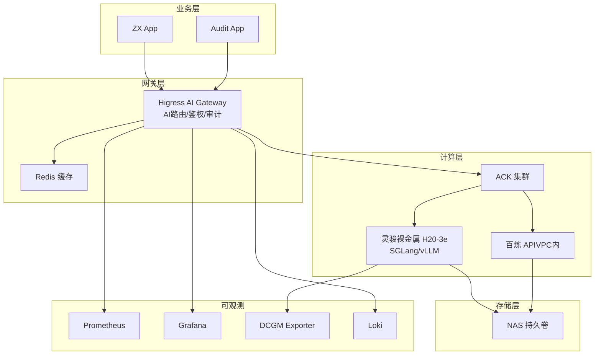
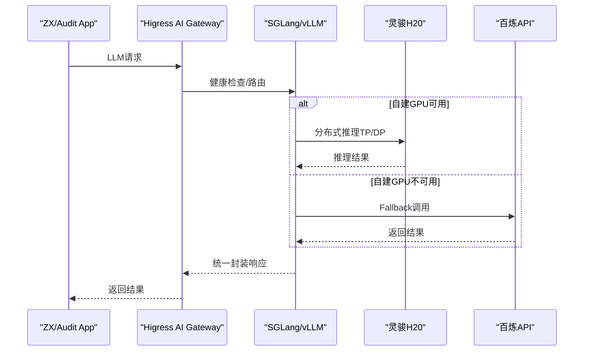
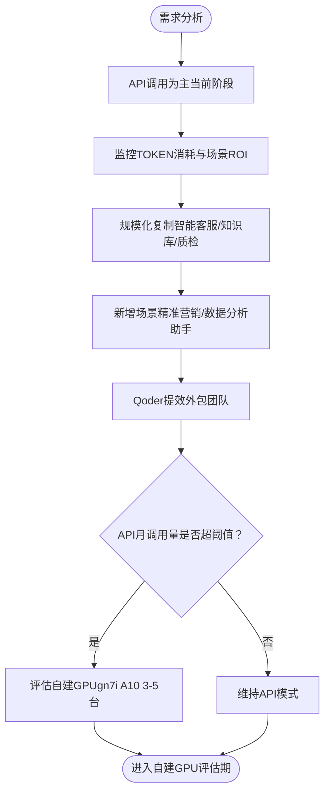
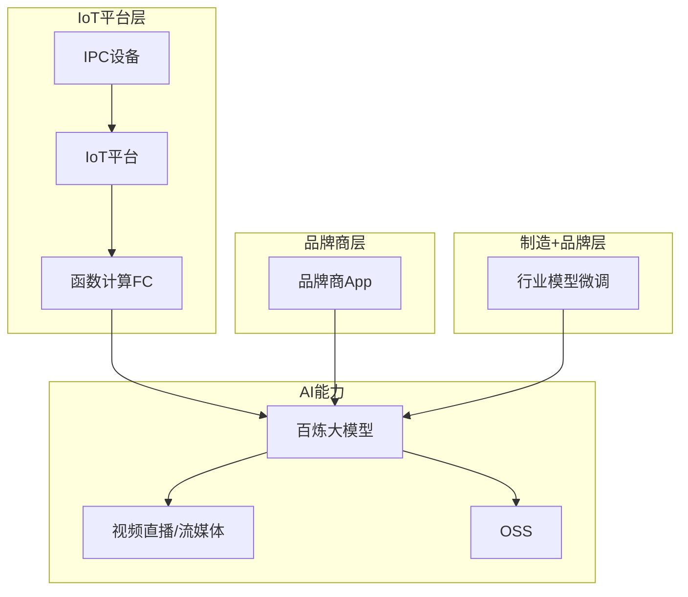
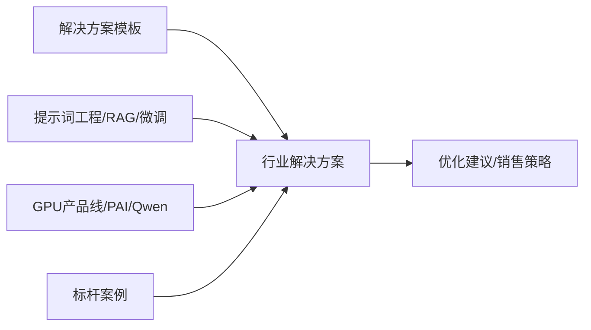

# 行业解决方案

<cite>
**本文引用的文件**
- [企业自建AI推理平台-概述](file://knowledge/solutions/enterprise-ai-platform/overview.md)
- [企业自建AI推理平台-案例报告](file://knowledge/solutions/enterprise-ai-platform/case-report.html)
- [商业地产-概述](file://knowledge/solutions/commercial-real-estate/overview.md)
- [IPC智能安防-概述](file://knowledge/solutions/vertical-ipc/overview.md)
- [短剧出海-概述](file://knowledge/solutions/vertical-short-drama/overview.md)
- [MNC跨国企业-概述](file://knowledge/solutions/mnc/overview.md)
- [出海企业-概述](file://knowledge/solutions/going-global/overview.md)
- [AI行业解决方案模板](file://knowledge/solutions/_template.md)
- [GPU产品线选型：ECS GPU vs 灵骏 vs PAI](file://knowledge/alibaba-cloud/ai-infra/gpu-product-line.md)
- [通义千问（Qwen）](file://knowledge/alibaba-cloud/maas/qwen.md)
- [提示词工程-Prompt Engineering](file://knowledge/ai-general-notes/prompt-engineering.md)
- [README](file://README.md)
</cite>

## 目录
1. [引言](#引言)
2. [项目结构](#项目结构)
3. [核心组件](#核心组件)
4. [架构总览](#架构总览)
5. [详细组件分析](#详细组件分析)
6. [依赖分析](#依赖分析)
7. [性能考量](#性能考量)
8. [故障排查指南](#故障排查指南)
9. [结论](#结论)
10. [附录](#附录)

## 引言
本文件面向AI行业解决方案的系统化建设与交付，围绕“解决方案模板—标准化流程—行业化设计—定制化实施—生命周期管理”的主线，系统梳理企业自建AI推理平台、商业地产、IPC智能安防、短剧出海等典型行业场景，并总结设计原则、实施路径与最佳实践，帮助销售、售前与交付团队高效落地AI解决方案。

## 项目结构
本知识库以“解决方案”为中心，结合“AI通用方法论”“基础设施与平台”“厂商与产品”等维度，形成“模板-案例-方法-产品”的知识闭环。其中：
- 解决方案模板用于统一输出结构与关键要素
- 各行业解决方案提供可复制的架构、产品组合与优化建议
- AI通用方法论（提示词工程、RAG、微调）为定制化设计提供方法论支撑
- 基础设施与平台（GPU产品线、PAI、Qwen等）为技术选型与部署策略提供依据

图表来源
- [企业自建AI推理平台-概述](file://knowledge/solutions/enterprise-ai-platform/overview.md)
- [企业自建AI推理平台-案例报告](file://knowledge/solutions/enterprise-ai-platform/case-report.html)
- [商业地产-概述](file://knowledge/solutions/commercial-real-estate/overview.md)
- [IPC智能安防-概述](file://knowledge/solutions/vertical-ipc/overview.md)
- [短剧出海-概述](file://knowledge/solutions/vertical-short-drama/overview.md)
- [MNC跨国企业-概述](file://knowledge/solutions/mnc/overview.md)
- [出海企业-概述](file://knowledge/solutions/going-global/overview.md)
- [AI行业解决方案模板](file://knowledge/solutions/_template.md)
- [GPU产品线选型：ECS GPU vs 灵骏 vs PAI](file://knowledge/alibaba-cloud/ai-infra/gpu-product-line.md)
- [通义千问（Qwen）](file://knowledge/alibaba-cloud/maas/qwen.md)
- [提示词工程-Prompt Engineering](file://knowledge/ai-general-notes/prompt-engineering.md)

章节来源
- [README](file://README.md)

## 核心组件
- 解决方案模板：定义“客群画像、核心需求、推荐架构、产品组合、竞品对比、标杆案例、优化建议、销售切入、参考资料、变更记录”等标准字段，确保交付一致性与可复用性
- 行业解决方案：覆盖企业自建推理平台、商业地产、IPC智能安防、短剧出海、MNC跨国企业、出海企业等场景，提供架构设计、产品组合、优化建议与销售策略
- 方法论与产品：提示词工程、RAG、微调等方法论，以及GPU产品线、PAI平台、Qwen大模型等产品能力，支撑定制化设计与技术选型

章节来源
- [AI行业解决方案模板](file://knowledge/solutions/_template.md)
- [GPU产品线选型：ECS GPU vs 灵骏 vs PAI](file://knowledge/alibaba-cloud/ai-infra/gpu-product-line.md)
- [通义千问（Qwen）](file://knowledge/alibaba-cloud/maas/qwen.md)
- [提示词工程-Prompt Engineering](file://knowledge/ai-general-notes/prompt-engineering.md)

## 架构总览
以“统一网关 + 混合推理 + 全链路可观测 + 内容合规 + 高性能互联”为核心设计原则，面向企业自建AI推理平台的三层架构（业务层→网关层→计算层→存储层），并配套K8s统一调度、跨机RDMA互联、百炼API Fallback等能力，实现高可用、可扩展与合规可控。

图表来源
- [企业自建AI推理平台-概述](file://knowledge/solutions/enterprise-ai-platform/overview.md)

## 详细组件分析

### 企业自建AI推理平台
- 客群画像与迁移背景：从AWS H20 GPU集群迁移至阿里云，运营AI咨询与合规审计两条业务线
- 核心需求：统一网关、混合推理双轨、全链路可观测、内容合规、K8s统一GPU调度、跨机高性能互联
- 推荐架构：三层架构+RDMA RoCE互联+百炼API Fallback，强调“自建GPU主力+云端API兜底”
- 产品组合：Higress AI Gateway、灵骏裸金属H20、ACK+GPU Operator+LWS、SGLang/vLLM、Prometheus+Grafana+DCGM+Loki、NAS、百炼API
- 标杆案例：某500强企业，已完成集群搭建、GPU节点接入、Higress部署与监控体系，正在进行推理服务与路由配置
- 优化建议：Gateway HA、Fallback触发条件、灵骏+Ubuntu兼容性、跨机TP必要性评估、Prometheus收敛、Prompt缓存、多App隔离、审计容量规划等

图表来源
- [企业自建AI推理平台-概述](file://knowledge/solutions/enterprise-ai-platform/overview.md)

章节来源
- [企业自建AI推理平台-概述](file://knowledge/solutions/enterprise-ai-platform/overview.md)
- [企业自建AI推理平台-案例报告](file://knowledge/solutions/enterprise-ai-platform/case-report.html)

### 商业地产AI应用
- 客群画像：头部/中型/中小房企，AI从“试点验证”向“规模化复制”过渡，AI消耗占总云消耗3-8%
- 核心需求：已落地场景规模化复制、Qoder AI编程提效、智能客服、精准营销、数据分析助手、GPU方案评估、AI数据中台
- 推荐架构：以API调用为主（当前阶段推荐），未来在API月调用量超阈值时评估自建GPU
- 产品组合：百炼大模型（qwen3.6-plus）+ 视觉智能开放平台 + 智能语音交互 + 智能客服 + Qoder（PPL模式）
- 竞品对比：阿里云在多模态、定价灵活性、Qwen开源生态方面具优势
- 销售策略：引用行业高管公开表态、利用现有云资源续约/扩容期、地产IT系统升级/外包项目启动期、新商场开业/存量改造期

图表来源
- [商业地产-概述](file://knowledge/solutions/commercial-real-estate/overview.md)

章节来源
- [商业地产-概述](file://knowledge/solutions/commercial-real-estate/overview.md)

### IPC智能安防
- 客群画像：IoT平台层/品牌商层/制造+品牌层/纯制造层，AI能力从“可选”变为“必选”，云端TOKEN消耗与边缘推理并存
- 核心需求：IoT平台统一TOKEN供给、品牌商AI增值服务、制造+品牌行业大模型微调、云存储+AI事件检索、全球化部署
- 推荐架构：IoT平台统一供给→函数计算事件路由→百炼大模型→结果返回设备/App；或品牌商订阅模式；或制造+品牌行业模型微调
- 产品组合：百炼大模型（qwen3.6-plus）+ 函数计算FC + PAI + OSS + 视频直播/流媒体服务 + IoT平台 + 安全合规套件
- 销售策略：品牌商新产品线规划期、政企项目招标期、IoT平台扩容/升级期；POC分别验证TOKEN统一供给、AI场景与行业模型微调

图表来源
- [IPC智能安防-概述](file://knowledge/solutions/vertical-ipc/overview.md)

章节来源
- [IPC智能安防-概述](file://knowledge/solutions/vertical-ipc/overview.md)

### 短剧出海
- 客群画像：中国背景、海外拓展，需要全球化基础设施
- 核心需求：全球化部署、合规与本地化、成本与性能平衡、内容分发与互动
- 推荐架构：多Region部署、CDN/全球加速、本地化内容与交互、合规与数据主权
- 产品组合：AI层（大模型/MaaS）、网络层（CDN/全球加速）、安全层（合规/等保）、存储层（对象存储/边缘缓存）
- 销售策略：关键决策人（CTO/技术负责人）、切入时机（产品本地化上线期/合规政策窗口）、POC建议（多区域延迟与内容效果验证）

章节来源
- [短剧出海-概述](file://knowledge/solutions/vertical-short-drama/overview.md)

### MNC跨国企业
- 客群画像：全球化运营、多区域部署、合规要求高
- 核心需求：多区域一致性、合规与数据主权、统一治理与成本控制、全球化性能与可用性
- 推荐架构：多Region/多AZ、合规与安全套件、统一编排与治理、边缘与中心协同
- 产品组合：AI层（多模态/Agent）、网络层（全球加速/专线）、安全层（WAF/合规）、存储层（对象/块/文件）
- 销售策略：关键决策人（CIO/CTO/合规官）、切入时机（区域合规政策落地期/系统升级期）、POC建议（合规与性能验证）

章节来源
- [MNC跨国企业-概述](file://knowledge/solutions/mnc/overview.md)

### 出海企业
- 客群画像：中国背景、海外拓展，需要全球化基础设施
- 核心需求：全球化部署、合规与本地化、成本与性能平衡、内容分发与互动
- 推荐架构：多Region部署、CDN/全球加速、本地化内容与交互、合规与数据主权
- 产品组合：AI层（大模型/MaaS）、网络层（CDN/全球加速）、安全层（合规/等保）、存储层（对象存储/边缘缓存）
- 销售策略：关键决策人（CTO/技术负责人）、切入时机（产品本地化上线期/合规政策窗口）、POC建议（多区域延迟与内容效果验证）

章节来源
- [出海企业-概述](file://knowledge/solutions/going-global/overview.md)

## 依赖分析
- 解决方案模板与行业方案：模板提供统一结构，行业方案在模板基础上填充客群画像、需求、架构、产品组合、优化建议与销售策略
- 方法论与产品：提示词工程、RAG、微调等方法论为定制化设计提供基础；GPU产品线、PAI、Qwen等产品能力决定技术选型与部署策略
- 案例与最佳实践：标杆案例提供实施进度、优化项与竞品对比，指导后续项目交付与优化

图表来源
- [AI行业解决方案模板](file://knowledge/solutions/_template.md)
- [提示词工程-Prompt Engineering](file://knowledge/ai-general-notes/prompt-engineering.md)
- [GPU产品线选型：ECS GPU vs 灵骏 vs PAI](file://knowledge/alibaba-cloud/ai-infra/gpu-product-line.md)
- [通义千问（Qwen）](file://knowledge/alibaba-cloud/maas/qwen.md)
- [企业自建AI推理平台-概述](file://knowledge/solutions/enterprise-ai-platform/overview.md)

## 性能考量
- 推理性能与成本：在企业自建推理平台中，H20单机1,128GB显存下，≤72B模型无需跨机TP；多副本DP通常ROI更高；跨机TP需评估延迟与成本
- 可观测性：Prometheus+Grafana+DCGM+Loki实现全链路监控，建议收敛为一套监控体系
- 网络与互联：RDMA RoCE保障跨机Tensor Parallel通信，需结合模型规模与业务需求按需启用
- API与自建权衡：商业地产以API为主，当月调用量超阈值时评估自建GPU；IPC场景IoT平台统一供给可摊薄单设备TOKEN成本

章节来源
- [企业自建AI推理平台-概述](file://knowledge/solutions/enterprise-ai-platform/overview.md)
- [商业地产-概述](file://knowledge/solutions/commercial-real-estate/overview.md)
- [IPC智能安防-概述](file://knowledge/solutions/vertical-ipc/overview.md)

## 故障排查指南
- Higress网关：单副本存在单点风险，需扩至2-3副本+反亲和+SLB四层负载
- Fallback触发条件：需明确健康检查超时次数/队列深度/错误率熔断三档配置，避免“双轨冷备”
- 灵骏兼容性：MOFED版本与aiext kernel需锁版本；NCCL_IB_HCA等参数需显式配置
- 监控问题：DCGM Exporter DaemonSet AVAILABLE=0，疑似readiness probe配置问题
- RDMA调度：当前DP包含ECS节点浪费资源，应仅调度到GPU节点（nodeSelector）

章节来源
- [企业自建AI推理平台-概述](file://knowledge/solutions/enterprise-ai-platform/overview.md)
- [企业自建AI推理平台-案例报告](file://knowledge/solutions/enterprise-ai-platform/case-report.html)

## 结论
通过统一的解决方案模板与标准化流程，结合行业化设计与定制化实施，能够高效交付AI解决方案。建议以“方法论+产品能力+案例经验”为支撑，围绕统一网关、混合推理、全链路可观测、内容合规与高性能互联等设计原则，分阶段推进从需求分析到实施交付的全生命周期管理，持续优化与迭代，实现业务价值与技术可行性的平衡。

## 附录
- 解决方案生命周期管理建议
  - 需求分析：基于模板梳理客群画像、核心需求与优先级
  - 架构设计：参考行业方案模板与标杆案例，确定统一网关、混合推理与可观测方案
  - 技术选型：结合GPU产品线、PAI与Qwen等产品能力，评估API与自建方案
  - 实施交付：按阶段推进（已完成/进行中/规划中），及时识别与处理优化项
  - 运维优化：收敛监控、评估跨机TP必要性、完善Fallback与合规审计
  - 成功案例沉淀：总结实施经验、竞品对比与销售策略，形成可复用的知识资产

章节来源
- [AI行业解决方案模板](file://knowledge/solutions/_template.md)
- [企业自建AI推理平台-概述](file://knowledge/solutions/enterprise-ai-platform/overview.md)
- [GPU产品线选型：ECS GPU vs 灵骏 vs PAI](file://knowledge/alibaba-cloud/ai-infra/gpu-product-line.md)
- [通义千问（Qwen）](file://knowledge/alibaba-cloud/maas/qwen.md)