# 解决方案模板设计

<cite>
**本文引用的文件**
- [README.md](file://README.md)
- [index.md](file://index.md)
- [_template.md](file://knowledge/solutions/_template.md)
- [commercial-real-estate/overview.md](file://knowledge/solutions/commercial-real-estate/overview.md)
- [enterprise-ai-platform/overview.md](file://knowledge/solutions/enterprise-ai-platform/overview.md)
- [enterprise-ai-platform/case-report.html](file://knowledge/solutions/enterprise-ai-platform/case-report.html)
- [going-global/overview.md](file://knowledge/solutions/going-global/overview.md)
- [_general_company_intro_template.md](file://knowledge/_general_company_intro_template.md)
- [_maas_template.md](file://knowledge/_maas_template.md)
- [_product_template.md](file://knowledge/_product_template.md)
- [ai-general-notes/_template.md](file://knowledge/ai-general-notes/_template.md)
- [alibaba-cloud/competitive-analysis/_template.md](file://knowledge/alibaba-cloud/competitive-analysis/_template.md)
</cite>

## 目录
1. [引言](#引言)
2. [项目结构](#项目结构)
3. [核心组件](#核心组件)
4. [架构总览](#架构总览)
5. [详细组件分析](#详细组件分析)
6. [依赖分析](#依赖分析)
7. [性能考量](#性能考量)
8. [故障排查指南](#故障排查指南)
9. [结论](#结论)
10. [附录](#附录)

## 引言
本文件面向“AI行业解决方案模板设计”，系统化阐述模板的设计框架、标准化字段、质量控制机制与版本管理策略，并结合知识库中的现有模板与案例，总结可复用的通用模板（需求分析、架构设计、实施计划等），提供最佳实践与常见问题解决方案，帮助团队在不同行业场景下高效产出高质量的标准化解决方案。

## 项目结构
知识库采用“按领域/行业/厂商”分层组织，解决方案模板位于 solutions 目录，配套模板与索引位于根目录与知识库根目录下，便于检索与复用。

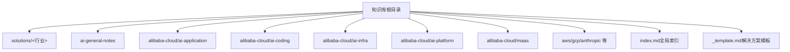

图表来源
- [index.md:1-69](file://index.md#L1-L69)
- [README.md:13-18](file://README.md#L13-L18)

章节来源
- [README.md:1-20](file://README.md#L1-L20)
- [index.md:1-69](file://index.md#L1-L69)

## 核心组件
- 解决方案模板：提供标准化结构与字段，确保不同行业与客群的方案具备一致的表达与评审维度。
- 行业案例模板：以商业地产、企业自建推理平台等为代表，展示模板在真实场景中的落地。
- 通用模板族：通用概念模板、产品模板、MaaS模板、对比分析模板等，支撑跨领域复用。
- 索引与导航：全局索引与目录结构，帮助快速定位模板与案例。

章节来源
- [_template.md:1-108](file://knowledge/solutions/_template.md#L1-L108)
- [commercial-real-estate/overview.md:1-217](file://knowledge/solutions/commercial-real-estate/overview.md#L1-L217)
- [enterprise-ai-platform/overview.md:1-273](file://knowledge/solutions/enterprise-ai-platform/overview.md#L1-L273)
- [index.md:62-68](file://index.md#L62-L68)

## 架构总览
模板设计遵循“统一结构 + 可插拔内容”的架构，通过标准化字段与模块化区块，实现跨行业复用与快速定制。

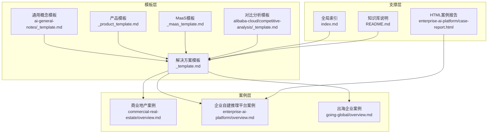

图表来源
- [_template.md:1-108](file://knowledge/solutions/_template.md#L1-L108)
- [commercial-real-estate/overview.md:1-217](file://knowledge/solutions/commercial-real-estate/overview.md#L1-L217)
- [enterprise-ai-platform/overview.md:1-273](file://knowledge/solutions/enterprise-ai-platform/overview.md#L1-L273)
- [going-global/overview.md:1-53](file://knowledge/solutions/going-global/overview.md#L1-L53)
- [index.md:62-68](file://index.md#L62-L68)
- [README.md:13-18](file://README.md#L13-L18)
- [enterprise-ai-platform/case-report.html:1-800](file://knowledge/solutions/enterprise-ai-platform/case-report.html#L1-L800)

## 详细组件分析

### 解决方案模板设计框架
- 结构化区块：客群画像、核心需求、推荐架构、产品组合、竞品对比、标杆案例、优化建议、销售切入、参考资料、变更记录等。
- 标准化字段：客群标签、状态、摘要、优先级、角色形态数量、能力对比、销售决策人与切入时机、POC建议等。
- 质量控制：摘要区块（SUMMARY_START/END）强制关键信息；优先级（P0/P1/P2）统一需求排序；表格化字段便于评审与追踪。

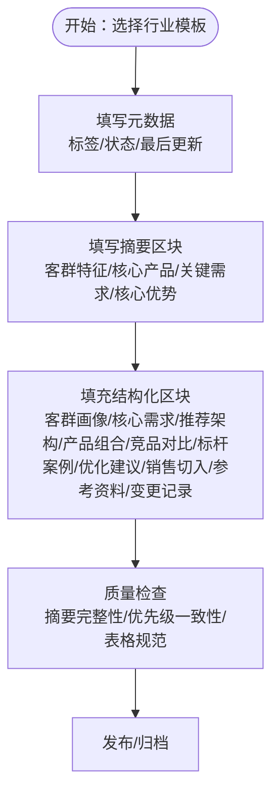

图表来源
- [_template.md:7-108](file://knowledge/solutions/_template.md#L7-L108)

章节来源
- [_template.md:1-108](file://knowledge/solutions/_template.md#L1-L108)

### 需求分析模板（标准化字段与优先级）
- 优先级：P0/P1/P2，统一需求排序与资源分配。
- 字段：需求描述、对应产品/服务，便于后续产品组合与资源规划。
- 示例：商业地产案例中明确“已落地场景规模化复制”“Qoder提效”“智能客服落地”等P0/P1需求。

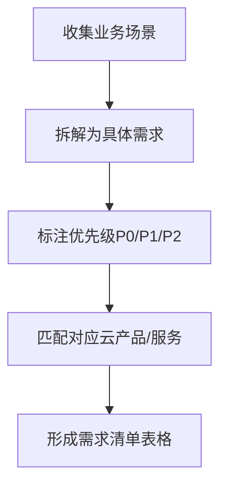

图表来源
- [commercial-real-estate/overview.md:43-54](file://knowledge/solutions/commercial-real-estate/overview.md#L43-L54)

章节来源
- [commercial-real-estate/overview.md:43-54](file://knowledge/solutions/commercial-real-estate/overview.md#L43-L54)

### 架构设计模板（三层/多层架构与设计原则）
- 三层架构示例：业务层→网关层→计算/存储层；或更细粒度的AI网关层、GPU计算层、K8s编排层、可观测层等。
- 设计原则：统一网关、混合推理双轨、全链路可观测、内容合规、高性能互联（按需）等。
- 节点规划：控制面、业务节点、GPU推理节点的数量与用途。

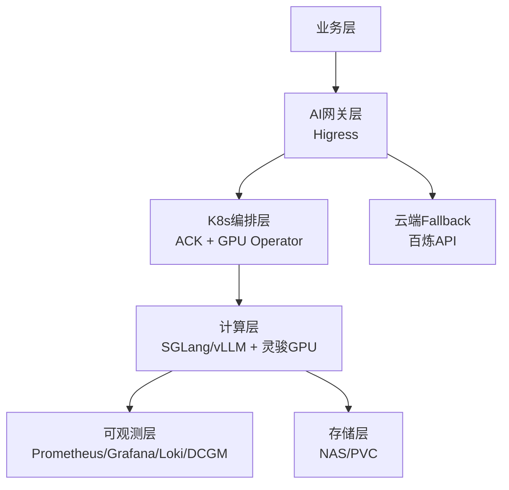

图表来源
- [enterprise-ai-platform/overview.md:46-136](file://knowledge/solutions/enterprise-ai-platform/overview.md#L46-L136)

章节来源
- [enterprise-ai-platform/overview.md:46-136](file://knowledge/solutions/enterprise-ai-platform/overview.md#L46-L136)

### 实施计划模板（进度与优化建议）
- 实施进度：已完成/进行中/规划中，配合里程碑与责任人。
- 优化建议：高/中/低优先级建议，配套说明与影响评估。
- HTML案例报告：可视化展示架构图、进度卡片、对比表格与优化清单。

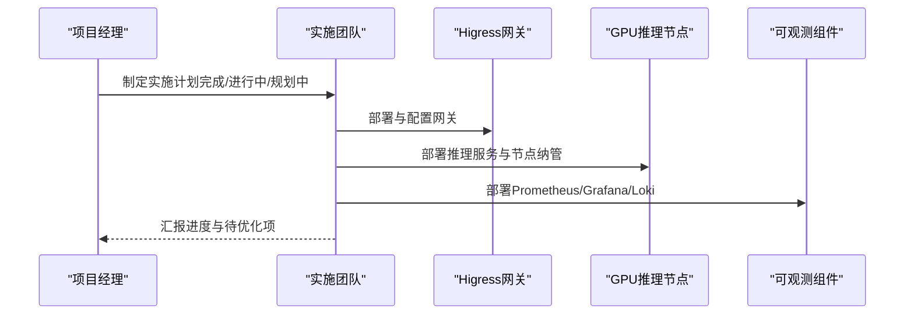

图表来源
- [enterprise-ai-platform/overview.md:186-238](file://knowledge/solutions/enterprise-ai-platform/overview.md#L186-L238)
- [enterprise-ai-platform/case-report.html:666-720](file://knowledge/solutions/enterprise-ai-platform/case-report.html#L666-L720)

章节来源
- [enterprise-ai-platform/overview.md:186-238](file://knowledge/solutions/enterprise-ai-platform/overview.md#L186-L238)
- [enterprise-ai-platform/case-report.html:666-720](file://knowledge/solutions/enterprise-ai-platform/case-report.html#L666-L720)

### 产品组合模板（层级化推荐与成本参考）
- 层级：AI层、视觉层、语音层、客服层、编程层、存储层、日志层等。
- 规格建议：按场景选择合适规格与计费模式，提供成本参考与收入估算。

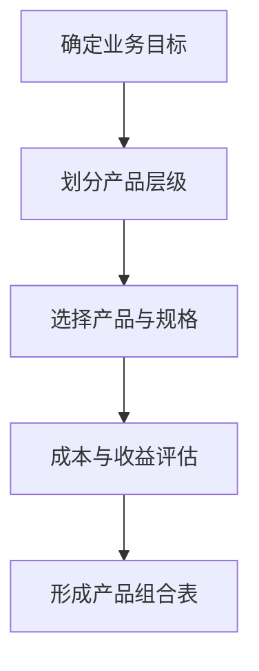

图表来源
- [commercial-real-estate/overview.md:111-131](file://knowledge/solutions/commercial-real-estate/overview.md#L111-L131)
- [enterprise-ai-platform/overview.md:157-170](file://knowledge/solutions/enterprise-ai-platform/overview.md#L157-L170)

章节来源
- [commercial-real-estate/overview.md:111-131](file://knowledge/solutions/commercial-real-estate/overview.md#L111-L131)
- [enterprise-ai-platform/overview.md:157-170](file://knowledge/solutions/enterprise-ai-platform/overview.md#L157-L170)

### 竞品对比模板（维度化对比与差异化卖点）
- 维度：大模型服务、视觉AI、对话AI、定价灵活性等。
- 差异化优势：突出自身能力与客户关注点的契合度。

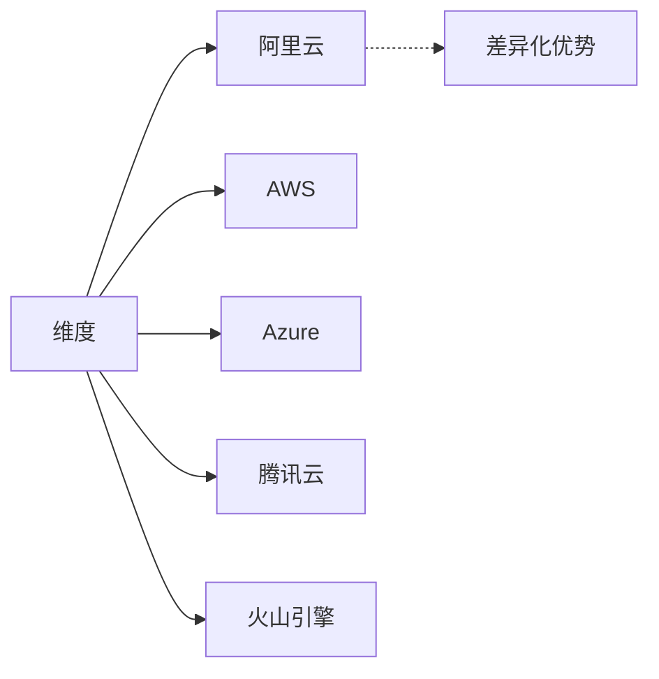

图表来源
- [commercial-real-estate/overview.md:140-151](file://knowledge/solutions/commercial-real-estate/overview.md#L140-L151)
- [enterprise-ai-platform/overview.md:173-183](file://knowledge/solutions/enterprise-ai-platform/overview.md#L173-L183)

章节来源
- [commercial-real-estate/overview.md:140-151](file://knowledge/solutions/commercial-real-estate/overview.md#L140-L151)
- [enterprise-ai-platform/overview.md:173-183](file://knowledge/solutions/enterprise-ai-platform/overview.md#L173-L183)

### 标杆案例模板（背景/已实施/规划中/待处理）
- 背景：客户类型、核心产品、预算规模、迁移背景。
- 已实施/进行中/规划中/待处理：进度可视化，便于销售与交付协同。
- 关键优化项：待处理问题清单与影响评估。

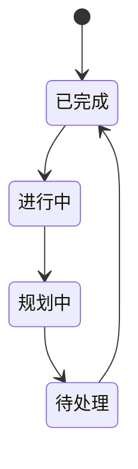

图表来源
- [commercial-real-estate/overview.md:165-180](file://knowledge/solutions/commercial-real-estate/overview.md#L165-L180)
- [enterprise-ai-platform/overview.md:186-209](file://knowledge/solutions/enterprise-ai-platform/overview.md#L186-L209)

章节来源
- [commercial-real-estate/overview.md:165-180](file://knowledge/solutions/commercial-real-estate/overview.md#L165-L180)
- [enterprise-ai-platform/overview.md:186-209](file://knowledge/solutions/enterprise-ai-platform/overview.md#L186-L209)

### 销售切入模板（决策人/切入时机/差异化卖点/POC）
- 决策人：CTO/CIO/数字化负责人、外包项目管理负责人、CEO/总裁。
- 切入时机：续约/扩容期、IT系统升级/外包项目启动期、新商场开业/存量改造期。
- POC建议：场景验证与提效验证相结合。

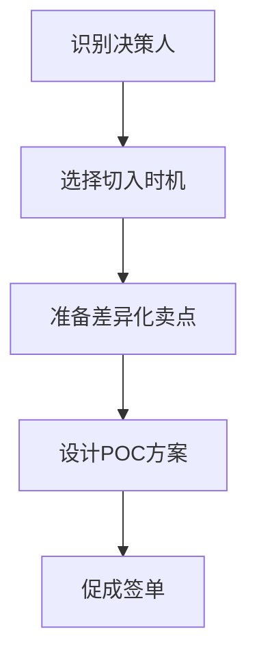

图表来源
- [commercial-real-estate/overview.md:182-201](file://knowledge/solutions/commercial-real-estate/overview.md#L182-L201)
- [enterprise-ai-platform/overview.md:241-255](file://knowledge/solutions/enterprise-ai-platform/overview.md#L241-L255)

章节来源
- [commercial-real-estate/overview.md:182-201](file://knowledge/solutions/commercial-real-estate/overview.md#L182-L201)
- [enterprise-ai-platform/overview.md:241-255](file://knowledge/solutions/enterprise-ai-platform/overview.md#L241-L255)

### 通用模板族与跨领域复用
- 通用概念模板：聚焦“技术概念类/概念洞察类”，提供关键选型维度与认知框架。
- 产品模板：产品原理解析、适用边界、关键配置与最佳实践、竞品快速对照。
- MaaS模板：模型定位、当前主推、核心能力与限制、适用场景、关键技术论文、参考资料。
- 对比分析模板：概览对比、核心产品矩阵、生态与合规、定价策略差异、SA建议。

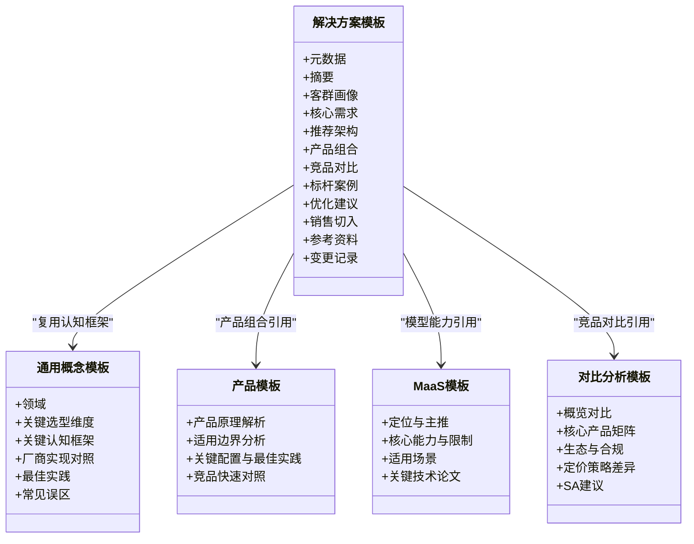

图表来源
- [_template.md:1-108](file://knowledge/solutions/_template.md#L1-L108)
- [ai-general-notes/_template.md:1-75](file://knowledge/ai-general-notes/_template.md#L1-L75)
- [_product_template.md:1-62](file://knowledge/_product_template.md#L1-L62)
- [_maas_template.md:1-65](file://knowledge/_maas_template.md#L1-L65)
- [alibaba-cloud/competitive-analysis/_template.md:1-46](file://knowledge/alibaba-cloud/competitive-analysis/_template.md#L1-L46)

章节来源
- [ai-general-notes/_template.md:1-75](file://knowledge/ai-general-notes/_template.md#L1-L75)
- [_product_template.md:1-62](file://knowledge/_product_template.md#L1-L62)
- [_maas_template.md:1-65](file://knowledge/_maas_template.md#L1-L65)
- [alibaba-cloud/competitive-analysis/_template.md:1-46](file://knowledge/alibaba-cloud/competitive-analysis/_template.md#L1-L46)

## 依赖分析
- 模板依赖：解决方案模板依赖通用概念模板提供认知框架，依赖产品模板与MaaS模板提供能力与产品信息，依赖对比分析模板提供竞品维度。
- 案例依赖：案例文档依赖模板字段与结构，形成可复用的标准化案例库。
- 导航依赖：全局索引与README提供模板与案例的检索路径，提升复用效率。

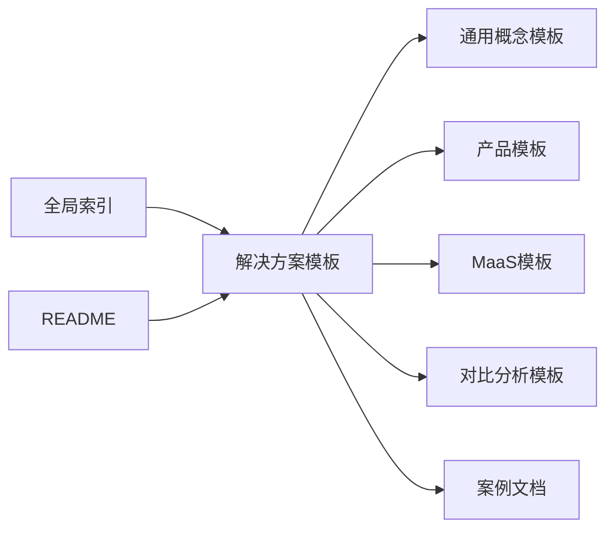

图表来源
- [_template.md:1-108](file://knowledge/solutions/_template.md#L1-L108)
- [index.md:62-68](file://index.md#L62-L68)
- [README.md:13-18](file://README.md#L13-L18)

章节来源
- [index.md:62-68](file://index.md#L62-L68)
- [README.md:13-18](file://README.md#L13-L18)

## 性能考量
- 模板渲染与检索：统一字段与结构化表格，便于自动化检索与筛选。
- 案例复用：通过标准化进度与优化建议，缩短新项目启动时间。
- 可观测性：借鉴企业自建推理平台的可观测实践，建议在方案中纳入监控与审计维度，提升交付质量与可追溯性。

## 故障排查指南
- 摘要缺失：检查摘要区块是否完整填写，确保关键信息可见。
- 优先级混乱：统一使用P0/P1/P2，避免需求排序不一致导致资源错配。
- 表格不规范：统一表格列名与格式，确保评审与执行一致性。
- 实施进度不清：使用“已完成/进行中/规划中/待处理”四象限，配合可视化看板。
- 优化建议未闭环：明确高/中/低优先级与责任人，定期回溯与更新。

章节来源
- [_template.md:7-108](file://knowledge/solutions/_template.md#L7-L108)
- [enterprise-ai-platform/overview.md:211-238](file://knowledge/solutions/enterprise-ai-platform/overview.md#L211-L238)

## 结论
通过标准化的解决方案模板与配套模板族，结合真实案例的结构化沉淀，能够实现跨行业、跨领域的高效复用与质量保障。建议在实践中持续完善摘要与优先级机制、强化表格化与可视化表达，并将可观测与合规维度纳入模板默认字段，以提升交付质量与可追溯性。

## 附录
- 模板使用最佳实践
  - 先填写摘要与元数据，再填充结构化区块。
  - 使用统一优先级与表格格式，确保评审一致性。
  - 引用通用模板与案例，减少重复劳动。
  - 定期回溯优化建议与实施进度，保持方案活力。
- 常见问题与解决
  - 摘要不完整：强制填写摘要区块，确保关键信息可见。
  - 需求优先级不一致：制定统一评审规则与模板说明。
  - 竞品对比不充分：使用对比分析模板，明确维度与差异化优势。
  - 实施进度不清晰：采用四象限进度看板，定期更新与复盘。