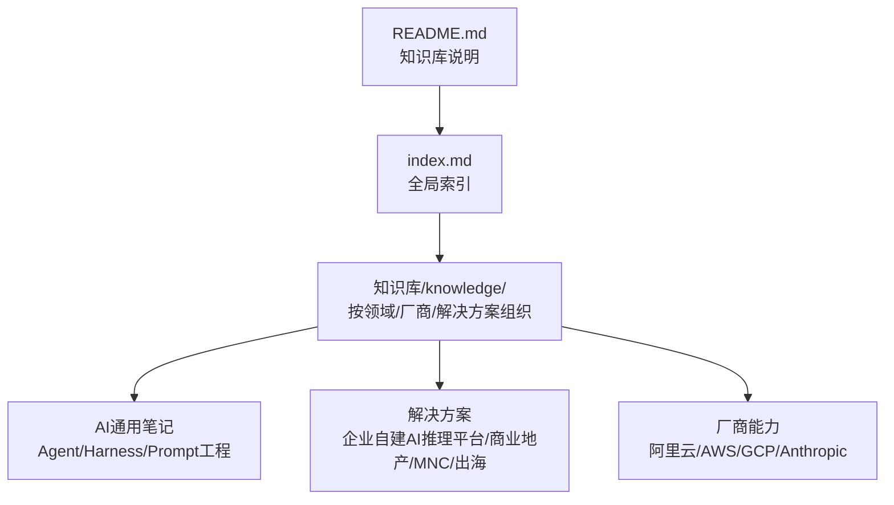
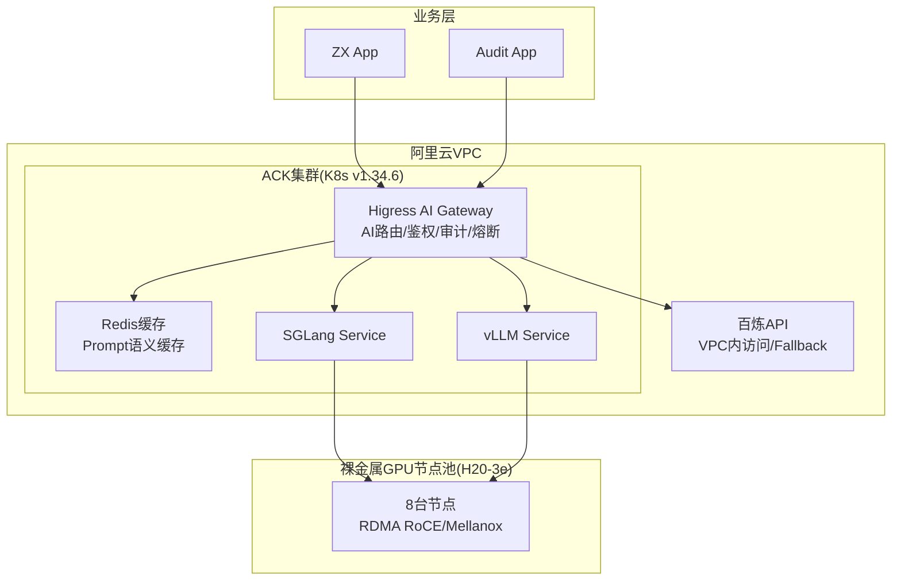
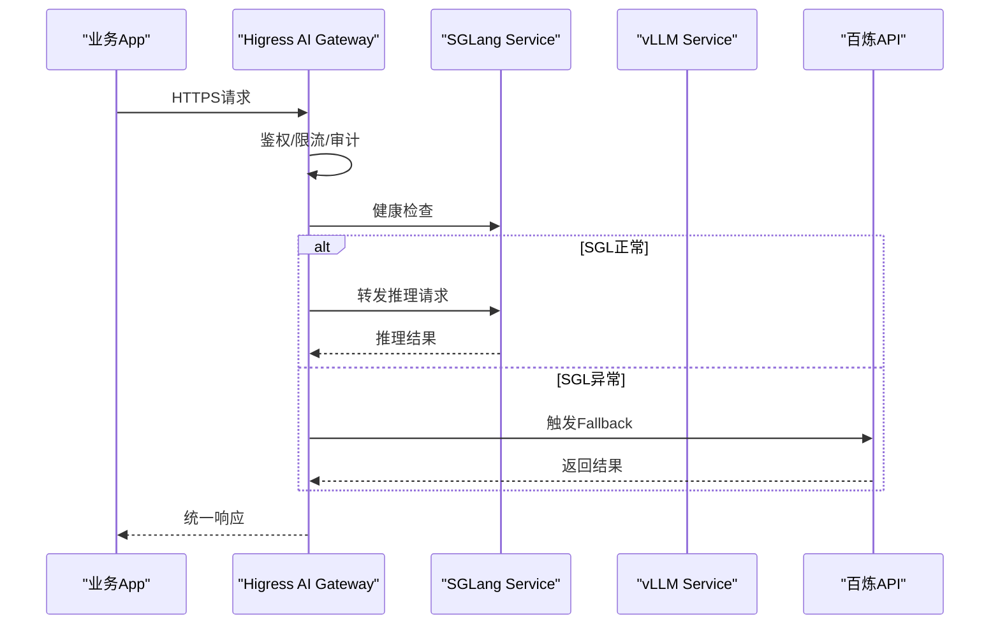
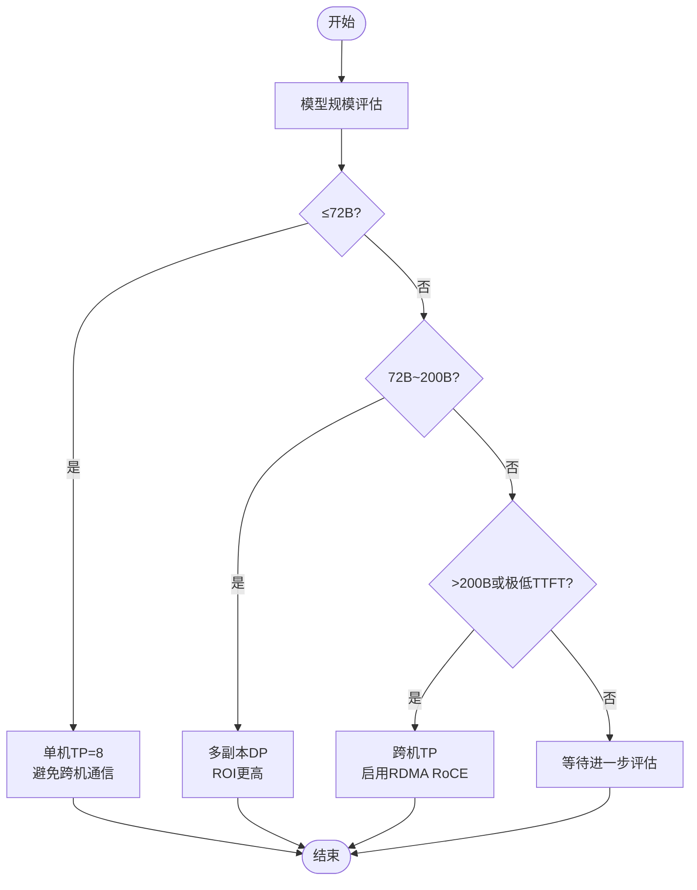
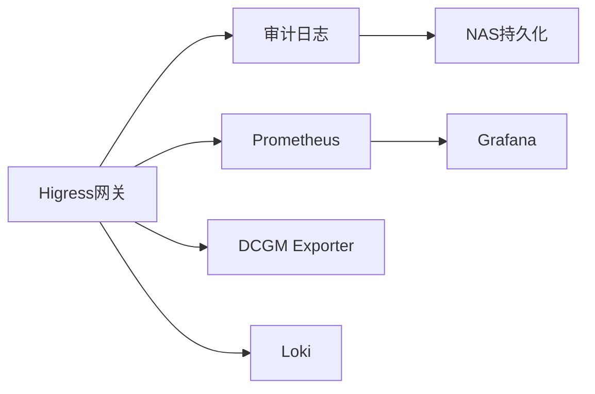
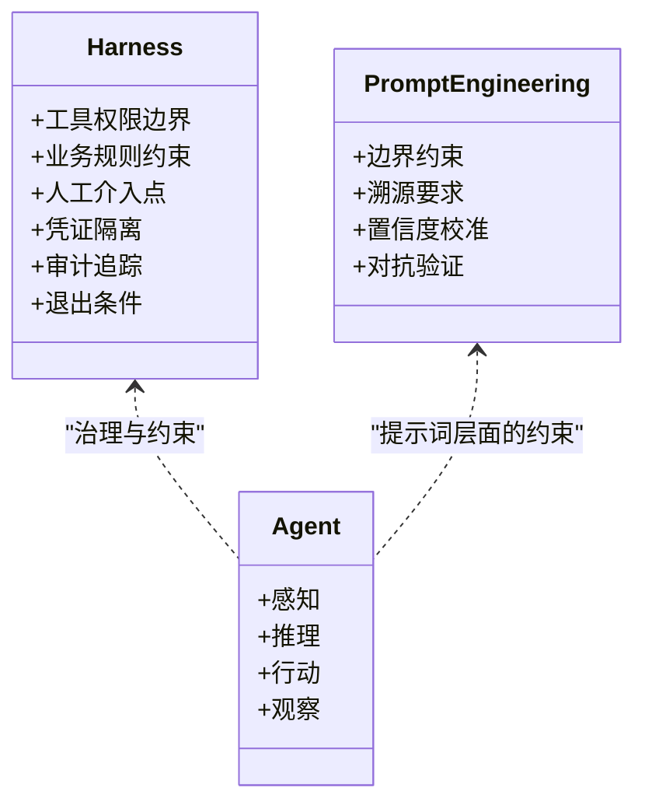
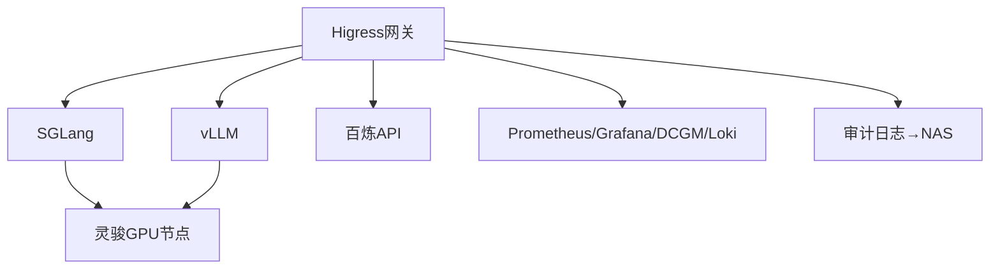

# 跨国企业AI应用

<cite>
**本文引用的文件**
- [README.md](file://README.md)
- [index.md](file://index.md)
- [企业自建AI推理平台-概述.md](file://knowledge/solutions/enterprise-ai-platform/overview.md)
- [企业自建AI推理平台-案例报告.html](file://knowledge/solutions/enterprise-ai-platform/case-report.html)
- [MNC（跨国企业）解决方案分析.md](file://knowledge/solutions/mnc/overview.md)
- [出海企业（Going Global）解决方案分析.md](file://knowledge/solutions/going-global/overview.md)
- [商业地产行业AI解决方案.md](file://knowledge/solutions/commercial-real-estate/overview.md)
- [AI通用笔记-Agent定义.md](file://knowledge/ai-general-notes/agent-def.md)
- [AI通用笔记-Prompt工程.md](file://knowledge/ai-general-notes/prompt-engineering.md)
- [AI通用笔记-Harness（AI代理缰绳）.md](file://knowledge/ai-general-notes/harness.md)
- [阿里云-PAI平台.md](file://knowledge/alibaba-cloud/ai-platform/pai.md)
- [阿里云-百炼平台.md](file://knowledge/alibaba-cloud/maas/overview.md)
- [阿里云-灵骏裸金属.md](file://knowledge/alibaba-cloud/ai-infra/lingjun.md)
- [阿里云-GPU产品线选型.md](file://knowledge/alibaba-cloud/ai-infra/gpu-product-line.md)
- [AWS-SageMaker平台.md](file://knowledge/aws/ai-platform/sagemaker.md)
- [AWS-EC2 GPU.md](file://knowledge/aws/ai-infra/ec2-gpu.md)
- [GCP-Vertex AI平台.md](file://knowledge/gcp/ai-platform/vertex-ai.md)
- [GCP-TPU.md](file://knowledge/gcp/ai-infra/tpu.md)
- [IPC智能安防行业解决方案.md](file://knowledge/solutions/vertical-ipc/overview.md)
</cite>

## 目录
1. [简介](#简介)
2. [项目结构](#项目结构)
3. [核心组件](#核心组件)
4. [架构总览](#架构总览)
5. [详细组件分析](#详细组件分析)
6. [依赖分析](#依赖分析)
7. [性能考量](#性能考量)
8. [故障排查指南](#故障排查指南)
9. [结论](#结论)
10. [附录](#附录)

## 简介
本文件面向跨国企业，系统化梳理构建全球统一AI平台的关键挑战与实施路径，覆盖多地区部署策略、数据治理与合规管理、多时区/多语言/多法规适配、以及AI治理最佳实践。文档以企业自建AI推理平台的实战案例为基础，结合MNC与出海企业两类客群的典型需求，总结可复制的架构范式与落地方法论。

## 项目结构
知识库采用“领域+厂商+解决方案”的分层组织方式，便于跨厂商横向对比与跨行业迁移借鉴。顶层README与全局索引明确了目录职责与导航路径。

图表来源
- [README.md:1-20](file://README.md#L1-L20)
- [index.md:1-69](file://index.md#L1-L69)

章节来源
- [README.md:1-20](file://README.md#L1-L20)
- [index.md:1-69](file://index.md#L1-L69)

## 核心组件
- 统一AI网关（Higress AI Gateway）：统一入口、AI路由、鉴权、审计、熔断降级与灰度发布一体化。
- 混合推理双轨：自建GPU推理集群（灵骏裸金属+ACK+SGLang/vLLM）+ 云端API Fallback（百炼API）。
- 全链路可观测：Prometheus/Grafana/DCGM/Loki，覆盖网关→推理引擎→GPU卡级指标。
- 内容合规：全量Prompt/Response审计与NAS持久化，满足国内监管要求。
- 跨机高性能互联：RDMA RoCE+Multus CNI+共享设备插件，Tensor Parallel跨机通信。
- 多业务App资源隔离：Higress限流+SGLang硬隔离，避免相互阻塞。
- K8s统一GPU调度：ACK集群统一纳管ECS+裸金属+百炼API，资源视图一体化。

章节来源
- [企业自建AI推理平台-概述.md:31-43](file://knowledge/solutions/enterprise-ai-platform/overview.md#L31-L43)
- [企业自建AI推理平台-概述.md:46-127](file://knowledge/solutions/enterprise-ai-platform/overview.md#L46-L127)
- [企业自建AI推理平台-概述.md:129-136](file://knowledge/solutions/enterprise-ai-platform/overview.md#L129-L136)
- [企业自建AI推理平台-概述.md:157-170](file://knowledge/solutions/enterprise-ai-platform/overview.md#L157-L170)
- [企业自建AI推理平台-案例报告.html:440-497](file://knowledge/solutions/enterprise-ai-platform/case-report.html#L440-L497)
- [企业自建AI推理平台-案例报告.html:500-639](file://knowledge/solutions/enterprise-ai-platform/case-report.html#L500-L639)
- [企业自建AI推理平台-案例报告.html:664-793](file://knowledge/solutions/enterprise-ai-platform/case-report.html#L664-L793)

## 架构总览
下图展示某500强企业从AWS迁移至阿里云的混合推理平台架构：业务层→VPC→ACK集群（含Higress网关、Redis缓存、SGLang/vLLM推理服务）→裸金属GPU节点池（H20-3e）→百炼API Fallback。

图表来源
- [企业自建AI推理平台-概述.md:46-127](file://knowledge/solutions/enterprise-ai-platform/overview.md#L46-L127)
- [企业自建AI推理平台-案例报告.html:503-568](file://knowledge/solutions/enterprise-ai-platform/case-report.html#L503-L568)

## 详细组件分析

### 组件A：统一AI网关（Higress）
- 职责：统一接入点，统一管控LLM流量；支持AI路由、限流/鉴权、审计日志、熔断降级与灰度发布。
- 关键收益：业务App无需感知后端推理引擎变更；运维复杂度下降；合规审计前置。
- 优化建议：Gateway副本扩至2-3副本+反亲和+SLB四层负载；明确Fallback触发条件（健康检查/队列深度/错误率）。

图表来源
- [企业自建AI推理平台-概述.md:35-43](file://knowledge/solutions/enterprise-ai-platform/overview.md#L35-L43)
- [企业自建AI推理平台-概述.md:129-136](file://knowledge/solutions/enterprise-ai-platform/overview.md#L129-L136)
- [企业自建AI推理平台-案例报告.html:666-720](file://knowledge/solutions/enterprise-ai-platform/case-report.html#L666-L720)

章节来源
- [企业自建AI推理平台-概述.md:31-43](file://knowledge/solutions/enterprise-ai-platform/overview.md#L31-L43)
- [企业自建AI推理平台-概述.md:129-136](file://knowledge/solutions/enterprise-ai-platform/overview.md#L129-L136)
- [企业自建AI推理平台-案例报告.html:666-720](file://knowledge/solutions/enterprise-ai-platform/case-report.html#L666-L720)

### 组件B：混合推理双轨（自建GPU+云端API）
- 自建GPU：ACK集群+灵骏裸金属H20-3e+SGLang/vLLM，满足数据不出场与高性能。
- 云端API：百炼API作为Fllback，保障业务连续性；健康检查自动熔断切换。
- TP策略建议：≤72B模型单机TP=8；72B~200B模型多副本DP；>200B或追求极低TTFT才启用跨机TP。

图表来源
- [企业自建AI推理平台-概述.md:147-154](file://knowledge/solutions/enterprise-ai-platform/overview.md#L147-L154)
- [企业自建AI推理平台-案例报告.html:722-766](file://knowledge/solutions/enterprise-ai-platform/case-report.html#L722-L766)

章节来源
- [企业自建AI推理平台-概述.md:147-154](file://knowledge/solutions/enterprise-ai-platform/overview.md#L147-L154)
- [企业自建AI推理平台-概述.md:157-170](file://knowledge/solutions/enterprise-ai-platform/overview.md#L157-L170)
- [企业自建AI推理平台-案例报告.html:722-766](file://knowledge/solutions/enterprise-ai-platform/case-report.html#L722-L766)

### 组件C：全链路可观测与内容合规
- 可观测：Prometheus+Grafana+DCGM+Loki，覆盖Token统计、延迟/吞吐、GPU利用率/温度。
- 合规：Higress审计日志→NAS持久化，满足国内监管；按App维度访问控制。
- 优化建议：收敛两套Prometheus为一套；启用Prompt语义缓存；明确审计日志容量规划。

图表来源
- [企业自建AI推理平台-概述.md:38-43](file://knowledge/solutions/enterprise-ai-platform/overview.md#L38-L43)
- [企业自建AI推理平台-概述.md:168-170](file://knowledge/solutions/enterprise-ai-platform/overview.md#L168-L170)
- [企业自建AI推理平台-案例报告.html:467-497](file://knowledge/solutions/enterprise-ai-platform/case-report.html#L467-L497)
- [企业自建AI推理平台-案例报告.html:768-793](file://knowledge/solutions/enterprise-ai-platform/case-report.html#L768-L793)

章节来源
- [企业自建AI推理平台-概述.md:38-43](file://knowledge/solutions/enterprise-ai-platform/overview.md#L38-L43)
- [企业自建AI推理平台-概述.md:168-170](file://knowledge/solutions/enterprise-ai-platform/overview.md#L168-L170)
- [企业自建AI推理平台-案例报告.html:467-497](file://knowledge/solutions/enterprise-ai-platform/case-report.html#L467-L497)
- [企业自建AI推理平台-案例报告.html:768-793](file://knowledge/solutions/enterprise-ai-platform/case-report.html#L768-L793)

### 组件D：K8s统一GPU调度与跨机互联
- 统一调度：ACK集群统一纳管ECS+灵骏裸金属+百炼API，资源视图一体化。
- 跨机互联：RDMA RoCE+Multus CNI+共享设备插件，保障跨机Tensor Parallel性能。
- 优化建议：GPU Operator+LWS Controller HA双副本；确保DCGM Exporter可用性；RDMA DP仅调度到GPU节点。

章节来源
- [企业自建AI推理平台-概述.md:40-43](file://knowledge/solutions/enterprise-ai-platform/overview.md#L40-L43)
- [企业自建AI推理平台-概述.md:115-119](file://knowledge/solutions/enterprise-ai-platform/overview.md#L115-L119)
- [企业自建AI推理平台-案例报告.html:722-766](file://knowledge/solutions/enterprise-ai-platform/case-report.html#L722-L766)

### 组件E：AI治理与合规（Harness与Prompt工程）
- Harness：Agent的约束+治理层，定义能做什么、不能做什么、何时人工介入；是差异化护城河。
- Prompt工程：四层防幻觉机制（边界约束、溯源要求、置信度校准、对抗验证），降低幻觉60-80%。
- 在合规场景中，Harness+审计日志+限流/鉴权共同构成合规闭环。

图表来源
- [AI通用笔记-Harness（AI代理缰绳）.md:1-56](file://knowledge/ai-general-notes/harness.md#L1-L56)
- [AI通用笔记-Prompt工程.md:46-80](file://knowledge/ai-general-notes/prompt-engineering.md#L46-L80)
- [AI通用笔记-Agent定义.md:31-41](file://knowledge/ai-general-notes/agent-def.md#L31-L41)

章节来源
- [AI通用笔记-Harness（AI代理缰绳）.md:1-56](file://knowledge/ai-general-notes/harness.md#L1-L56)
- [AI通用笔记-Prompt工程.md:46-80](file://knowledge/ai-general-notes/prompt-engineering.md#L46-L80)
- [AI通用笔记-Agent定义.md:31-41](file://knowledge/ai-general-notes/agent-def.md#L31-L41)

### 组件F：多时区/多语言/多法规适配
- 多时区：统一网关集中配置灰度发布与熔断策略，避免各区域策略碎片化。
- 多语言：百炼/百川等MaaS平台提供多语言模型与多模态能力，结合Prompt工程实现高质量翻译与本地化。
- 多法规：合规审计前置（Higress审计日志→NAS），满足数据本地化与可追溯性要求。

章节来源
- [企业自建AI推理平台-概述.md:129-136](file://knowledge/solutions/enterprise-ai-platform/overview.md#L129-L136)
- [企业自建AI推理平台-案例报告.html:467-497](file://knowledge/solutions/enterprise-ai-platform/case-report.html#L467-L497)

### 组件G：跨区域部署策略（MNC与出海）
- MNC（跨国企业）：多区域部署，合规要求高；建议以“统一平台+区域隔离”为原则，核心能力在总部统一治理，区域按法规与数据主权落地。
- 出海企业：需要全球化基础设施与低延迟；建议利用多Region百炼API与CDN/GA加速，结合边缘与云端混合推理。

章节来源
- [MNC（跨国企业）解决方案分析.md:7-11](file://knowledge/solutions/mnc/overview.md#L7-L11)
- [出海企业（Going Global）解决方案分析.md:7-11](file://knowledge/solutions/going-global/overview.md#L7-L11)
- [IPC智能安防行业解决方案.md:39-41](file://knowledge/solutions/vertical-ipc/overview.md#L39-L41)

## 依赖分析
- 组件耦合与内聚：Higress作为核心枢纽，内聚了路由、鉴权、审计、熔断等功能；与SGLang/vLLM、百炼API形成清晰的外部依赖边界。
- 外部依赖：百炼API（VPC内访问）、灵骏裸金属（H20-3e）、ACK集群、GPU Operator/LWS控制器、RDMA设备。
- 潜在风险：DCGM Exporter可用性、Higress副本数不足、RDMA DP调度到非GPU节点等。

图表来源
- [企业自建AI推理平台-概述.md:157-170](file://knowledge/solutions/enterprise-ai-platform/overview.md#L157-L170)
- [企业自建AI推理平台-概述.md:115-119](file://knowledge/solutions/enterprise-ai-platform/overview.md#L115-L119)
- [企业自建AI推理平台-案例报告.html:664-793](file://knowledge/solutions/enterprise-ai-platform/case-report.html#L664-L793)

章节来源
- [企业自建AI推理平台-概述.md:157-170](file://knowledge/solutions/enterprise-ai-platform/overview.md#L157-L170)
- [企业自建AI推理平台-概述.md:115-119](file://knowledge/solutions/enterprise-ai-platform/overview.md#L115-L119)
- [企业自建AI推理平台-案例报告.html:664-793](file://knowledge/solutions/enterprise-ai-platform/case-report.html#L664-L793)

## 性能考量
- 推理性能：灵骏AI扩展内核（6.8.0-aiext）+ CUDA 13.0 + SGLang/vLLM，H20单机1,128GB显存覆盖≤72B模型，避免跨机通信开销。
- 传输性能：RDMA RoCE保障跨机Tensor Parallel通信带宽与低延迟；建议按需启用。
- 成本归集：通过DCGM+业务标签统计单次会话GPU成本，对接业务定价模型。
- 弹性伸缩：HPA策略与百炼API Fallback联动，保障高峰期稳定性。

章节来源
- [企业自建AI推理平台-概述.md:157-170](file://knowledge/solutions/enterprise-ai-platform/overview.md#L157-L170)
- [企业自建AI推理平台-概述.md:147-154](file://knowledge/solutions/enterprise-ai-platform/overview.md#L147-L154)
- [企业自建AI推理平台-案例报告.html:768-793](file://knowledge/solutions/enterprise-ai-platform/case-report.html#L768-L793)

## 故障排查指南
- Higress单点故障：副本数不足（1→2-3副本+反亲和+SLB四层负载）。
- Fallback触发条件缺失：健康检查超时/队列深度/错误率需明确三档配置。
- DCGM Exporter不可用：检查readiness probe配置。
- RDMA调度异常：nodeSelector限制仅调度到GPU节点，避免资源浪费。

章节来源
- [企业自建AI推理平台-案例报告.html:708-720](file://knowledge/solutions/enterprise-ai-platform/case-report.html#L708-L720)
- [企业自建AI推理平台-概述.md:213-238](file://knowledge/solutions/enterprise-ai-platform/overview.md#L213-L238)

## 结论
跨国企业构建全球统一AI平台的关键在于：以统一网关为核心枢纽，结合自建GPU与云端API的混合推理双轨，配合全链路可观测与内容合规能力，实现“全球一致、区域适配”。通过Harness与Prompt工程强化AI治理，借助多Region部署与边缘/云端混合架构满足多时区/多语言/多法规需求。实战案例证明该范式可在合规压力与成本优化之间取得平衡，并为后续扩展与灰度发布奠定基础。

## 附录
- 产品与平台参考
  - 阿里云：灵骏裸金属（H20-3e）、ACK、Higress、百炼API、PAI、GPU产品线选型
  - AWS：SageMaker、EC2 GPU
  - GCP：Vertex AI、TPU
  - 典型行业：商业地产、IPC智能安防

章节来源
- [阿里云-灵骏裸金属.md](file://knowledge/alibaba-cloud/ai-infra/lingjun.md)
- [阿里云-GPU产品线选型.md](file://knowledge/alibaba-cloud/ai-infra/gpu-product-line.md)
- [阿里云-PAI平台.md](file://knowledge/alibaba-cloud/ai-platform/pai.md)
- [阿里云-百炼平台.md](file://knowledge/alibaba-cloud/maas/overview.md)
- [AWS-SageMaker平台.md](file://knowledge/aws/ai-platform/sagemaker.md)
- [AWS-EC2 GPU.md](file://knowledge/aws/ai-infra/ec2-gpu.md)
- [GCP-Vertex AI平台.md](file://knowledge/gcp/ai-platform/vertex-ai.md)
- [GCP-TPU.md](file://knowledge/gcp/ai-infra/tpu.md)
- [商业地产行业AI解决方案.md:1-217](file://knowledge/solutions/commercial-real-estate/overview.md#L1-L217)
- [IPC智能安防行业解决方案.md:1-52](file://knowledge/solutions/vertical-ipc/overview.md#L1-L52)