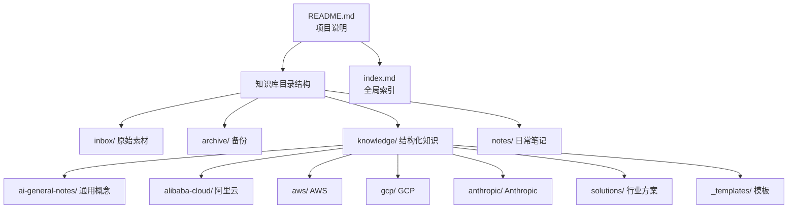
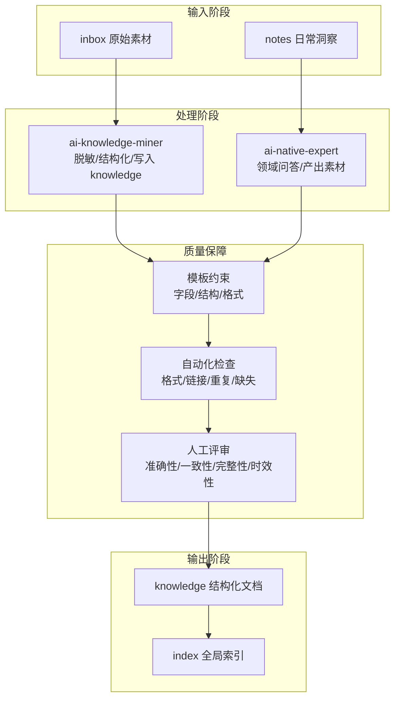
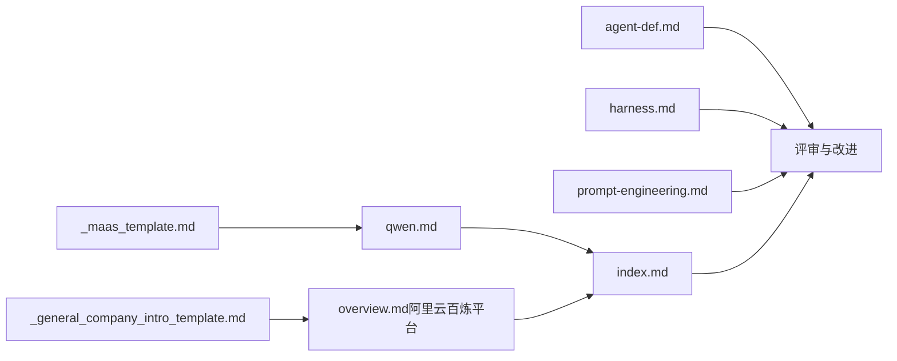

# 内容质量标准

<cite>
**本文引用的文件**
- [README.md](file://README.md)
- [index.md](file://index.md)
- [_general_company_intro_template.md](file://knowledge/_general_company_intro_template.md)
- [_maas_template.md](file://knowledge/_maas_template.md)
- [Daily_note_update_with_AI_insight.md](file://notes/Daily_note_update_with_AI_insight.md)
- [agent-def.md](file://knowledge/ai-general-notes/agent-def.md)
- [harness.md](file://knowledge/ai-general-notes/harness.md)
- [prompt-engineering.md](file://knowledge/ai-general-notes/prompt-engineering.md)
- [rag.md](file://knowledge/ai-general-notes/rag.md)
- [fine-tuning.md](file://knowledge/ai-general-notes/fine-tuning.md)
- [overview.md（阿里云百炼平台）](file://knowledge/alibaba-cloud/maas/overview.md)
- [qwen.md（通义千问）](file://knowledge/alibaba-cloud/maas/qwen.md)
</cite>

## 目录
1. [引言](#引言)
2. [项目结构](#项目结构)
3. [核心组件](#核心组件)
4. [架构总览](#架构总览)
5. [详细组件分析](#详细组件分析)
6. [依赖分析](#依赖分析)
7. [性能考虑](#性能考虑)
8. [故障排查指南](#故障排查指南)
9. [结论](#结论)
10. [附录](#附录)

## 引言
本文件旨在为AI知识库的内容质量标准提供一套系统化、可落地的评估与改进框架。通过对仓库现有模板与示例文档的分析，总结出质量评估的关键指标（准确性、完整性、一致性、时效性），并配套专家评审、自动化检查与人工审核的实施要点，形成“可衡量、可执行、可持续”的质量控制闭环。

## 项目结构
知识库采用“按领域/厂商/产品”分层组织的文档结构，辅以全局索引与模板，便于检索与复用。核心目录与职责如下：
- inbox：原始素材入口
- archive：归档备份
- knowledge：结构化知识库，按领域/厂商/产品组织
- notes：日常笔记与AI洞察
- index.md：全局索引，帮助快速定位文档

图表来源
- [README.md:1-20](file://README.md#L1-L20)
- [index.md:1-69](file://index.md#L1-L69)

章节来源
- [README.md:1-20](file://README.md#L1-L20)
- [index.md:1-69](file://index.md#L1-L69)

## 核心组件
围绕内容质量评估，本知识库已形成以下关键组件：
- 模板体系：通用概念模板、MaaS产品模板、公司分析模板等，确保结构一致、字段完备
- 示例文档：Agent、Harness、Prompt Engineering、RAG、Fine-tuning等，体现高质量内容的范式
- 全局索引：帮助快速定位与交叉验证
- 日常笔记：记录AI洞察与差异点，支撑时效性与一致性

章节来源
- [_general_company_intro_template.md:1-234](file://knowledge/_general_company_intro_template.md#L1-L234)
- [_maas_template.md:1-65](file://knowledge/_maas_template.md#L1-L65)
- [agent-def.md:1-128](file://knowledge/ai-general-notes/agent-def.md#L1-L128)
- [harness.md:1-108](file://knowledge/ai-general-notes/harness.md#L1-L108)
- [prompt-engineering.md:1-193](file://knowledge/ai-general-notes/prompt-engineering.md#L1-L193)
- [rag.md:1-42](file://knowledge/ai-general-notes/rag.md#L1-L42)
- [fine-tuning.md:1-42](file://knowledge/ai-general-notes/fine-tuning.md#L1-L42)
- [Daily_note_update_with_AI_insight.md:1-6](file://notes/Daily_note_update_with_AI_insight.md#L1-L6)

## 架构总览
内容质量标准的实施架构由“模板约束—自动化检查—人工评审—持续改进”四个环节组成，贯穿从素材到发布的全流程。

图表来源
- [README.md:7-11](file://README.md#L7-L11)
- [index.md:1-69](file://index.md#L1-L69)

## 详细组件分析

### 指标体系与评分细则
为便于量化评估，建议将质量指标分解为以下维度与评分标准（百分制）：

- 准确性（权重30%）
  - 事实正确性：陈述的事实与权威来源一致（100%正确得满分，逐条扣分）
  - 数据可靠性：数据注明来源、可信度分级、估算说明（缺失来源扣分）
  - 专家共识：与主流评测/报告一致，存在分歧时标注“争议/待验证”
  - 评分细则：事实错误每处-10分，来源缺失每处-5分，标注不清每处-3分

- 完整性（权重25%）
  - 信息覆盖面：涵盖关键维度（定位、能力、限制、适用场景、接入方式等）
  - 逻辑连贯性：段落间衔接自然，前后呼应，避免自相矛盾
  - 评分细则：缺少关键字段每项-5分，逻辑断裂每处-3分，明显矛盾每处-10分

- 一致性（权重25%）
  - 术语统一：同一概念在全库内使用统一表述（不一致每处-2分）
  - 格式规范：遵循模板字段与格式要求（不规范每处-2分）
  - 评分细则：术语不统一每处-2分，格式不符每处-2分

- 时效性（权重20%）
  - 更新频率：定期回顾与更新（未更新扣分）
  - 过期标注：涉及时效性内容需标注截止时间/状态（未标注每处-5分）
  - 评分细则：超过3个月未更新扣5-15分，涉及时效未标注每处-5分

章节来源
- [_general_company_intro_template.md:3,92-93,129-131,194-199:3-3](file://knowledge/_general_company_intro_template.md#L3-L3)
- [_maas_template.md:3-5](file://knowledge/_maas_template.md#L3-L5)

### 专家评审标准
- 结构与逻辑
  - 文档是否遵循模板字段，关键信息是否齐全
  - 段落之间是否存在逻辑跳跃或前后矛盾
- 事实核查
  - 数据来源是否清晰、可追溯
  - 是否对模糊/估算/争议信息进行标注
- 术语与表达
  - 是否使用统一术语，避免歧义
  - 表达是否简洁准确，避免冗余

章节来源
- [_maas_template.md:7-10](file://knowledge/_maas_template.md#L7-L10)
- [agent-def.md:7-11](file://knowledge/ai-general-notes/agent-def.md#L7-L11)
- [harness.md:7-11](file://knowledge/ai-general-notes/harness.md#L7-L11)
- [prompt-engineering.md:7-11](file://knowledge/ai-general-notes/prompt-engineering.md#L7-L11)

### 自动化检查规则
- 字段完整性
  - 检查必填字段（如“最后更新”“所属厂商”“产品类别”“状态”等）是否填写
- 链接有效性
  - 校验参考资料/官网链接可访问性
- 重复与相似
  - 基于关键词/摘要的相似度检测，避免重复内容
- 格式一致性
  - 表格/标题/列表格式是否符合模板要求

章节来源
- [_maas_template.md:3-5](file://knowledge/_maas_template.md#L3-L5)
- [qwen.md:3-5](file://knowledge/alibaba-cloud/maas/qwen.md#L3-L5)

### 人工审核要点
- 事实与数据
  - 对比多个权威来源，确认关键数据与结论
- 适用性与局限
  - 明确适用/不适用场景，避免过度推广
- 时效性与标注
  - 对涉及时效的内容进行标注，必要时标注“待验证/估算”

章节来源
- [Daily_note_update_with_AI_insight.md:3-6](file://notes/Daily_note_update_with_AI_insight.md#L3-L6)
- [qwen.md:8-10](file://knowledge/alibaba-cloud/maas/qwen.md#L8-L10)

### 质量控制最佳实践
- 模板驱动：所有文档均使用模板，确保字段与结构一致
- 双轨校验：自动化检查+人工评审，关键文档至少双人复核
- 回归更新：设定周期性回顾机制，结合notes中的差异点进行修正
- 索引联动：更新文档后同步维护index，确保检索与交叉验证便捷

章节来源
- [index.md:1-69](file://index.md#L1-L69)
- [Daily_note_update_with_AI_insight.md:1-6](file://notes/Daily_note_update_with_AI_insight.md#L1-L6)

### 常见问题与解决方案
- 问题：术语不统一
  - 解决：统一术语表，评审时重点检查
- 问题：数据来源缺失
  - 解决：模板强制要求来源字段，自动化检查缺失即拦截
- 问题：时效性标注不足
  - 解决：模板加入“最后更新/数据时效说明”，定期提醒更新
- 问题：内容重复或逻辑断裂
  - 解决：引入相似度检测与逻辑连贯性检查，人工复核

章节来源
- [_general_company_intro_template.md:3,92-93,129-131,194-199:3-3](file://knowledge/_general_company_intro_template.md#L3-L3)
- [_maas_template.md:3-5](file://knowledge/_maas_template.md#L3-L5)

### 质量标准在知识管理中的作用与效果
- 提升检索质量：统一结构与术语，提高索引与交叉验证效率
- 降低认知成本：标准化模板与评审流程，减少理解偏差
- 保障决策质量：权威来源与时效标注，辅助更可靠的决策
- 持续改进：通过变更日志与回顾机制，推动内容不断优化

章节来源
- [index.md:1-69](file://index.md#L1-L69)
- [agent-def.md:123-128](file://knowledge/ai-general-notes/agent-def.md#L123-L128)
- [harness.md:104-108](file://knowledge/ai-general-notes/harness.md#L104-L108)
- [prompt-engineering.md:189-193](file://knowledge/ai-general-notes/prompt-engineering.md#L189-L193)

## 依赖分析
质量标准的实施依赖于模板、示例文档与索引的协同：
- 模板为质量提供“刚性约束”，确保字段与格式一致
- 示例文档提供“柔性参考”，展示高质量内容的范式
- 索引提供“检索与交叉验证”的基础

图表来源
- [_maas_template.md:1-65](file://knowledge/_maas_template.md#L1-L65)
- [_general_company_intro_template.md:1-234](file://knowledge/_general_company_intro_template.md#L1-L234)
- [agent-def.md:1-128](file://knowledge/ai-general-notes/agent-def.md#L1-L128)
- [harness.md:1-108](file://knowledge/ai-general-notes/harness.md#L1-L108)
- [prompt-engineering.md:1-193](file://knowledge/ai-general-notes/prompt-engineering.md#L1-L193)
- [index.md:1-69](file://index.md#L1-L69)
- [qwen.md:1-120](file://knowledge/alibaba-cloud/maas/qwen.md#L1-L120)
- [overview.md（阿里云百炼平台）:1-9](file://knowledge/alibaba-cloud/maas/overview.md#L1-L9)

## 性能考虑
- 自动化检查的性能优化
  - 使用增量扫描与缓存命中，减少重复计算
  - 将链接有效性检查与相似度检测拆分为异步任务
- 评审效率提升
  - 模板化字段优先，减少自由文本评审工作量
  - 建立“高风险字段”清单，集中资源重点把关

## 故障排查指南
- 常见问题定位
  - 字段缺失：检查模板字段映射与导入脚本
  - 链接失效：启用健康检查与告警通知
  - 术语不一致：建立术语表与正则匹配规则
- 处理流程
  - 自动化检查拦截后，进入人工复核通道
  - 评审完成后更新文档并同步索引

章节来源
- [_maas_template.md:3-5](file://knowledge/_maas_template.md#L3-L5)
- [Daily_note_update_with_AI_insight.md:3-6](file://notes/Daily_note_update_with_AI_insight.md#L3-L6)

## 结论
通过模板约束、自动化检查与人工评审的协同，结合周期性回顾与索引联动，本知识库可实现“可衡量、可执行、可持续”的内容质量标准。建议在实践中逐步完善自动化规则与评审清单，持续优化质量评估与改进流程。

## 附录
- 评审清单（示例）
  - 字段完整性：是否填写“最后更新/所属厂商/产品类别/状态”
  - 事实核查：关键数据是否有来源，是否标注估算/争议
  - 术语一致性：是否使用统一术语表
  - 时效性：是否标注截止时间/状态
  - 逻辑连贯性：段落衔接是否自然，是否存在前后矛盾

章节来源
- [_maas_template.md:3-5](file://knowledge/_maas_template.md#L3-L5)
- [_general_company_intro_template.md:3,92-93,129-131,194-199:3-3](file://knowledge/_general_company_intro_template.md#L3-L3)
- [Daily_note_update_with_AI_insight.md:3-6](file://notes/Daily_note_update_with_AI_insight.md#L3-L6)