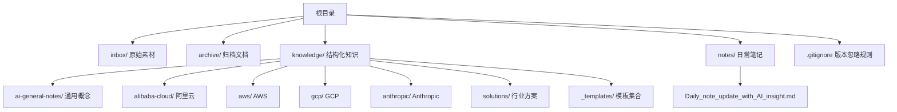
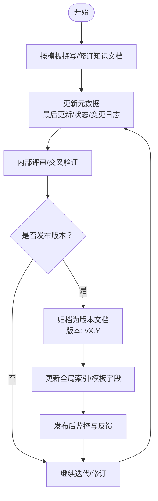
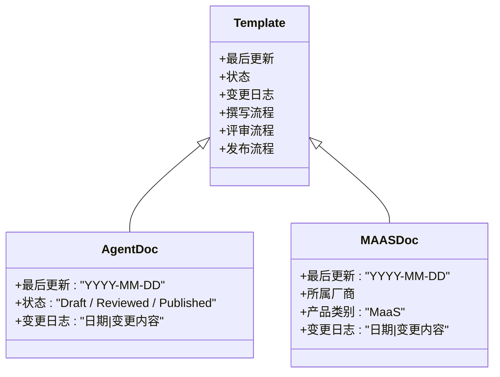
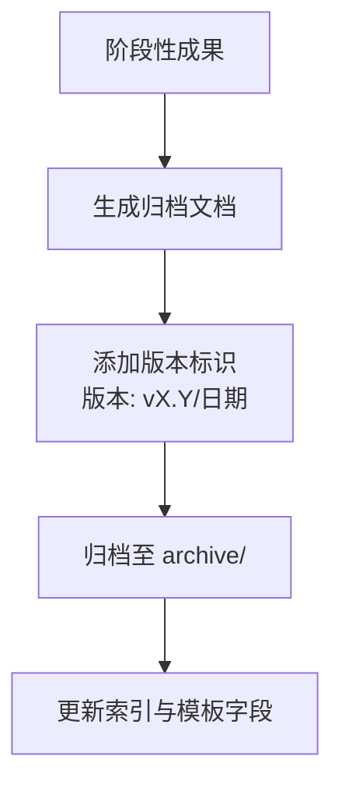
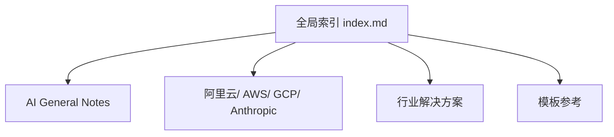
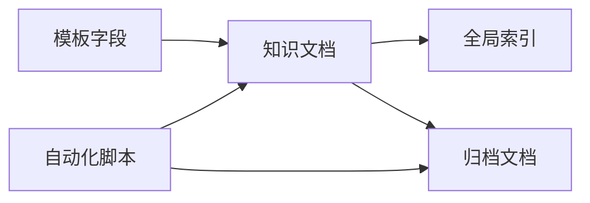

# 版本管理与变更追踪

<cite>
**本文引用的文件**
- [README.md](file://README.md)
- [index.md](file://index.md)
- [.gitignore](file://.gitignore)
- [archive/20260518.md](file://archive/20260518.md)
- [knowledge/ai-general-notes/agent-def.md](file://knowledge/ai-general-notes/agent-def.md)
- [knowledge/ai-general-notes/ai-capability-and-deployment.md](file://knowledge/ai-general-notes/ai-capability-and-deployment.md)
- [knowledge/_maas_template.md](file://knowledge/_maas_template.md)
- [knowledge/ai-general-notes/_template.md](file://knowledge/ai-general-notes/_template.md)
- [knowledge/solutions/_template.md](file://knowledge/solutions/_template.md)
- [notes/Daily_note_update_with_AI_insight.md](file://notes/Daily_note_update_with_AI_insight.md)
- [vibeproject/real_user_test_wan2.6_no_audit.py](file://vibeproject/real_user_test_wan2.6_no_audit.py)
- [vibeproject/test_ds_v4.py](file://vibeproject/test_ds_v4.py)
</cite>

## 目录
1. [简介](#简介)
2. [项目结构](#项目结构)
3. [核心组件](#核心组件)
4. [架构总览](#架构总览)
5. [详细组件分析](#详细组件分析)
6. [依赖分析](#依赖分析)
7. [性能考量](#性能考量)
8. [故障排查指南](#故障排查指南)
9. [结论](#结论)
10. [附录](#附录)

## 简介
本文件面向AI知识库的版本管理与变更追踪，结合仓库现有实践，系统化梳理版本号规范、分支与合并策略、变更日志管理、知识演进追踪、发布流程与质量门禁、发布后监控，以及工具与自动化配置建议。文档既关注知识内容的演进，也强调可追溯性与可维护性，帮助团队在长期运营中保持知识库的高质量与一致性。

## 项目结构
知识库采用按领域与组织分类的文档结构，配合全局索引与模板，形成“内容-索引-模板”的协同体系。版本与变更追踪体现在两类载体：
- 正式知识文档：包含“最后更新”“状态”“变更日志”等字段，便于追踪演进。
- 归档文档：以“版本: vX.Y”等标识记录阶段性成果，便于回溯与对比。

图表来源
- [README.md:13-19](file://README.md#L13-L19)
- [index.md:1-69](file://index.md#L1-L69)
- [.gitignore:23-31](file://.gitignore#L23-L31)

章节来源
- [README.md:13-19](file://README.md#L13-L19)
- [index.md:1-69](file://index.md#L1-L69)
- [.gitignore:23-31](file://.gitignore#L23-L31)

## 核心组件
- 知识文档模板：提供“最后更新”“状态”“变更日志”等标准化字段，确保每篇文档具备可追溯性与版本意识。
- 归档文档：以“版本: vX.Y”等标识记录阶段性成果，便于回滚与对比。
- 全局索引：统一导航与版本信息展示，辅助版本检索与关联。
- 日常笔记：记录即时洞察与外部信息，作为知识沉淀的源头之一。

章节来源
- [knowledge/_maas_template.md:1-65](file://knowledge/_maas_template.md#L1-L65)
- [knowledge/ai-general-notes/_template.md:1-75](file://knowledge/ai-general-notes/_template.md#L1-L75)
- [knowledge/solutions/_template.md:103-108](file://knowledge/solutions/_template.md#L103-L108)
- [archive/20260518.md:3-6](file://archive/20260518.md#L3-L6)
- [index.md:3-69](file://index.md#L3-L69)
- [notes/Daily_note_update_with_AI_insight.md:1-6](file://notes/Daily_note_update_with_AI_insight.md#L1-L6)

## 架构总览
版本管理与变更追踪在知识库中的落地路径如下：
- 内容创作：基于模板撰写，填写“最后更新”“状态”“变更日志”。
- 归档与发布：阶段性成果归档为“版本: vX.Y”文档，纳入archive。
- 索引与检索：通过全局索引与模板字段，实现版本检索与关联。
- 回滚与对比：通过归档文档与变更日志，进行历史版本对比与回滚。

## 详细组件分析

### 组件A：知识文档模板与版本字段
- 模板字段：包含“最后更新”“状态”“变更日志”等，确保每篇文档具备版本意识与可追溯性。
- 使用建议：
  - “最后更新”用于记录最近一次修订日期，便于快速定位最新版本。
  - “状态”用于标识草稿/评审/发布等阶段，便于流程控制。
  - “变更日志”用于记录每次修订的关键内容，便于回滚与对比。

图表来源
- [knowledge/ai-general-notes/_template.md:1-75](file://knowledge/ai-general-notes/_template.md#L1-L75)
- [knowledge/_maas_template.md:1-65](file://knowledge/_maas_template.md#L1-L65)

章节来源
- [knowledge/ai-general-notes/_template.md:1-75](file://knowledge/ai-general-notes/_template.md#L1-L75)
- [knowledge/_maas_template.md:1-65](file://knowledge/_maas_template.md#L1-L65)

### 组件B：归档文档与版本标识
- 归档文档以“版本: vX.Y”等标识记录阶段性成果，便于回滚与对比。
- 建议：
  - 归档命名遵循“YYYYMMDD_主题_版本号”或“主题_版本号”等规范，确保可排序与可检索。
  - 归档文档应保留“版本: vX.Y”“日期”“修订摘要”等关键字段，便于历史对比。

图表来源
- [archive/20260518.md:3-6](file://archive/20260518.md#L3-L6)

章节来源
- [archive/20260518.md:3-6](file://archive/20260518.md#L3-L6)

### 组件C：全局索引与版本检索
- 全局索引提供跨领域的统一导航，便于定位知识与版本信息。
- 建议：
  - 在索引中保留“最后更新”“版本”等关键信息，便于快速检索。
  - 对重要版本添加“⭐”等标记，突出关键里程碑。

图表来源
- [index.md:1-69](file://index.md#L1-L69)

章节来源
- [index.md:1-69](file://index.md#L1-L69)

### 组件D：日常笔记与知识源
- 日常笔记记录即时洞察与外部信息，作为知识沉淀的源头之一。
- 建议：
  - 将重要洞察纳入正式知识文档，保留来源与时间戳。
  - 对外部信息注明来源，便于后续交叉验证与回溯。

章节来源
- [notes/Daily_note_update_with_AI_insight.md:1-6](file://notes/Daily_note_update_with_AI_insight.md#L1-L6)

### 组件E：自动化脚本与版本验证
- 自动化脚本用于验证模型与API行为，可作为“版本验证”的一部分。
- 建议：
  - 将脚本与对应版本文档关联，记录测试环境、参数与结果。
  - 对关键变更（如模型版本、地域路由）在脚本中明确标注，便于回归测试。

章节来源
- [vibeproject/real_user_test_wan2.6_no_audit.py:1-105](file://vibeproject/real_user_test_wan2.6_no_audit.py#L1-L105)
- [vibeproject/test_ds_v4.py:1-102](file://vibeproject/test_ds_v4.py#L1-L102)

## 依赖分析
- 模板依赖：知识文档依赖模板字段（最后更新、状态、变更日志）实现版本化管理。
- 归档依赖：归档文档依赖“版本: vX.Y”等标识实现历史版本管理。
- 索引依赖：全局索引依赖文档元数据实现版本检索与导航。
- 工具依赖：自动化脚本依赖环境变量与API配置，确保可重复验证。

图表来源
- [knowledge/ai-general-notes/_template.md:1-75](file://knowledge/ai-general-notes/_template.md#L1-L75)
- [knowledge/_maas_template.md:1-65](file://knowledge/_maas_template.md#L1-L65)
- [index.md:1-69](file://index.md#L1-L69)
- [archive/20260518.md:3-6](file://archive/20260518.md#L3-L6)
- [vibeproject/test_ds_v4.py:1-102](file://vibeproject/test_ds_v4.py#L1-L102)

章节来源
- [knowledge/ai-general-notes/_template.md:1-75](file://knowledge/ai-general-notes/_template.md#L1-L75)
- [knowledge/_maas_template.md:1-65](file://knowledge/_maas_template.md#L1-L65)
- [index.md:1-69](file://index.md#L1-L69)
- [archive/20260518.md:3-6](file://archive/20260518.md#L3-L6)
- [vibeproject/test_ds_v4.py:1-102](file://vibeproject/test_ds_v4.py#L1-L102)

## 性能考量
- 版本检索性能：通过全局索引与模板字段的规范化，降低版本检索成本。
- 归档体积控制：对废弃PRD版本与过程文件进行清理，减少无关内容对检索与存储的影响。
- 自动化验证：通过脚本化测试，减少手工验证成本，提高版本验证效率。

章节来源
- [.gitignore:27-31](file://.gitignore#L27-L31)
- [vibeproject/test_ds_v4.py:1-102](file://vibeproject/test_ds_v4.py#L1-L102)

## 故障排查指南
- 版本字段缺失：若某篇文档缺少“最后更新”“状态”“变更日志”，应补全并回填历史修订。
- 归档文档缺失：若缺少“版本: vX.Y”标识，应补充版本号与日期，并在索引中标注。
- 索引信息不一致：若索引中的版本信息与文档元数据不一致，应统一更新，确保可追溯性。
- 自动化脚本失败：检查环境变量与API配置，确保脚本可重复执行；对关键变更在脚本中明确标注。

章节来源
- [knowledge/ai-general-notes/_template.md:1-75](file://knowledge/ai-general-notes/_template.md#L1-L75)
- [knowledge/_maas_template.md:1-65](file://knowledge/_maas_template.md#L1-L65)
- [index.md:1-69](file://index.md#L1-L69)
- [archive/20260518.md:3-6](file://archive/20260518.md#L3-L6)
- [vibeproject/real_user_test_wan2.6_no_audit.py:1-105](file://vibeproject/real_user_test_wan2.6_no_audit.py#L1-L105)
- [vibeproject/test_ds_v4.py:1-102](file://vibeproject/test_ds_v4.py#L1-L102)

## 结论
通过模板化字段、归档文档、全局索引与自动化脚本的协同，知识库实现了可追溯、可对比、可回滚的版本管理与变更追踪。建议在现有基础上进一步完善分支与合并策略、变更日志格式与影响评估、发布流程与质量门禁，并建立发布后监控机制，以支撑知识库的长期维护与演进。

## 附录
- 版本号规范建议
  - 采用语义化版本：主版本.次版本.修订号（vX.Y.Z），重大破坏性变更提升主版本，新增功能提升次版本，修复提升修订号。
  - 归档文档版本标识：使用“版本: vX.Y”“日期”“修订摘要”等字段，确保可检索与可对比。
- 分支与合并策略建议
  - 主分支：仅接受经评审的发布版本归档。
  - 功能分支：按主题或领域划分，合并前需完成评审与自动化验证。
  - 合并冲突：优先通过模板字段与归档文档的标准化减少冲突；冲突无法避免时，采用“变更日志”记录冲突点与解决依据。
- 变更日志管理规范
  - 格式：日期|变更内容|影响评估|回滚策略（可选）。
  - 影响评估：对功能、性能、兼容性、安全性等方面进行简要评估。
  - 回滚策略：明确回滚路径与验证步骤，确保可逆。
- 发布流程与质量门禁
  - 草稿→评审→发布：文档状态流转需经评审与交叉验证。
  - 质量门禁：模板字段完整、变更日志清晰、自动化脚本验证通过。
  - 发布后监控：通过索引与归档文档的版本标识，持续收集反馈并迭代。
- 工具与自动化配置
  - 环境变量：脚本依赖API密钥与地域配置，确保可重复执行。
  - 归档与索引：脚本与文档版本标识联动，确保可追溯性。

章节来源
- [knowledge/ai-general-notes/_template.md:1-75](file://knowledge/ai-general-notes/_template.md#L1-L75)
- [knowledge/_maas_template.md:1-65](file://knowledge/_maas_template.md#L1-L65)
- [index.md:1-69](file://index.md#L1-L69)
- [archive/20260518.md:3-6](file://archive/20260518.md#L3-L6)
- [vibeproject/real_user_test_wan2.6_no_audit.py:1-105](file://vibeproject/real_user_test_wan2.6_no_audit.py#L1-L105)
- [vibeproject/test_ds_v4.py:1-102](file://vibeproject/test_ds_v4.py#L1-L102)