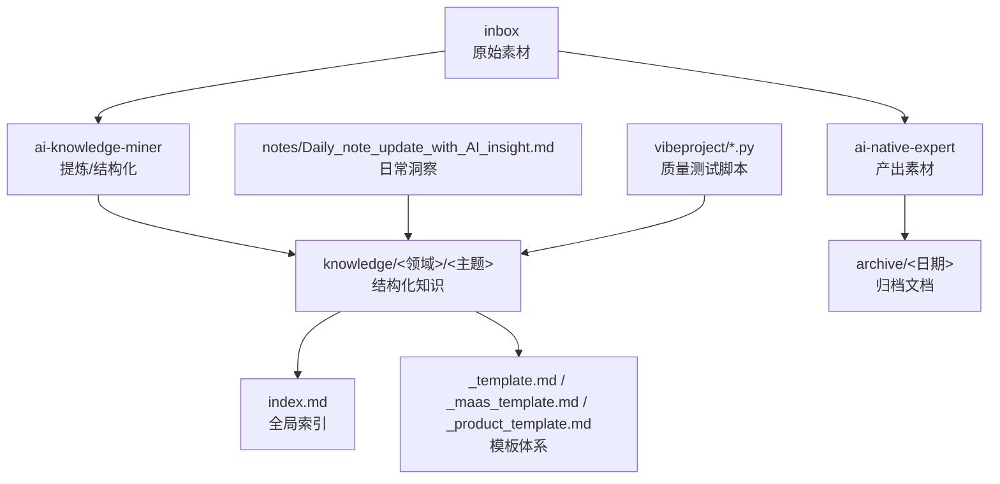
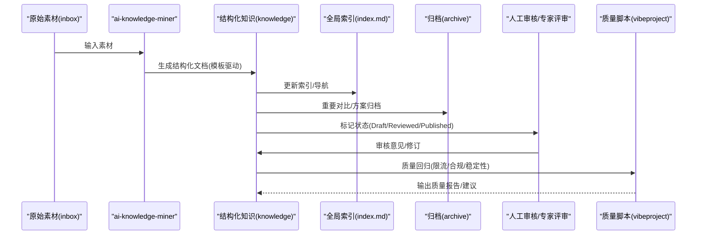
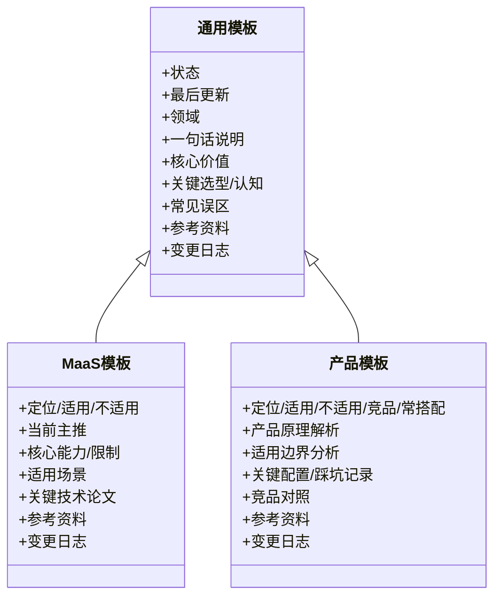
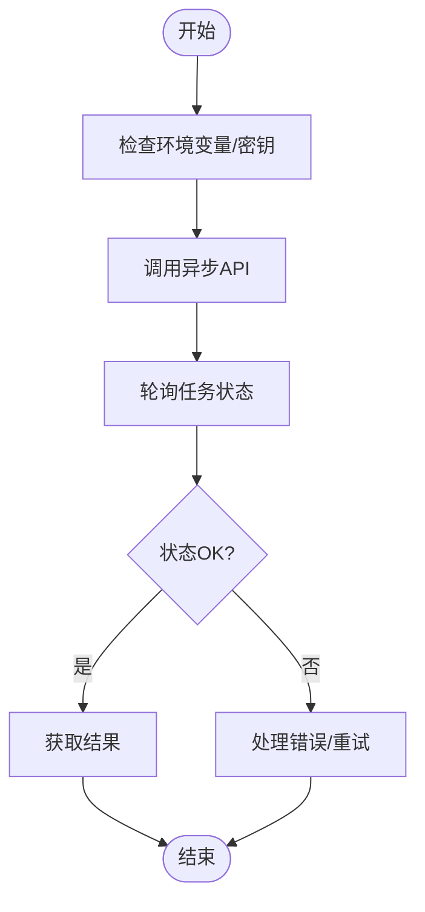
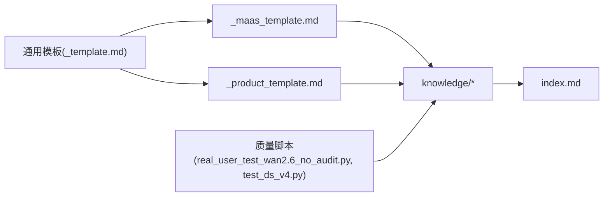

# 质量控制与审核

<cite>
**本文引用的文件**
- [README.md](file://README.md)
- [index.md](file://index.md)
- [Daily_note_update_with_AI_insight.md](file://notes/Daily_note_update_with_AI_insight.md)
- [real_user_test_wan2.6_no_audit.py](file://vibeproject/real_user_test_wan2.6_no_audit.py)
- [test_ds_v4.py](file://vibeproject/test_ds_v4.py)
- [_general_company_intro_template.md](file://knowledge/_general_company_intro_template.md)
- [_maas_template.md](file://knowledge/_maas_template.md)
- [agent-def.md](file://knowledge/ai-general-notes/agent-def.md)
- [_template.md](file://knowledge/ai-general-notes/_template.md)
- [_product_template.md](file://knowledge/_product_template.md)
- [20260420.md](file://archive/20260420.md)
- [20260518.md](file://archive/20260518.md)
</cite>

## 目录
1. [引言](#引言)
2. [项目结构](#项目结构)
3. [核心组件](#核心组件)
4. [架构总览](#架构总览)
5. [详细组件分析](#详细组件分析)
6. [依赖分析](#依赖分析)
7. [性能考量](#性能考量)
8. [故障排除指南](#故障排除指南)
9. [结论](#结论)
10. [附录](#附录)

## 引言
本文件面向AI知识库的质量控制与审核，围绕内容质量标准、评估指标体系、审核流程与质量控制机制、版本管理与变更追踪、持续改进与反馈闭环进行系统化梳理。结合仓库现有模板、索引与示例文档，提出可落地的质量度量与改进建议，帮助团队在知识沉淀、内容治理与长期演进中保持一致性、准确性与可追溯性。

## 项目结构
知识库采用“inbox/归档/知识库”的三层结构，配合全局索引与模板体系，支撑从原始素材到结构化知识再到可检索索引的全流程。核心目录与职责如下：
- inbox：原始素材收集区，供AI专家agent产出与汇聚
- archive：归档区，沉淀对比分析、方案文档等历史材料
- knowledge：结构化知识库，按领域/厂商/主题分类，配套模板与索引
- notes：日常笔记与AI洞察，形成轻量级知识片段
- vibeproject：质量相关的测试与验证脚本，覆盖API调用、限流与合规开关等

图表来源
- [README.md:13-18](file://README.md#L13-L18)
- [index.md:1-69](file://index.md#L1-L69)
- [Daily_note_update_with_AI_insight.md:1-6](file://notes/Daily_note_update_with_AI_insight.md#L1-L6)

章节来源
- [README.md:1-20](file://README.md#L1-L20)
- [index.md:1-69](file://index.md#L1-L69)

## 核心组件
- 模板体系：通用概念、MaaS产品、产品分析等模板，统一字段与格式，便于一致性校验与自动化检查
- 索引与导航：全局索引提供跨领域的知识导航，降低检索成本
- 归档与对比：归档文档沉淀对比分析与方案，便于回溯与复用
- 日常洞察：轻量笔记记录关键发现，作为知识增量来源
- 质量脚本：API调用、限流与合规开关验证，支撑内容安全与稳定性基线

章节来源
- [_template.md:1-75](file://knowledge/ai-general-notes/_template.md#L1-L75)
- [_maas_template.md:1-65](file://knowledge/_maas_template.md#L1-L65)
- [_product_template.md:1-62](file://knowledge/_product_template.md#L1-L62)
- [index.md:1-69](file://index.md#L1-L69)
- [20260420.md:1-68](file://archive/20260420.md#L1-L68)
- [20260518.md:1-470](file://archive/20260518.md#L1-L470)
- [Daily_note_update_with_AI_insight.md:1-6](file://notes/Daily_note_update_with_AI_insight.md#L1-L6)
- [real_user_test_wan2.6_no_audit.py:1-105](file://vibeproject/real_user_test_wan2.6_no_audit.py#L1-L105)
- [test_ds_v4.py:1-102](file://vibeproject/test_ds_v4.py#L1-L102)

## 架构总览
质量控制贯穿“素材→提炼→结构化→索引→归档→复用”的全生命周期，形成“模板驱动 + 自动化检查 + 人工审核 + 版本追踪”的闭环。

图表来源
- [README.md:7-11](file://README.md#L7-L11)
- [index.md:1-69](file://index.md#L1-L69)
- [_template.md:5](file://knowledge/ai-general-notes/_template.md#L5)

## 详细组件分析

### 模板与格式一致性（准确性与完整性）
- 通用模板：统一“状态”字段（草稿/复审/发布），强制“最后更新”“领域”等元信息，便于自动化校验与审计
- MaaS模板：标准化模型定位、能力与限制、适用场景、技术论文与变更记录，确保信息完整性与可比性
- 产品模板：明确产品定位、适用/不适用边界、踩坑记录、竞品对照，提升可操作性与可验证性
- 通用概念模板：提供“关键选型维度/关键认知框架”两类结构，便于在技术方案与趋势洞察之间切换

图表来源
- [_template.md:1-75](file://knowledge/ai-general-notes/_template.md#L1-L75)
- [_maas_template.md:1-65](file://knowledge/_maas_template.md#L1-L65)
- [_product_template.md:1-62](file://knowledge/_product_template.md#L1-L62)

章节来源
- [_template.md:1-75](file://knowledge/ai-general-notes/_template.md#L1-L75)
- [_maas_template.md:1-65](file://knowledge/_maas_template.md#L1-L65)
- [_product_template.md:1-62](file://knowledge/_product_template.md#L1-L62)

### 全局索引与导航（一致性与可检索性）
- 全局索引按“道/线/体/点”四个层级组织，覆盖跨厂商技术概念、对比分析、行业解决方案与单产品知识
- 通过“状态”“最后更新”“所属厂商/领域”等元信息，便于一致性检查与版本追踪

章节来源
- [index.md:1-69](file://index.md#L1-L69)

### 归档与对比分析（时效性与可追溯性）
- 归档文档记录对比分析与方案，包含版本、日期、分类等元信息，便于历史回溯与对比
- 示例：模型对比分析文档包含“谁赢”“选型建议”“一句话总结”，强化时效性与实用性

章节来源
- [20260420.md:1-68](file://archive/20260420.md#L1-L68)
- [20260518.md:1-470](file://archive/20260518.md#L1-L470)

### 日常洞察与增量质量（时效性与完整性）
- 日常笔记记录关键发现，作为增量知识来源，建议纳入“最后更新”与“来源标注”，确保时效性与可追溯性

章节来源
- [Daily_note_update_with_AI_insight.md:1-6](file://notes/Daily_note_update_with_AI_insight.md#L1-L6)

### 质量脚本与自动化检查（稳定性与合规）
- API调用脚本：验证异步任务、轮询与结果获取，确保接口稳定性与错误处理
- 限流与地域路由：明确RPM/TPM限额与地域节点要求，支撑生产级质量基线
- 合规开关：演示禁用内容安全检测的Header配置，强调合规与审计的边界与流程

图表来源
- [real_user_test_wan2.6_no_audit.py:31-101](file://vibeproject/real_user_test_wan2.6_no_audit.py#L31-L101)

章节来源
- [real_user_test_wan2.6_no_audit.py:1-105](file://vibeproject/real_user_test_wan2.6_no_audit.py#L1-L105)
- [test_ds_v4.py:1-102](file://vibeproject/test_ds_v4.py#L1-L102)

### 审核流程与质量控制机制
- 多级审核：Draft → Reviewed → Published，结合模板字段与索引状态，形成可追踪的流转
- 专家评审：在关键领域（如MaaS、竞品分析）引入专家复核，确保专业性与一致性
- 自动化检查：利用模板字段与脚本校验（格式、元信息、接口行为），降低人工负担
- 专家评审示例：Agent定义文档中的“OpenAI三大优先级”“各厂商Agent平台对照”等，体现专家视角与权威来源标注

章节来源
- [_template.md:5](file://knowledge/ai-general-notes/_template.md#L5)
- [agent-def.md:42-58](file://knowledge/ai-general-notes/agent-def.md#L42-L58)
- [agent-def.md:78-87](file://knowledge/ai-general-notes/agent-def.md#L78-L87)

### 版本管理与变更追踪
- 变更日志：模板统一提供Changelog，记录日期与变更内容，支撑历史回溯
- 元信息：最后更新、状态、领域等字段，便于自动化筛选与报表生成
- 归档策略：重要对比与方案归档，形成版本演进的证据链

章节来源
- [_maas_template.md:62-65](file://knowledge/_maas_template.md#L62-L65)
- [_template.md:72-75](file://knowledge/ai-general-notes/_template.md#L72-L75)
- [20260420.md:55-57](file://archive/20260420.md#L55-L57)

### 持续改进与质量反馈循环
- 指标建议：覆盖率（模板字段填充率）、一致性（状态/元信息规范）、完整性（关键区块缺失率）、时效性（最后更新距今）
- 反馈闭环：脚本输出质量报告、专家评审意见、索引与模板迭代，形成持续优化

章节来源
- [test_ds_v4.py:5-11](file://vibeproject/test_ds_v4.py#L5-L11)
- [real_user_test_wan2.6_no_audit.py:21-24](file://vibeproject/real_user_test_wan2.6_no_audit.py#L21-L24)

## 依赖分析
- 模板依赖：通用模板为MaaS与产品模板的父模板，确保字段与结构一致
- 索引依赖：全局索引依赖知识库文档的元信息与状态字段
- 脚本依赖：质量脚本依赖环境变量与API端点，确保可重复验证

图表来源
- [_template.md:1-75](file://knowledge/ai-general-notes/_template.md#L1-L75)
- [_maas_template.md:1-65](file://knowledge/_maas_template.md#L1-L65)
- [_product_template.md:1-62](file://knowledge/_product_template.md#L1-L62)
- [index.md:1-69](file://index.md#L1-L69)
- [real_user_test_wan2.6_no_audit.py:1-105](file://vibeproject/real_user_test_wan2.6_no_audit.py#L1-L105)
- [test_ds_v4.py:1-102](file://vibeproject/test_ds_v4.py#L1-L102)

章节来源
- [_template.md:1-75](file://knowledge/ai-general-notes/_template.md#L1-L75)
- [_maas_template.md:1-65](file://knowledge/_maas_template.md#L1-L65)
- [_product_template.md:1-62](file://knowledge/_product_template.md#L1-L62)
- [index.md:1-69](file://index.md#L1-L69)
- [real_user_test_wan2.6_no_audit.py:1-105](file://vibeproject/real_user_test_wan2.6_no_audit.py#L1-L105)
- [test_ds_v4.py:1-102](file://vibeproject/test_ds_v4.py#L1-L102)

## 性能考量
- 模板字段与结构化程度直接影响检索效率与人工复核成本
- 自动化脚本应覆盖关键路径（异步任务、错误处理、轮询间隔），避免重复人工验证
- 限流与地域路由策略需与业务峰值匹配，减少失败与重试带来的抖动

## 故障排除指南
- API调用失败：检查密钥、端点与Headers配置，关注状态码与错误消息
- 任务状态异常：确认轮询间隔与任务ID，避免并发冲突
- 合规开关：明确禁用内容安全检测的边界与审批流程，确保合规可追溯

章节来源
- [real_user_test_wan2.6_no_audit.py:55-97](file://vibeproject/real_user_test_wan2.6_no_audit.py#L55-L97)

## 结论
通过模板驱动的格式规范、自动化脚本的质量基线、专家评审的专业把关与版本化的变更追踪，知识库可实现“准确性、完整性、一致性、时效性”的系统化质量控制。建议持续完善指标体系与反馈闭环，推动质量度量与改进的常态化。

## 附录
- 质量度量指标建议
  - 准确性：权威来源标注比例、专家评审通过率
  - 完整性：模板关键区块填充率、元信息齐备率
  - 一致性：状态字段统一率、索引链接有效性
  - 时效性：最后更新距今、归档文档更新频率
- 改进建议
  - 引入自动化字段校验与索引扫描
  - 建立专家评审清单与评分机制
  - 将质量脚本纳入CI/CD，实现提交即检
  - 以归档文档为证据链，支持审计与回溯