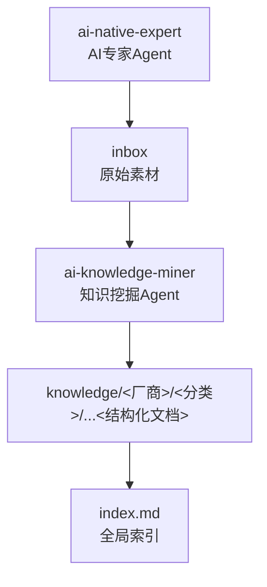
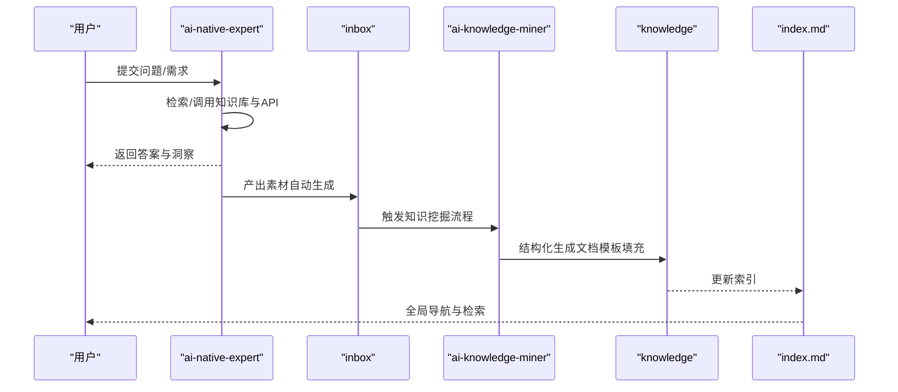
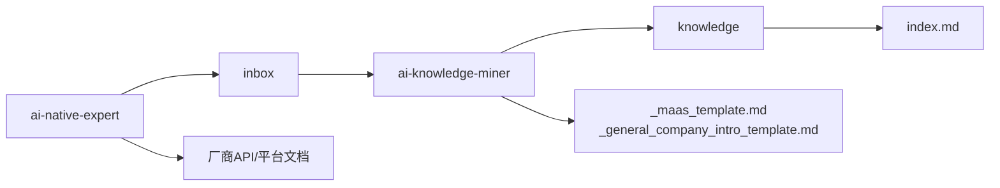

# 项目概述

<cite>
**本文引用的文件**
- [README.md](file://README.md)
- [index.md](file://index.md)
- [知识库全局索引](file://index.md)
- [_maas_template.md](file://knowledge/_maas_template.md)
- [_general_company_intro_template.md](file://knowledge/_general_company_intro_template.md)
- [知识/ai-general-notes/overview.md](file://knowledge/ai-general-notes/overview.md)
- [知识/ai-general-notes/agent-def.md](file://knowledge/ai-general-notes/agent-def.md)
- [知识/ai-general-notes/harness.md](file://knowledge/ai-general-notes/harness.md)
- [知识/ai-general-notes/prompt-engineering.md](file://knowledge/ai-general-notes/prompt-engineering.md)
- [知识/alibaba-cloud/maas/overview.md](file://knowledge/alibaba-cloud/maas/overview.md)
- [知识/alibaba-cloud/ai-coding/qoder.md](file://knowledge/alibaba-cloud/ai-coding/qoder.md)
- [知识/alibaba-cloud/ai-application/claw-family.md](file://knowledge/alibaba-cloud/ai-application/claw-family.md)
- [vibeproject/test_ds_v4.py](file://vibeproject/test_ds_v4.py)
- [vibeproject/real_user_test_wan2.6_no_audit.py](file://vibeproject/real_user_test_wan2.6_no_audit.py)
</cite>

## 目录
1. [引言](#引言)
2. [项目结构](#项目结构)
3. [核心组件](#核心组件)
4. [架构总览](#架构总览)
5. [详细组件分析](#详细组件分析)
6. [依赖分析](#依赖分析)
7. [性能考虑](#性能考虑)
8. [故障排查指南](#故障排查指南)
9. [结论](#结论)
10. [附录](#附录)

## 引言
本项目旨在建设一个系统化、可沉淀、可复用的AI知识库，围绕两大核心Agent实现“知识挖掘”与“AI专家咨询”的闭环：  
- ai-knowledge-miner：负责将原始素材提炼为脱敏、结构化的知识文档，沉淀到知识库相应目录，强调“提炼、沉淀、处理inbox”。  
- ai-native-expert：聚焦MaaS（如Qwen/Wan/Claude/Gemini/GPT）与AI Coding（如Qoder/Kiro/Claude Code）等能力与选型，提供专业问答与竞品分析，并在回答后自动生成inbox素材。

项目的价值定位在于：  
- 以自动化Agent驱动知识的高效沉淀与整理，降低知识管理的人工成本与碎片化风险。  
- 通过标准化模板与流程，形成跨厂商、跨领域的知识组织体系，支撑选型、部署与运营决策。  
- 以“道-点-线-体”四层知识结构（领域通识、单产品知识、对比分析、行业方案）构建全局索引，帮助初学者快速建立认知框架，同时为资深从业者提供深度参考。

## 项目结构
项目采用“素材-沉淀-索引”的三层结构：  
- inbox：原始素材收集区，由ai-native-expert在回答后自动生成，作为后续知识挖掘的输入。  
- knowledge：结构化知识库，按“AI General Notes（跨厂商通识）+ 各厂商/平台/应用/基础设施/方案”分类组织，配套标准化模板。  
- index.md：全局索引，提供“道-点-线-体”四层导航与模板参考，便于检索与复用。

图示来源
- [README.md:13-19](file://README.md#L13-L19)
- [index.md:1-69](file://index.md#L1-L69)

章节来源
- [README.md:1-20](file://README.md#L1-L20)
- [index.md:1-69](file://index.md#L1-L69)

## 核心组件
- ai-knowledge-miner（知识挖掘Agent）  
  - 职责：从inbox中抽取关键信息，进行脱敏与结构化处理，生成标准格式的知识文档，写入knowledge对应目录。  
  - 关键流程：接收素材 → 识别结构 → 脱敏清洗 → 模板填充 → 写入知识库 → 更新索引。  
  - 产出：结构化文档（如MaaS产品分析、通用概念、行业方案等），配套变更日志与模板参考。  

- ai-native-expert（AI专家Agent）  
  - 职责：面向MaaS与AI Coding领域提供专业问答、能力对比、API与选型建议，并在回答后自动生成inbox素材，形成“咨询-沉淀”的闭环。  
  - 关键流程：接收问题 → 检索/调用知识库 → 生成答案 → 产出素材 → 写入inbox → 触发知识挖掘。  
  - 产出：高质量问答与素材，推动知识库持续增长与更新。  

- 知识库与模板体系  
  - 通用模板：_maas_template.md、_general_company_intro_template.md等，确保知识表达一致性与完整性。  
  - 分类组织：AI General Notes（概念与工程）、厂商专题（MaaS、AI Coding、AI App、AI Platform、AI Infra）、对比分析、行业解决方案。  
  - 全局索引：index.md提供“道-点-线-体”四层导航，便于检索与复用。  

章节来源
- [README.md:5-12](file://README.md#L5-L12)
- [_maas_template.md:1-65](file://knowledge/_maas_template.md#L1-L65)
- [_general_company_intro_template.md:1-234](file://knowledge/_general_company_intro_template.md#L1-L234)
- [index.md:6-69](file://index.md#L6-L69)

## 架构总览
双Agent协同架构以“专家咨询-知识沉淀”为主线，形成“输入-处理-输出-索引”的闭环：  
- 输入：ai-native-expert接收用户问题，结合知识库与外部API生成答案，并自动生成inbox素材。  
- 处理：ai-knowledge-miner对inbox素材进行结构化处理，依据模板生成标准化文档。  
- 输出：知识文档写入knowledge目录，索引同步更新，供检索与复用。  
- 索引：index.md提供全局导航，串联“道-点-线-体”四层知识，支撑快速定位与交叉参考。

图示来源
- [README.md:5-12](file://README.md#L5-L12)
- [index.md:1-69](file://index.md#L1-L69)

## 详细组件分析

### ai-native-expert（AI专家Agent）
- 设计理念  
  - 以“专家”身份提供MaaS与AI Coding领域的专业洞察，强调“可验证、可溯源、可对比”。  
  - 通过“问答-素材-沉淀”的闭环，将外部咨询转化为内部知识资产。  
- 关键能力  
  - 能力与选型：覆盖模型定位、上下文、适用场景、限制与技术论文等维度。  
  - 竞品分析：提供横向对比视角，辅助决策与策略制定。  
  - 素材生成：回答后自动生成结构化素材，进入inbox，触发后续挖掘。  
- 典型场景  
  - MaaS能力评估与选型（如Qwen/Wan/Claude/Gemini/GPT）。  
  - AI Coding工具对比与落地建议（如Qoder/Kiro/Claude Code）。  
  - 行业解决方案与规模化复制（如商业地产、企业自建推理平台）。  

章节来源
- [README.md:10-11](file://README.md#L10-L11)
- [知识/ai-general-notes/agent-def.md:1-128](file://knowledge/ai-general-notes/agent-def.md#L1-L128)
- [知识/ai-general-notes/harness.md:1-108](file://knowledge/ai-general-notes/harness.md#L1-L108)
- [知识/ai-general-notes/prompt-engineering.md:1-193](file://knowledge/ai-general-notes/prompt-engineering.md#L1-L193)
- [知识/alibaba-cloud/maas/overview.md:1-9](file://knowledge/alibaba-cloud/maas/overview.md#L1-L9)
- [知识/alibaba-cloud/ai-coding/qoder.md:1-9](file://knowledge/alibaba-cloud/ai-coding/qoder.md#L1-L9)
- [知识/alibaba-cloud/ai-application/claw-family.md:1-137](file://knowledge/alibaba-cloud/ai-application/claw-family.md#L1-L137)

### ai-knowledge-miner（知识挖掘Agent）
- 设计理念  
  - 将“原始素材”转化为“结构化知识”，强调“脱敏、规范、可复用”。  
  - 以模板为中心，确保知识表达的一致性与完整性，降低后期维护成本。  
- 关键流程  
  - 素材识别：从inbox提取关键字段（如模型、厂商、场景、限制等）。  
  - 脱敏清洗：去除敏感信息，统一格式与术语。  
  - 模板填充：依据_maaS_template.md、_general_company_intro_template.md等模板生成文档。  
  - 写入与索引：将文档写入knowledge对应目录，并更新index.md索引。  
- 典型产出  
  - MaaS产品分析（定位、适用/不适用、核心能力与限制、适用场景、技术论文、变更日志）。  
  - 通用概念与工程（Agent、Harness、Prompt Engineering等）。  
  - 行业解决方案与对比分析模板。  

章节来源
- [README.md:7-11](file://README.md#L7-L11)
- [_maas_template.md:1-65](file://knowledge/_maas_template.md#L1-L65)
- [_general_company_intro_template.md:1-234](file://knowledge/_general_company_intro_template.md#L1-L234)
- [index.md:60-69](file://index.md#L60-L69)

### 知识组织体系与标准化流程
- “道-点-线-体”四层知识结构  
  - 道：AI领域通识（Agent、Harness、Prompt Engineering等），提供关键选型维度与认知框架。  
  - 点：单产品知识（MaaS、AI Coding、AI App、AI Platform、AI Infra），覆盖厂商与产品矩阵。  
  - 线：对比分析（如阿里云 vs AWS、Qoder vs Kiro等），辅助选型与策略制定。  
  - 体：行业解决方案（如商业地产、企业自建AI推理平台），强调规模化复制与落地实践。  
- 标准化流程  
  - 素材→脱敏→模板填充→写入→索引更新，确保知识的可追溯与可复用。  
  - 通过index.md全局索引串联四层知识，支持快速检索与交叉参考。  

章节来源
- [index.md:6-69](file://index.md#L6-L69)
- [知识/ai-general-notes/overview.md:1-42](file://knowledge/ai-general-notes/overview.md#L1-L42)
- [知识/ai-general-notes/agent-def.md:1-128](file://knowledge/ai-general-notes/agent-def.md#L1-L128)
- [知识/ai-general-notes/harness.md:1-108](file://knowledge/ai-general-notes/harness.md#L1-L108)
- [知识/ai-general-notes/prompt-engineering.md:1-193](file://knowledge/ai-general-notes/prompt-engineering.md#L1-L193)

### 双Agent协同的工程化要点
- 退出条件显式化：避免长循环中任务无法终止，需设定最大步数、超时等守卫条件。  
- 工具幂等性：可重试操作需幂等，不可逆操作需人工确认门。  
- 上下文压缩：长循环中上下文膨胀，需摘要/截断策略。  
- 可观测性优先：每一步感知-推理-行动-观察均需日志，便于调试与审计。  
- Prompt vs Harness：Harness是系统层面的硬约束，优于软约束的Prompt；Harness质量决定产品可用性上限。  

章节来源
- [知识/ai-general-notes/agent-def.md:101-107](file://knowledge/ai-general-notes/agent-def.md#L101-L107)
- [知识/ai-general-notes/harness.md:79-89](file://knowledge/ai-general-notes/harness.md#L79-L89)

## 依赖分析
- 组件耦合与协作  
  - ai-native-expert与inbox之间存在直接依赖：回答后自动生成素材，触发ai-knowledge-miner。  
  - ai-knowledge-miner与knowledge之间存在强依赖：模板与知识库结构决定产出质量。  
  - index.md对knowledge具有索引依赖，是知识检索与复用的关键入口。  
- 外部依赖与集成点  
  - MaaS与AI Coding能力的问答依赖厂商API与平台文档（如阿里云百炼、AWS Bedrock、Anthropic Claude等）。  
  - Python脚本示例展示了多地域API调用、限流与环境变量配置等工程实践，体现对外部系统的集成方式。  

图示来源
- [README.md:5-12](file://README.md#L5-L12)
- [index.md:1-69](file://index.md#L1-L69)
- [知识/_maas_template.md:1-65](file://knowledge/_maas_template.md#L1-L65)
- [知识/_general_company_intro_template.md:1-234](file://knowledge/_general_company_intro_template.md#L1-L234)

章节来源
- [README.md:5-12](file://README.md#L5-L12)
- [index.md:1-69](file://index.md#L1-L69)
- [知识/_maas_template.md:1-65](file://knowledge/_maas_template.md#L1-L65)
- [知识/_general_company_intro_template.md:1-234](file://knowledge/_general_company_intro_template.md#L1-L234)

## 性能考虑
- 知识挖掘吞吐与质量平衡  
  - 模板填充与脱敏处理的复杂度与文档规模成正比，建议批量处理与缓存常用模板。  
  - 对长文档进行分段处理与增量索引更新，降低索引重建开销。  
- Agent循环稳定性  
  - 显式化退出条件与上下文压缩策略可显著降低长任务的资源占用与失败率。  
- 外部API调用  
  - Python脚本示例展示了多地域调用与限流控制，建议在Agent中集成统一的限流与重试策略，避免触发外部限流。  

## 故障排查指南
- 环境变量与地域配置  
  - 多地域API调用需正确设置环境变量与端点，确保请求路由到指定地域（如US/Singapore）。  
  - 示例脚本展示了环境变量缺失时的跳过逻辑与错误处理，便于快速定位问题。  
- 内容安全检测与审核  
  - 部分模型在特定地域或场景下启用内容安全检测，可通过请求头禁用或调整参数，注意合规与风险控制。  
- 素材与产物一致性  
  - 若发现知识库文档与inbox素材不一致，检查模板填充逻辑与脱敏规则，必要时回溯Agent生成链路。  

章节来源
- [vibeproject/test_ds_v4.py:5-39](file://vibeproject/test_ds_v4.py#L5-L39)
- [vibeproject/real_user_test_wan2.6_no_audit.py:21-24](file://vibeproject/real_user_test_wan2.6_no_audit.py#L21-L24)

## 结论
本项目通过双Agent协同，实现了“专家咨询-知识沉淀-索引检索”的闭环，形成了以“道-点-线-体”为核心的系统化知识组织体系。  
- 核心优势：以自动化Agent驱动知识高效沉淀，标准化模板保障知识质量与一致性，全局索引提升检索与复用效率。  
- 价值定位：在AI知识管理领域提供可复制、可扩展的工程化范式，既适合初学者建立认知框架，也为资深从业者提供深度参考。  
- 未来规划：持续完善Agent能力与模板体系，扩展行业解决方案与对比分析维度，强化跨厂商与跨平台的知识整合与治理。

## 附录
- 模板参考  
  - MaaS产品模板：_maas_template.md  
  - 通用公司分析模板：_general_company_intro_template.md  
- 知识导航  
  - 全局索引：index.md（道-点-线-体四层导航与模板参考）

章节来源
- [index.md:62-69](file://index.md#L62-L69)
- [_maas_template.md:1-65](file://knowledge/_maas_template.md#L1-L65)
- [_general_company_intro_template.md:1-234](file://knowledge/_general_company_intro_template.md#L1-L234)