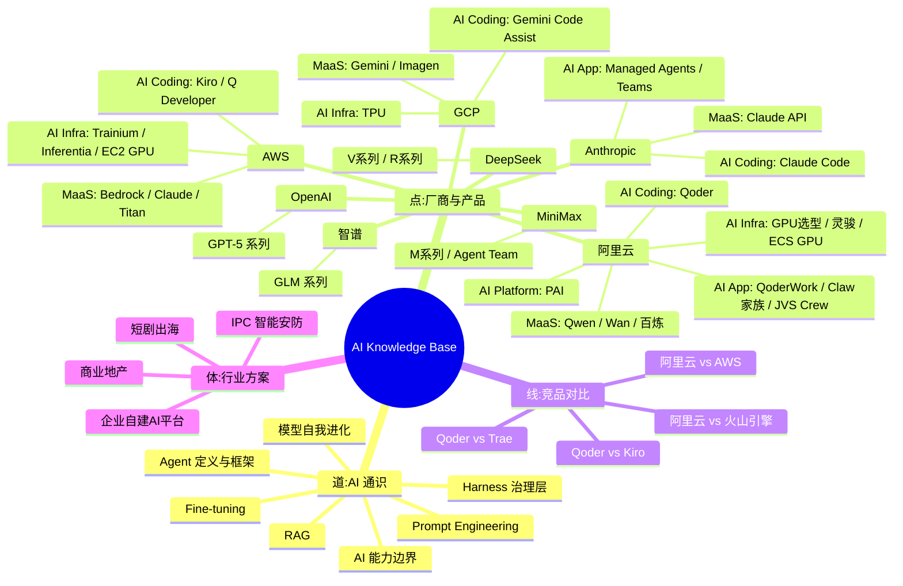
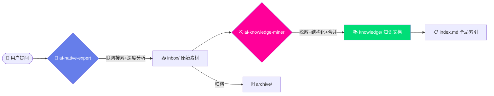

# 🧠 AI Knowledge Base

> AI Native 领域结构化知识库 — 双 Agent 驱动，持续进化

<p align="center">
  <b>📄 69</b> 篇知识文档 ·
  <b>⭐ 9</b> 篇精华 ·
  <b>🏢 10</b> 个厂商/领域 ·
  <b>🤖 2</b> 个 AI Agent 协作
</p>

<p align="center">
  <a href="index.md"></a>
  <a href="#-精华速览"></a>
  <a href="#-知识全景"></a>
  <a href="#-知识生产流水线"></a>
</p>

---

## 📊 知识全景



---

## 🏗️ 知识生产流水线



| Agent | 角色 | 触发词 |
|-------|------|--------|
| 🧠 **ai-native-expert** | 联网深度分析 AI 问题，产出 inbox 素材 | 模型对比、选型、API 问题、竞品分析 |
| ⛏️ **ai-knowledge-miner** | 提炼 inbox/notes 为结构化知识文档 | 提炼、沉淀、处理 inbox、knowledge miner |

---

## 📂 目录结构

```
.
├── inbox/          ← 原始素材暂存（一次性，处理后自动归档）
├── notes/          ← 长期笔记（提炼后保留原文件）
├── archive/        ← 已处理素材备份
├── knowledge/      ← 🎯 结构化知识库（核心产出）
│   ├── ai-general-notes/   ← 跨厂商 AI 通识（Agent/Harness/Prompt/RAG...）
│   ├── alibaba-cloud/      ← 阿里云（18 篇）
│   ├── aws/                ← AWS（10 篇）
│   ├── gcp/                ← GCP（7 篇）
│   ├── anthropic/          ← Anthropic（5 篇）
│   ├── minimax/            ← MiniMax（3 篇）
│   ├── deepseek/           ← DeepSeek（3 篇）
│   ├── openai/             ← OpenAI（2 篇）
│   ├── zhipu/              ← 智谱 AI（2 篇）
│   └── solutions/          ← 行业解决方案（7 篇）
├── index.md        ← 全局索引导航
└── README.md
```

---

## ⭐ 精华速览

| 文档 | 一句话价值 |
|------|-----------|
| [Agent 定义与框架](knowledge/ai-general-notes/agent-def.md) | Agent 的 for 循环本质、Model+Harness 框架、平台战略拐点 |
| [Harness 治理层](knowledge/ai-general-notes/harness.md) | 企业战略级资产、约束治理层、调用层容量与限流治理 |
| [Prompt Engineering](knowledge/ai-general-notes/prompt-engineering.md) | 防幻觉四层机制、第一性原理、博弈论应用 |
| [AI 能力边界](knowledge/ai-general-notes/ai-capability-and-deployment.md) | 锯齿状能力边界、迭代部署哲学、Personal AGI 终局 |
| [GPU 产品线选型](knowledge/alibaba-cloud/ai-infra/gpu-product-line.md) | 阿里云 GPU 全线产品对比与场景选型决策树 |
| [Qoder vs Trae](knowledge/alibaba-cloud/competitive-analysis/qoder-vs-trae/overview.md) | 企业级 vs 个人开发者 AI Coding 定位差异 |
| [DeepSeek 深度分析](knowledge/deepseek/general_intro.md) | MLA+MoE 架构创新、557 万美元训练成本、开源 SOTA |
| [企业自建 AI 平台](knowledge/solutions/enterprise-ai-platform/overview.md) | Higress AI 网关 + 灵骏 GPU + 百炼 Fallback 完整方案 |
| [MiniMax Agent Team](knowledge/minimax/agent-team.md) | Leader–Worker–Verifier 对抗制衡、多 Agent runtime 设计哲学 |
